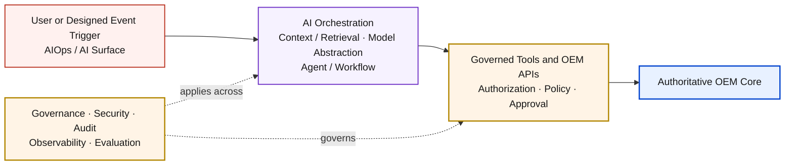
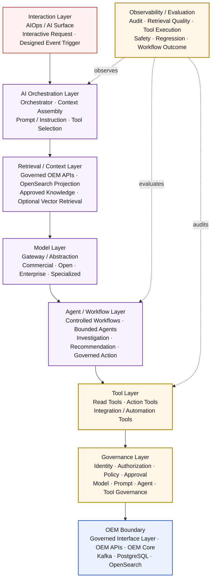
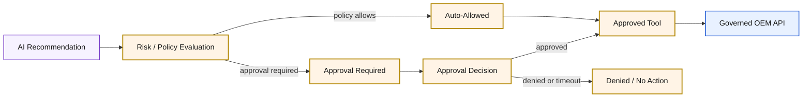

# AI-01 — OEM AIOps / AI Architecture

## Architecture Overview

| Architecture lifecycle | Documentation status | Scope |
|---|---|---|
| `PLANNED` | `DOCUMENTED`; partial AIOps evidence preserved separately | Cross-environment optional attachment |

AI-01 defines how Open Event Management can add intelligent investigation, reasoning, recommendation and governed agentic automation without changing OEM authority, security or vendor neutrality. AI is an optional interaction capability over OEM; it is not the OEM Core and is not required for core event management.

AI-01 is an architecture definition, not evidence that an LLM, open model, retrieval-augmented generation stack, vector index, model gateway, agent runtime, production tool executor or durable AI memory is deployed.

## Solution Architecture



AI orchestration can combine governed context, models and bounded workflows. Models do not directly control OEM. Recommendations and tool requests cross authorization and policy boundaries before an approved API can affect the authoritative OEM Core.

## AI Capability Model

| Capability | Architectural meaning |
|---|---|
| Investigate | Assemble governed evidence for a bounded operational question |
| Explain | Present traceable context about OEM state or decisions |
| Summarize | Condense authorized event, lifecycle or integration context |
| Recommend | Propose an action without granting authority to execute it |
| Correlate Context | Relate approved signals and sources without redefining Processor correlation |
| Plan | Construct bounded workflow steps within policy constraints |
| Execute Governed Tool | Invoke an approved capability after authorization and validation |
| Observe Outcome | Capture the result, policy decision and workflow outcome |

This taxonomy defines architecture capabilities. It does not claim that every capability is implemented.

## Engineering Architecture



The engineering view separates interaction, orchestration, retrieval, model, workflow, tool, governance and OEM responsibilities. Agents and models have no direct connection to OEM stores.

## Interaction Modes

AI-01 supports two distinct invocation modes:

- **Interactive:** a human uses the AIOps / AI surface to investigate, explain, summarize, request recommendations or propose a governed action.
- **Event-driven:** a designed OEM event or lifecycle signal invokes a bounded AI workflow. AI is not invoked for every event by default.

Both modes use the same identity, context, policy, tool and audit boundaries.

## AI Orchestration

AI orchestration coordinates context assembly, prompt or instruction selection, model invocation, workflow or agent steps and tool selection. It does not own OEM business rules, tool authorization or operational state.

An orchestrator can support deterministic workflows and bounded agents without assuming that dynamic agentic behavior is always preferable.

## Model Abstraction

```text
AI Orchestration
  → Model Gateway / Model Abstraction
  → Selected Model Provider
```

The vendor-neutral Model Layer can accommodate commercial LLM providers, open or self-hostable models, locally hosted models, enterprise-hosted models and specialized models. AI-01 selects no provider or model family.

A future Model Gateway or abstraction can normalize requests and responses, route providers, select models, integrate provider authentication, enforce usage and model policy, and produce telemetry. It is not the OEM operational authority, tool-authorization engine or business-rule engine. No production gateway implementation is asserted.

## Retrieval and Context

```text
Question / Task
  → Retrieval Intent
  → Approved Context Sources
  → Context Assembly
  → Model
```

Approved context can come from governed OEM APIs, event lifecycle views, OpenSearch search or analytics projections, and approved documentation or knowledge sources. Access remains bounded by identity, tenant or customer scope, policy and data classification.

Context sources preserve their provenance and evidence class: a PostgreSQL-backed OEM API can expose authoritative operational state; OpenSearch supplies a projection; documentation supplies reference knowledge; model output is generated interpretation.

## OpenSearch Relationship

OpenSearch remains the **Search / Analytics Projection**. AI-01 can use it as an approved retrieval, search or analytics context source through governed interfaces.

OpenSearch is not RAG by itself, a model, an agent or an operational authority. Retrieval does not promote a projection into authoritative state.

## RAG Boundary

Retrieval-augmented generation is the composition of **retrieval + context assembly + model generation**. It can use keyword, structured, semantic/vector or hybrid retrieval depending on a separately selected implementation.

AI-01 does not claim that RAG or vector retrieval is implemented. Vector retrieval remains an optional abstraction, not a required OpenSearch capability.

## Agent and Workflow Model

| Pattern | Definition | Suitable uses |
|---|---|---|
| Workflow | Predetermined orchestration with controlled steps | Repeatable investigation, known remediation sequences and structured analysis |
| Agent | Governed execution entity using a bounded goal, context, model reasoning, tools, workflow state and policy | Adaptive investigation, tool selection and constrained multi-step reasoning |

An agent is not an LLM, a direct database client or an unrestricted automation identity. Workflow and agent patterns can coexist; neither is universally preferred.

## Tool Model

A tool is a bounded capability whose contract identifies its name, input and output schemas, required permission, side effects, error behavior and audit context. Tools can expose reads, event actions, ticket or notification operations, automation triggers and diagnostic queries.

Tools invoke governed OEM APIs or integrations. They never provide direct store mutation merely because a model requested it.

## Read vs Action Tools

| Read tools | Action tools |
|---|---|
| Search; retrieve event; retrieve lifecycle; retrieve context; retrieve integration result; explain or summarize inputs | Acknowledge; close; suppress; route; ticket operation; notification; automation trigger; approved configuration change |

Action tools require stronger authorization, policy, validation and audit controls. Model output alone cannot authorize an action.

## Human Approval



Human-in-the-loop approval is supported when action policy requires it. Approval is risk- and policy-driven, not mandatory for every AI action.

## Interactive AI Flow

```text
Human → AIOps / AI Surface → AI Orchestrator
      → Retrieve / Reason → Response / Recommendation
      → Optional Governed Action
```

Interactive use can investigate an event, summarize a situation, explain context, recommend a next step or request an approved remediation. AI-01 does not prescribe a specific user experience.

## Event-Driven AI Flow

```text
Designed OEM Event / Kafka Trigger
  → Designed AI Workflow
  → Context Retrieval
  → Model / Analysis
  → Policy Decision
  → Recommendation or Approved Tool Action
  → Audit / Result
```

Kafka can supply designed triggers or context. It is not AI memory, agent state, a prompt store or model state.

## AI Memory Boundary

Conceptual memory categories include conversation or session context, workflow state and long-lived knowledge. These remain distinct from OEM operational state.

PostgreSQL remains the Operational Source of Truth. AI memory cannot silently become a second operational authority. Durable AI memory requires a separate explicit architecture decision; AI-01 claims no production memory implementation.

## Prompt / Instruction Governance

Prompts and instructions are governed AI artifacts with identity, version, purpose, model compatibility, evaluation status and change history. Retrieved, user and event content remain data, not trusted instructions.

Prompts contain no production secrets. Prompt versioning complements rather than replaces application and configuration governance.

## Model Governance

The architecture supports inventory and governance of model, provider, version, hosting mode, approved use cases, data policy, evaluation status and lifecycle status. These are governance contracts, not claims of an implemented model registry.

## Agent Governance

The architecture supports agent identity and version, bounded objective, allowed tools and data scopes, model configuration, policy, approval requirements, evaluation status and audit trail. Agents receive no unlimited credentials.

## Tool Governance

The architecture supports a tool registry, tool version, permission requirements, input/output contract, side-effect and risk classifications, error behavior and auditability. Action tools receive the strongest applicable controls.

## Identity and Authorization

Each interactive or event-driven workflow acts through identifiable human, service, workflow, agent and tool-execution principals. Authorization evaluates requested capability, resource and scope, applicable policy and tenant/customer context. AI cannot broaden the caller's effective access.

AI-01 does not select a concrete IAM, RBAC or policy engine and does not claim that one uniform implementation already spans OEM.

## AI Security

AI security requires identity, least privilege, externalized secrets, data minimization, provider data boundaries, prompt/input controls, output validation, tool authorization, action policy, audit and abuse or rate controls where applicable.

Secrets are not placed in prompts, model configuration committed to Git, logs or documentation. Provider credentials remain outside model and agent reasoning contexts.

## Untrusted Input / Prompt Injection Boundary

User input, event content and retrieved content are potentially untrusted. System instructions, policy and authorized tool definitions remain distinct from that content.

A model request cannot grant tool permission. Tool authorization and action policy execute outside model reasoning, and untrusted content cannot override them.

## Output Validation

Model output is generated interpretation, not trusted authority. Before becoming a structured recommendation, tool input or state-changing action, output can require schema, policy and business-rule validation plus approval according to the use case.

Invalid, ungrounded or unauthorized output produces no implicit OEM mutation.

## AI Observability

AI observability can cover request count, latency, model and provider errors, token or resource usage where applicable, retrieval success and quality, tool invocation and failures, workflow duration, inspectable agent decisions, policy decisions, approval outcomes and final workflow results.

AI-01 selects no observability vendor and claims no completed production instrumentation.

## AI Evaluation

Evaluation can cover task correctness, retrieval quality, groundedness, hallucination, tool selection and correctness, policy compliance, security behavior, regression and workflow outcome.

The architecture supports offline, pre-release, regression and controlled production evaluation. It defines no invented scores, thresholds or completed evaluation evidence.

## AI Lifecycle / AI-02 Relationship

```text
Define → Develop → Evaluate → Approve
       → Release → Observe → Re-evaluate → Retire
```

AI-01 defines the planned runtime architecture. [AI-02](evolution/future-architecture-register.md) remains a separate `PLANNED` architecture for delivery and governance of models, prompts, agents and tools. ARCH-REDESIGN-12 does not implement AI-02.

## Data Privacy and Provider Boundary

Provider and hosting decisions are policy-controlled using data classification, tenant/customer scope, model/provider identity, hosting mode, allowed context and retention policy. AI-01 does not assert that any particular provider is approved.

Vendor neutrality preserves compatibility with local, enterprise-hosted and external providers behind the model abstraction.

## Context Isolation

Context retrieval preserves the same authorization and tenant/customer scope as the calling identity or designed workflow. An AI workflow cannot broaden data access through retrieval, model selection or tool invocation.

This is an isolation principle, not a claim of a specific tenancy implementation.

## Failure and Degradation Model

| Failure domain | Architectural response |
|---|---|
| Model or provider unavailable | Fail the AI operation safely; preserve OEM Core availability |
| Retrieval unavailable | Return a bounded failure or reduced-context result; do not fabricate authority |
| Invalid model output | Reject during validation; invoke no action tool |
| Tool failure | Preserve the explicit tool result and audit context |
| Policy denial | Execute no action and return the governed decision |
| Approval timeout | Execute no approval-dependent action |
| Workflow failure | Contain failure within AI orchestration and preserve traceability |

Graceful degradation is mandatory:

```text
AI Unavailable
  → OEM Core Continues Operating
  → GUI / CLI / API Remain Available According to Deployment
```

AI is additive and never a hard dependency for core event management.

## Relationship to Multi-Surface

[Multi-Surface](multi-surface-interaction.md) defines AIOps / AI as one optional governed interaction surface. AI-01 defines the internal intelligent architecture behind that surface and must traverse the same Governed Interface Layer.

## Relationship to D0

[D0](d0-logical-current.md) remains the authoritative definition of OEM Core components, event contracts, management boundary and data authority. AI-01 attaches above governed interfaces and does not redefine the Gateway, Processor, Worker or ESS.

## Relationship to Data Authority & Replay

[Data Authority & Replay](data-authority-replay.md) preserves PostgreSQL as Operational Source of Truth, Kafka as Transport / Replay Boundary and OpenSearch as Search / Analytics Projection. AI context and generated interpretation do not alter those roles.

## Deployment Relationship

AI-01 is cross-cutting and optional. It can attach to compatible D1, D3, D2, D4, D5A or D5B profiles only where separately selected capabilities, controls and evidence support it. The deployment architecture owns runtime placement; AI-01 owns the intelligent interaction boundary.

D4 minimum and D5A/D5B do not require AI-01. No environment gains an AI dependency from this architecture definition.

## Architectural Principles

| Principle | Architectural consequence |
|---|---|
| AI Optionality | OEM Core operates independently of AI availability. |
| OEM Authority | AI interpretation never replaces authoritative OEM state or decisions. |
| Separation of Responsibilities | Interaction, retrieval, model, workflow, tool and governance roles remain distinct. |
| Governed Actions | Models and agents act only through authorized, validated and audited tools. |
| Vendor Neutrality | Model and provider choices remain behind an abstraction boundary. |
| Retrieval Provenance | Context retains source, authority class and applicable scope. |
| Least Privilege | Workflows, agents and tools receive bounded identities and permissions. |
| Untrusted Content Isolation | Retrieved, user and event content cannot override policy or authorization. |
| Validated Outputs | Model output is checked before structured or state-changing use. |
| Observable and Evaluable | AI behavior is designed for traceability, measurement and regression evaluation. |
| Graceful Degradation | AI failure does not compromise OEM Core operation. |
| Lifecycle Separation | AI-01 runtime and AI-02 delivery/governance remain independently defined. |

## Architecture Boundary

AI-01 defines the planned runtime responsibilities and boundaries for AI interaction, orchestration, context, model abstraction, workflows and agents, tools, governance, security, observability, evaluation and graceful degradation.

It does not define or implement a model provider, model gateway, RAG/vector technology, production agent runtime, durable AI memory, concrete IAM engine, observability vendor, evaluation thresholds or AI-02 delivery pipeline. It does not redefine OEM Core or deployment topology.

## Implementation Evidence Boundary

The certified product source documents one implemented **minimum independent AIOps Engine** inside Event Processor:

- persistent configuration and revision handling;
- REST CRUD;
- immutable configuration-change audit records; and
- explicit HTTP assessment against an internal mock provider.

That engine is independent from the automatic event pipeline, performs no remediation, uses declarative tenant/actor headers rather than implemented authentication, and returns a synthetic mock assessment that is not real inference or provider compatibility evidence.

There is no certified implementation evidence for an LLM or open model runtime, RAG, vector retrieval, production model gateway, production agents, production tool execution, durable AI memory, complete AI governance, production observability or production evaluation. Architecture definitions on this page must not be read as implementation claims.

## Related Architectures

- [Multi-Surface Interaction Architecture](multi-surface-interaction.md)
- [D0 — OEM Logical Architecture](d0-logical-current.md)
- [D6 — Environment Evolution & Deployment Model](d6-environment-evolution.md)
- [Data Authority & Replay Boundary](data-authority-replay.md)
- [AI-02 — AI Delivery & Governance Lifecycle](evolution/future-architecture-register.md)
- [Architecture Evolution Register](evolution/index.md)
- [AIOps Engine implementation evidence](../platform/event-processor/aiops-engine.md)
