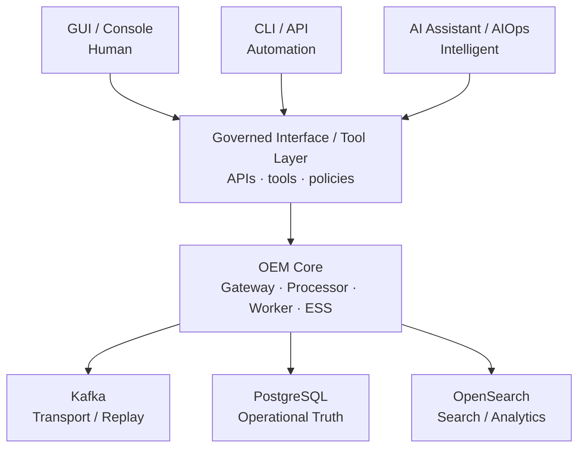
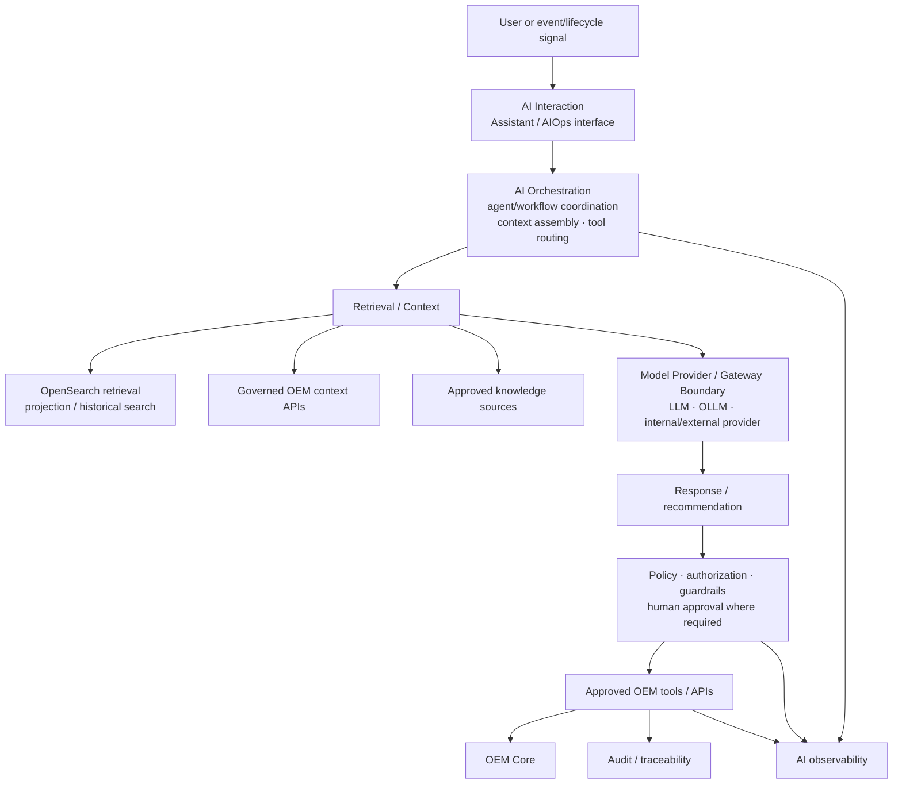

# AI-01 — OEM AIOps / AI Architecture

| Architecture lifecycle | Documentation status | Scope |
|---|---|---|
| `PLANNED` | Future architecture; partial AIOps evidence preserved separately | Cross-environment optional attachment |

AI-01 defines how AIOps/AI may interact with one governed OEM Core. OEM remains operable without AI, and neither D4 QA minimum nor D5A/D5B production target requires AI. AI-01 is not a claim that an LLM, OLLM, RAG stack, model gateway or agent runtime is deployed.

## Product principle

OEM is interaction-surface independent: the [GUI](multi-surface-interaction.md), CLI/API and AIOps/AI are alternative interaction models over the same platform. GUI remains first class but is not mandatory; programmatic and intelligent interactions must use governed interfaces rather than direct datastore access.

## One OEM Core — three interaction surfaces

The Governed Interface / Tool Layer is a boundary for OEM APIs, management APIs, approved CLI operations, AI tools/functions, authorization, policy enforcement, audit and action validation. It does not assert a new microservice. GUI, CLI and AI do not directly access PostgreSQL, Kafka or OpenSearch.

## AI-01 detailed architecture

The diagram describes a planned, vendor-neutral architecture. A local/open model, enterprise-hosted model or external provider may be used behind a Model Provider / Model Gateway Boundary; AI-01 does not require or select one vendor.

## Existing evidence and predecessor boundary

The repository documents an implemented, minimum independent [AIOps Engine](../platform/event-processor/aiops-engine.md): persistent configuration, REST CRUD, audit records and an explicit HTTP assessment against an internal mock provider. Its [implementation status](../platform/event-processor/implementation-status.md) says it is independent from current automatic pipeline contracts. This is partial AIOps evidence, not evidence of a full AI-01 implementation, LLM/OLLM runtime, RAG, vector retrieval, agent orchestration or production provider integration. Existing local AIOps mock references remain preserved in [D1](d1-local-current.md).

## Read/context versus action

Read/context behavior may assemble OpenSearch retrieval, OEM API event/history context and approved knowledge for investigation, summarization, correlation assistance, root-cause assistance or recommendations. OpenSearch is **not** the AIOps engine: it remains a Search / Analytics Projection and, in the future, may be a retrieval/context attachment.

Action is separate. A recommendation or intent must pass through policy, authorization and an approved tool or OEM API before reaching OEM Core, then be auditable. Model inference alone grants no operational authority. AI must not directly mutate PostgreSQL, Kafka, OpenSearch, Kubernetes or cloud resources unless a future explicit controlled-tool architecture authorizes that action.

## Invocation, tools and human control

AI-01 supports two conceptual invocation modes: **interactive** user → AI interface → analysis/action; and **event-driven** OEM event/lifecycle signal → AI workflow → policy-driven analysis, recommendation or action. AI invocation is selective, not a requirement for every event. Kafka can supply designed triggers or context, but remains transport/replay rather than model memory or AI state.

Tools are controlled adapters to OEM APIs, future automation, ITSM, notification systems and possible future infrastructure actions. Agents do not receive unrestricted raw credentials. Policy can later classify activity as read-only autonomous, recommendation-only, approval-required or pre-authorized automation; final policy values are pending.

## State, memory and environment boundaries

PostgreSQL remains the operational source of truth. An AI interpretation does not become authoritative merely because a model produced it; accepted mutations must traverse OEM Core/API contracts. LLM context, agent memory, event state, OpenSearch indexes and PostgreSQL state are distinct concepts. Persistent AI memory is a pending architecture decision.

For environments: D1 may host development/lab components only when independently evidenced; D3 excludes the full AI/OpenSearch plane from its minimum profile; D2 exposes future-capable API/OpenSearch boundaries; D4 explicitly excludes full AI-01 from its minimum; D5A/D5B treat AI-01 as optional. See [D6](d6-environment-evolution.md).

## Security, governance, observability and quality

AI-01 requires future identity, authorization, tool permissions, least privilege, secret isolation, prompt/input controls, output validation, audit, data-access boundaries and model/provider trust boundaries. Governance must cover model, prompt, agent, tool and policy version identity; inventory; evaluation; approval; traceability and outcomes.

Required future observability includes requests, latency, errors, token/resource usage where applicable, retrieval quality, tool invocation, agent workflow, policy decisions, human approvals and outcomes. Required quality work includes offline and regression evaluation, prompt evaluation, tool/action validation, hallucination/error analysis, safety/policy validation and agent workflow testing. No observability vendor or evaluation implementation is selected.

## AI delivery lifecycle and pending decisions

[AI-02 — AI Delivery & Governance Lifecycle](evolution/future-architecture-register.md) is registered as `PLANNED`. It will address model, prompt, agent and tool lifecycles; evaluation gates; promotion and rollback separately from D5B application-container CI/CD.

Open decisions include recovery of LLM/OLLM evidence, RAG/vector approach, provider/model gateway strategy, AI identity, tool authorization, human approval policy, persistent AI memory, observability, evaluation and versioning. See the [Future Architecture Register](evolution/future-architecture-register.md) and [BAU](evolution/BAU.md).
