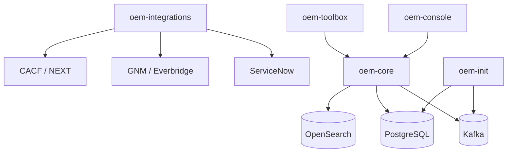
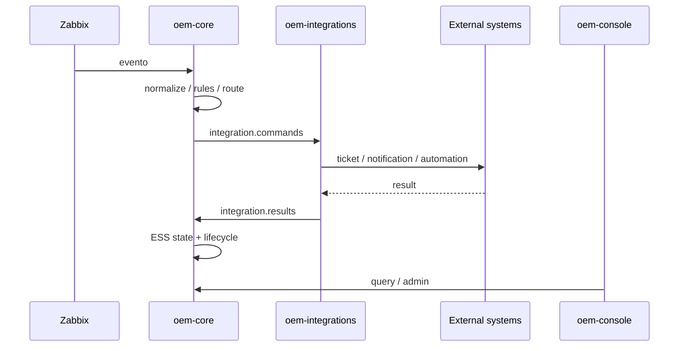

# Arquitectura de las cinco imágenes

## oem-core
Familia del dominio central: Gateway, Event Processor y Event State Service. En Kubernetes los procesos deben seguir siendo desplegables y escalables independientemente.

## oem-integrations
Integration Worker y adapters ITSM, Notification y Automation Router. Aísla credenciales y conectividad de proveedores.

## oem-console
Event Management Console, dashboards OEM y APIs frontend. Kafka UI y OpenSearch Dashboards son herramientas integradas, no el frontend OEM.

## oem-init
Jobs one-shot idempotentes para topics, esquemas, migraciones, bootstrap y preflight.

## oem-toolbox
CLI, diagnóstico, readiness, smoke tests, evidencia y soporte; debe ejecutarse on-demand.

