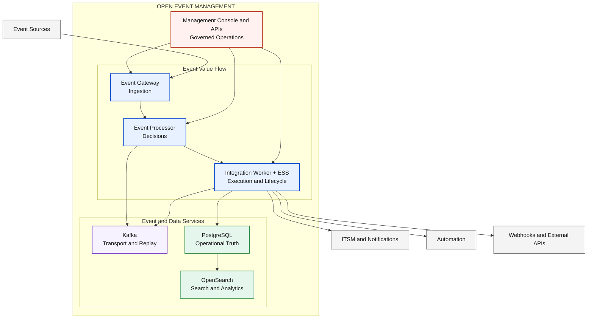
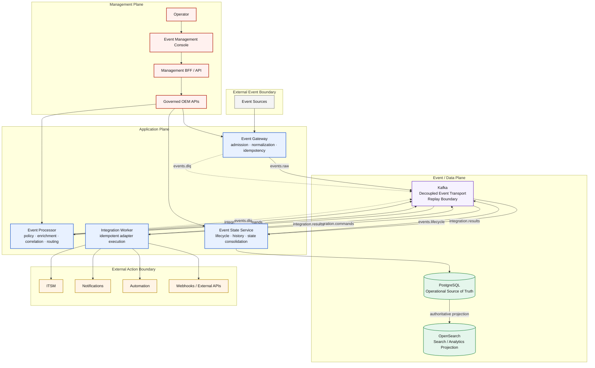

# D0 — OEM Logical Architecture

## Architecture Overview

Open Event Management (OEM) provides an event-driven platform for receiving,
processing, integrating, consolidating, and operating enterprise events. D0
defines the product's logical boundary, the responsibilities of its core
components, and the contracts between management, application, event, data,
and external integration planes.

This architecture defines **what OEM is**, independently from where it runs.
Deployment architectures layer infrastructure, topology, and environment
choices over this logical contract without changing component ownership, data
authority, or event flow.

## Solution Architecture

The solution view presents the complete OEM value path at committee and
customer level: event sources enter one governed product boundary and produce
operational outcomes through a consistent event, state, and management model.



## Solution Flow

1. **Receive:** Event sources submit events through the Event Gateway.
2. **Transport:** Kafka decouples ingestion from processing and establishes the replay boundary.
3. **Process:** The Event Processor applies policy, enrichment, correlation, suppression, and routing decisions.
4. **Command:** Approved integration intent is emitted as an integration command.
5. **Execute:** The Integration Worker invokes the selected external adapter idempotently.
6. **Result:** Integration outcomes return through the event backbone.
7. **Consolidate:** The Event State Service assembles lifecycle, history, and current state.
8. **Persist:** PostgreSQL records authoritative operational state.
9. **Project:** OpenSearch materializes searchable and analytical projections.
10. **Operate:** Operators and automation use the console and governed APIs to manage OEM.

## Engineering Architecture

The engineering view expands the same architecture into its logical planes and
key event contracts. Plane labels and component names carry the meaning; color
reinforces the hierarchy but is not required to interpret it.



The backbone also carries `integration.callbacks` and `event.journal` where
their documented contracts apply. `events.dlq` isolates events that cannot
continue through governed processing.

## Component Responsibilities

| Component | Responsibility | Primary Interaction |
|---|---|---|
| Event Gateway | Receives, validates, normalizes, and admits events idempotently. | Event sources and `events.raw` |
| Kafka | Decouples asynchronous producers and consumers and provides the replay boundary. | OEM event and integration contracts |
| Event Processor | Evaluates policy, enrichment, correlation, suppression, and routing. | Raw events, normalized events, and integration commands |
| Integration Worker | Executes integration intent through idempotent adapters. | Integration commands, external systems, and results |
| Event State Service | Consolidates lifecycle, history, results, and current event state. | Integration results, lifecycle events, and PostgreSQL |
| PostgreSQL | Owns operational state, history, audit, and authoritative decisions. | Event State Service |
| OpenSearch | Materializes search and analytics projections and may supply retrieval context to AI-01. | Projections derived from authoritative state |
| Event Management Console | Provides the governed human management surface. | Management BFF / API |
| Management BFF / API | Mediates management requests and exposes fit-for-purpose contracts. | Console and governed OEM APIs |

## Event Processing Flow

The Gateway **receives** and normalizes input before Kafka **transports** it.
The Processor **processes** policy and routing and **commands** integrations.
The Worker **executes** adapters and returns a **result**. ESS
**consolidates** lifecycle and state, PostgreSQL **persists** operational
truth, and OpenSearch **projects** searchable views. The Console and APIs then
allow authorized users and automation to **operate** the platform.

This separation is invariant: the Gateway receives and normalizes; the
Processor decides; the Worker executes; and ESS consolidates lifecycle and
state.

## Data Authority Model

| Service | Data role |
|---|---|
| Kafka | Decoupled event transport and replay boundary; not authoritative state |
| PostgreSQL | Operational Source of Truth for state, history, audit, and operational evidence |
| OpenSearch | Search and analytics projection; optional retrieval/context attachment for AI-01 |

OpenSearch is not AI and does not become authoritative through indexing or
retrieval. See [Data Authority & Replay](data-authority-replay.md) for replay,
projection, and reconciliation boundaries.

## Management Model

The governed management path is:

```text
Operator → Event Management Console → Management BFF / API
         → Governed OEM APIs → OEM Core
```

The Console does not directly access Kafka, PostgreSQL, OpenSearch, or runtime
hosts. The BFF and governed APIs enforce product contracts, authorization,
validation, and auditable operations for management surfaces.

## External Integration Model

Integration intent is created by the Event Processor and executed by the
Integration Worker through adapters. Adapters isolate OEM from vendor-specific
ITSM, notification, automation, webhook, and external API contracts. Results
return to OEM for lifecycle consolidation; external systems do not own OEM
operational state.

## Architectural Principles

| Principle | Architectural rule |
|---|---|
| Event-Driven | Asynchronous business flow uses explicit event contracts and Kafka boundaries. |
| API-First | Human, programmatic, and intelligent surfaces use governed OEM APIs. |
| Separation of Concerns | Gateway receives, Processor decides, Worker executes, and ESS consolidates. |
| Authoritative State | PostgreSQL owns operational truth and decision history. |
| Projection Model | OpenSearch derives search and analytics views from authoritative state. |
| Vendor Neutrality | External products and providers remain behind adapters and governed boundaries. |
| Extensibility | New sources, policies, adapters, and interaction surfaces preserve core contracts. |
| Governed Operations | Management actions traverse authorized, validated, and auditable interfaces. |

## Deployment Independence

D0 has no dependency on Docker, Docker Compose, RHEL, KVM, Kubernetes, GKE, or
Terraform. Those technologies define deployment and environment architectures
that realize this logical model; they do not redefine product responsibility,
event contracts, management boundaries, or data authority.

### Implementation boundaries

- Services communicate through governed APIs and event contracts.
- Asynchronous workflows use Kafka.
- Operational state is persisted in PostgreSQL.
- Search and analytics projections are materialized in OpenSearch.
- Integrations execute through workers and adapters.
- Management surfaces consume governed APIs.

No implementation boundary in D0 requires a hostname, port, container runtime,
or orchestration platform.

## Related Architectures

- [D1 — Local Deployment](d1-local-current.md)
- [D3 — DEV RHEL / On-Prem](d3-rhel-current.md)
- [D2 — DEV KVM + Kubernetes](d2-kvm-kubernetes-target.md)
- [D4 — QA GKE Minimum](d4-qa-gke-minimum-target.md)
- [D5A — PROD GKE Runtime](d5a-prod-gke-runtime-target.md)
- [D5B — PROD GKE + CI/CD](d5b-prod-gke-cicd-target.md)
- [Multi-Surface Interaction](multi-surface-interaction.md)
- [AI-01 — AIOps / AI](ai-01-aiops-ai-architecture.md)
- [Data Authority & Replay](data-authority-replay.md)
