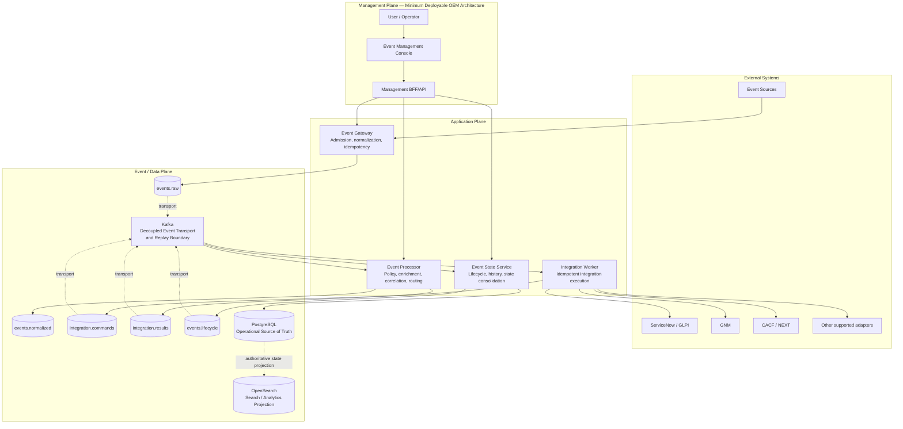

# D0 — OEM Canonical Logical Architecture

| Architecture lifecycle | Validation context | Environment |
|---|---|---|
| `CURRENT` | `DOCUMENTED` | Environment independent |

This is the canonical logical architecture for Open Event Management. It
describes product responsibilities and contracts; it does not assert that every
adapter or target runtime is production-certified.

**Predecessor:** [General Solution / V1 architecture](index.md) and
[technical V1 map](v1-map.md).  
**Successor:** none; this is the current documented D0 baseline.  
**Evolution record:** [Architecture Evolution Register](evolution/index.md).

## Canonical architecture

## Plane and contract rules

- **Management Plane:** Event Management Console reaches supported OEM APIs only
  through Management BFF/API. It does not directly access Kafka, PostgreSQL,
  OpenSearch or runtime hosts.
- **Application Plane:** Gateway, Processor, Worker and ESS have separated
  responsibilities. Processor creates integration intent; Worker executes it;
  ESS owns state consolidation and lifecycle.
- **Event / Data Plane:** PostgreSQL is the Operational Source of Truth.
  OpenSearch is a Search / Analytics Projection, not a second authority. Kafka
  decouples event transport and is the replay boundary.
- **External Systems:** names identify documented contracts and adapters. They
  do not by themselves certify a real-provider production integration.

## Topics

The primary flow uses `events.raw`, `events.normalized`,
`integration.commands`, `integration.results` and `events.lifecycle`. The
canonical supporting topic inventory also includes `events.dlq`,
`integration.callbacks` and `event.journal`. See the [technical V1 map](v1-map.md)
for the complete inventory and [solution flows](solution-flows.md) for detailed
execution paths.

## Architecture status

D0 is a logical contract, not a runtime certification. Docker Compose,
RHEL/on-prem, KVM/Kubernetes and GKE are deployment views that must preserve
this contract when documented. The Management Plane is an invariant of minimum
deployments D1–D5 unless a future ADR explicitly supersedes it. Local mocks and
development utilities are not implied by D0.

## Why this evolved

The predecessor architecture is retained as history. This successor formalizes
the Management Plane, PostgreSQL authority, OpenSearch projection, Kafka replay
boundary and environment-independent terminology. It also removes the prior
ambiguity that could be read as direct GUI/data-store coupling. See the
[evolution register](evolution/index.md).
