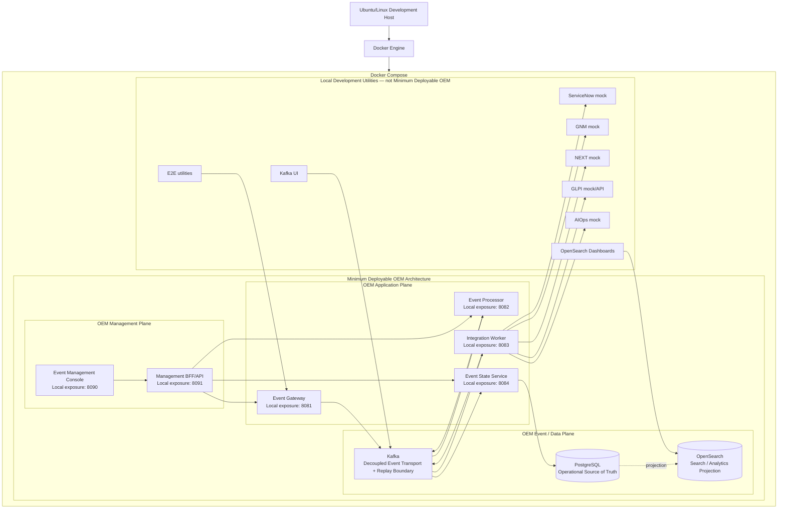

# D1 — Local Deployment Architecture

| Architecture lifecycle | Validation context | Environment |
|---|---|---|
| `CURRENT` | `DOCUMENTED` | Ubuntu/Linux development host + Docker Compose |

This is the documented local deployment baseline. Ubuntu describes the current
development context; Linux is the host requirement represented here. It is not a
cross-platform product constraint or a production deployment certification.

**Predecessor:** [Local runtime topology](runtime-topology.md) and preserved
Compose visual assets.  
**Successor:** none; this is the current documented D1 baseline.  
**Evolution record:** [Architecture Evolution Register](evolution/index.md).

## Local containment and planes

## Boundary rules

- Event Management Console and Management BFF/API are part of the minimum
  deployable OEM architecture. They are not development tooling.
- Console traffic goes through Management BFF/API; the Console has no direct
  Kafka, PostgreSQL, OpenSearch or runtime-host connection.
- Local exposure ports identify this Compose baseline only; they are not
  universal product contracts.
- Mocks, Kafka UI, OpenSearch Dashboards and E2E utilities are visibly outside
  the minimum OEM boundary. Their presence locally does not promote them to a
  deployment requirement.

## Data contract

Kafka transports and retains the event flow. PostgreSQL holds authoritative
operational state. OpenSearch receives a search and analytics projection. For
the failure and reconciliation boundary, see [Data Authority & Replay](data-authority-replay.md).

## Supporting references

- [Runtime topology predecessor](runtime-topology.md)
- [Local development procedure](../getting-started/local-development.md)
- [Technical V1 map](v1-map.md)
- [Architecture Evolution Register](evolution/index.md)
