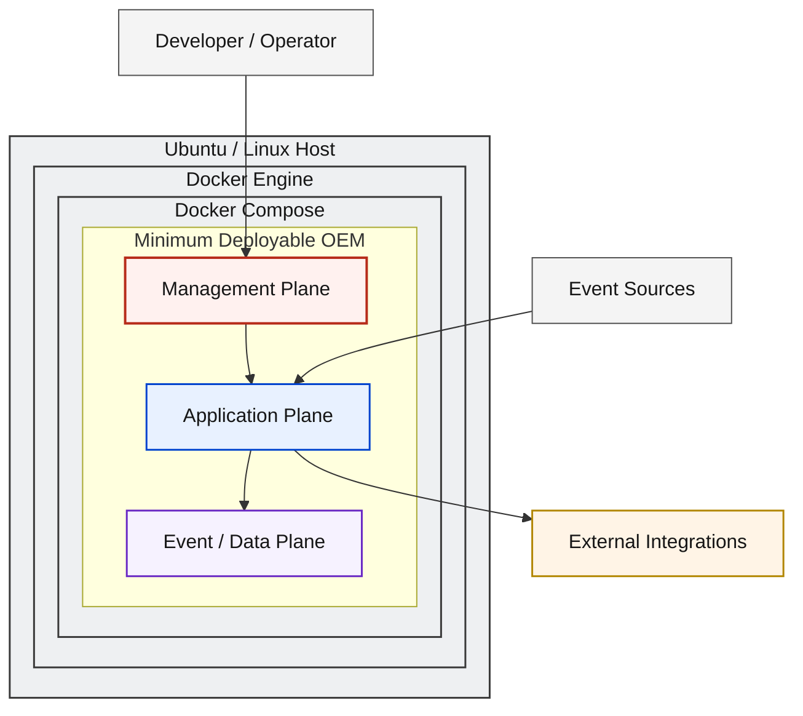
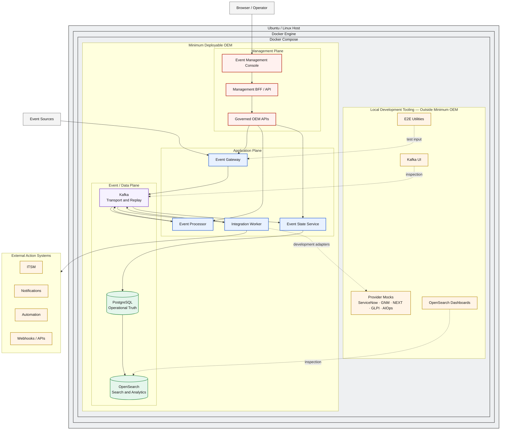

# D1 — Local Deployment Architecture

## Architecture Overview

D1 defines how the [D0 OEM Logical Architecture](d0-logical-current.md) is
deployed as a self-contained local runtime. A single Ubuntu or Linux host
provides Docker Engine, and Docker Compose declaratively orchestrates the OEM
containers, internal connectivity, and persistent services.

The deployment preserves every D0 responsibility and plane. It adds local
containment and runtime boundaries without changing event contracts, data
authority, integration ownership, or the governed management path.

## Solution Architecture

The solution view shows the local deployment hierarchy and distinguishes the
OEM product runtime from systems that remain outside the host.



## Solution Flow

1. **Receive:** An external event source submits an event to the Event Gateway.
2. **Admit:** The Gateway validates, normalizes, and admits the event.
3. **Transport:** Kafka decouples ingestion from downstream processing.
4. **Process:** The Event Processor applies event-management policy and routing.
5. **Execute:** The Integration Worker executes approved integration commands.
6. **Consolidate:** The Event State Service consolidates lifecycle and state.
7. **Persist:** PostgreSQL records authoritative operational truth.
8. **Project:** OpenSearch receives the search and analytics projection.
9. **Operate:** Operators use the Console, BFF, and governed OEM APIs.
10. **Support:** Local tooling observes and tests the runtime without becoming part of OEM Core.

## Engineering Architecture

The engineering view expands the same deployment. Nested boundaries represent
containment: the host runs Docker Engine, Docker Engine runs the Compose
project, and Compose contains both the Minimum Deployable OEM and a separate
local-tooling boundary.



## Deployment Components

| Layer | Component | Local Deployment Role |
|---|---|---|
| Host | Ubuntu / Linux Host | Provides the operating-system boundary for the local runtime. |
| Container runtime | Docker Engine | Runs and isolates OEM containers and supporting utilities. |
| Orchestration | Docker Compose | Declares service composition, connectivity, dependencies, and persistence attachments. |
| Management | Event Management Console | Provides the browser-based operator experience. |
| Management | Management BFF / API | Mediates console requests and exposes fit-for-purpose management contracts. |
| Application | Event Gateway | Receives, validates, normalizes, and admits events. |
| Application | Event Processor | Applies policy, enrichment, correlation, suppression, and routing. |
| Application | Integration Worker | Executes integration commands through adapters. |
| Application | Event State Service | Consolidates lifecycle, history, results, and state. |
| Event | Kafka | Provides decoupled event transport, retention, and replay boundaries. |
| Data | PostgreSQL | Persists authoritative operational state and history. |
| Data | OpenSearch | Materializes search and analytics projections. |

## Runtime Flow

Docker Compose starts the management, application, and event/data services as
one local composition. Event traffic follows the D0 flow from Gateway through
Kafka, Processor, Worker, and ESS. ESS persists state in PostgreSQL and
materializes projections in OpenSearch. Management traffic enters through the
Console and BFF rather than through direct datastore or container access.

Service lifecycle operations affect container processes; they do not transfer
logical responsibilities between components.

## Data Persistence Model

Container lifecycle and persistent-data lifecycle are separate concerns:

| Service | Persistence role |
|---|---|
| Kafka | Retains event transport records according to the local retention configuration and supports replay. |
| PostgreSQL | Retains the Operational Source of Truth for state, history, audit, and operational evidence. |
| OpenSearch | Retains rebuildable search and analytics projections derived from authoritative state. |

Docker-managed persistence attachments allow data to outlive individual
container processes. Their local implementation does not change the D0
authority model. See [Data Authority & Replay](data-authority-replay.md).

## Management Model

The local management path remains governed:

```text
Browser / Operator → Event Management Console → Management BFF / API
                   → Governed OEM APIs → OEM Core
```

The browser and Console do not directly access Kafka, PostgreSQL, OpenSearch,
Docker Engine, or host internals. Administrative behavior remains behind BFF
and OEM API contracts.

## Development Tooling Boundary

The OEM Product Runtime is not equivalent to Local Development Tooling.

| Development utility | Supported purpose |
|---|---|
| Provider mocks | Exercise synthetic ServiceNow, GNM, NEXT, GLPI, and AIOps integration contracts. |
| Kafka UI | Inspect local Kafka topics and records. |
| OpenSearch Dashboards | Inspect local search and analytics projections. |
| E2E utilities | Generate controlled inputs and validate end-to-end behavior. |

These utilities support testing, inspection, mock integrations, and development
diagnostics. They remain outside the Minimum Deployable OEM and do not redefine
the product architecture.

## Networking and Service Discovery

Docker Compose provides an internal application network for service-to-service
connectivity. Containers discover peers by declared service identity, while
dependencies use internal endpoints rather than host-loopback assumptions.

Only interfaces required by operators, event sources, or approved external
clients need controlled host exposure. Internal Kafka, database, search, and
service interfaces remain within the Compose network unless an operational
profile explicitly exposes them. Port assignments belong to local operations
and reference documentation rather than this deployment definition.

## Architectural Principles

| Principle | Deployment rule |
|---|---|
| D0 Preservation | Local containment does not change logical ownership or contracts. |
| Container Isolation | Services run in explicit container boundaries with scoped dependencies. |
| Declarative Local Orchestration | Docker Compose defines the local service composition. |
| Service Discovery | Containers communicate through declared service identities on the Compose network. |
| Persistent State Separation | Container process lifecycle is distinct from persistent data lifecycle. |
| Tooling Separation | Development utilities remain outside the Minimum Deployable OEM. |
| API-First Management | Operators use the Console, BFF, and governed OEM APIs. |
| Reproducible Local Runtime | The declared composition provides a repeatable local architecture. |

## Deployment Boundary

D1 defines a single Linux host, Docker Engine, and Docker Compose. It does not
define distributed RHEL roles, Kubernetes orchestration, GKE, cloud
foundation, production HA/DR, or CI/CD architecture. Those concerns belong to
their respective deployment and delivery architectures.

## Relationship to D0

[D0](d0-logical-current.md) defines OEM product responsibilities, event
contracts, management boundaries, and data authority. D1 maps those
responsibilities into local containers:

```text
D0 Logical Architecture → D1 Local Deployment Architecture
```

No logical responsibility changes in this mapping.

## Related Architectures

- [D0 — OEM Logical Architecture](d0-logical-current.md)
- [D3 — DEV RHEL / On-Prem](d3-rhel-current.md) maps OEM into distributed enterprise RHEL roles.
- [D2 — DEV KVM + Kubernetes](d2-kvm-kubernetes-target.md) maps OEM into portable Kubernetes orchestration.
- [Data Authority & Replay](data-authority-replay.md)
- [Local development procedure](../getting-started/local-development.md)
- [Architecture Evolution Register](evolution/index.md)
