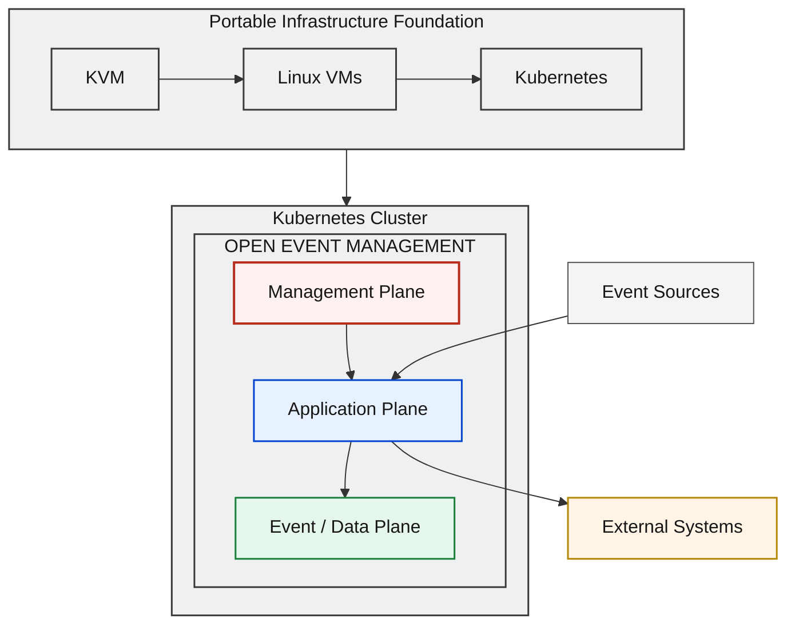
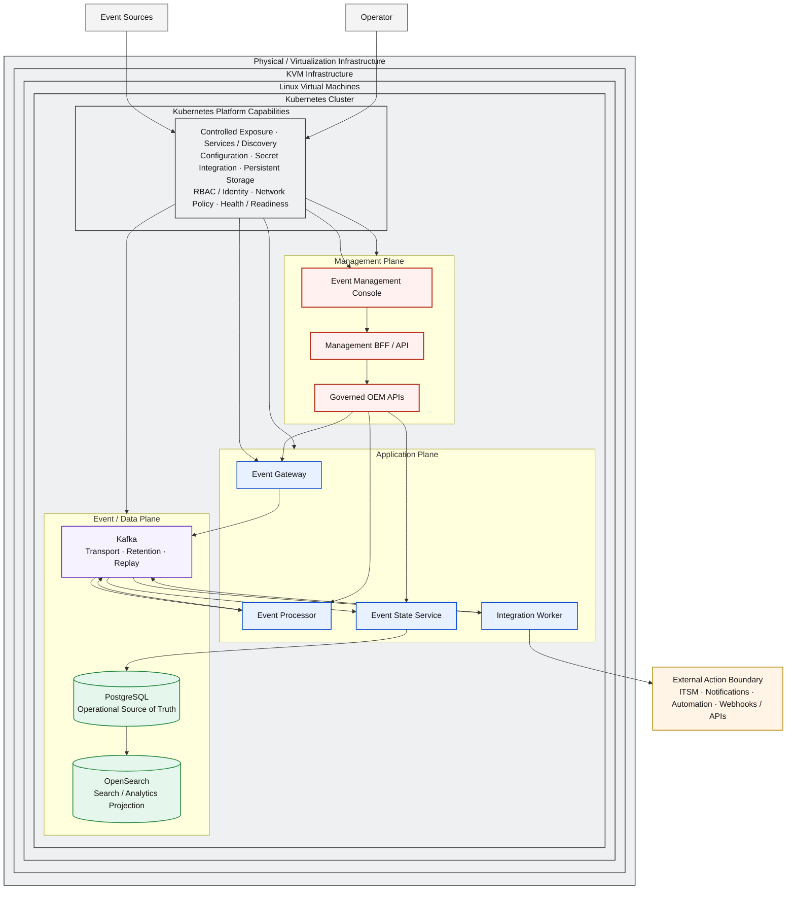

# D2 — KVM + Kubernetes Deployment Architecture

| Architecture lifecycle | Documentation status | Environment |
|---|---|---|
| `TARGET` | `DOCUMENTED` | KVM + Linux virtual machines + Kubernetes |

D2 maps the canonical OEM product architecture to a portable Kubernetes
orchestration layer. KVM provides virtualization, Linux virtual machines host
the Kubernetes cluster, and Kubernetes orchestrates OEM workloads without
changing product responsibilities, event contracts, or data authority.

**Predecessors:** [D0 logical architecture](d0-logical-current.md),
[D1 local deployment](d1-local-current.md), and
[D3 RHEL/on-prem](d3-rhel-current.md) as an alternative deployment profile.

**Consumer:** [D4 QA GKE](d4-qa-gke-minimum-target.md).

**Evolution record:** [Architecture Evolution Register](evolution/index.md).

## Architecture Overview

The deployment defines four distinct containment layers:

```text
Physical / Virtualization Infrastructure
  → KVM
  → Linux Virtual Machines
  → Kubernetes Cluster
  → OEM Workloads
```

Kubernetes is the workload orchestration abstraction, not the OEM product.
OEM preserves its Management, Application, and Event / Data planes inside the
cluster while Event Sources and External Systems remain outside its boundary.

## Solution Architecture



The infrastructure foundation remains visible but secondary to OEM. The same
workload and plane contract can be realized on another conforming Kubernetes
environment without coupling OEM to a specific cloud provider.

## Solution Flow

1. **Enter:** Event Sources reach the controlled cluster exposure boundary.
2. **Ingest:** Event Gateway validates, normalizes, and admits events.
3. **Transport:** Kafka carries canonical event contracts and provides replay boundaries.
4. **Process:** Event Processor applies policy, enrichment, correlation, suppression, and routing.
5. **Command:** Processor emits controlled integration intent.
6. **Execute:** Integration Worker invokes approved external adapters.
7. **Consolidate:** Event State Service assembles lifecycle, history, results, and state.
8. **Persist:** PostgreSQL records authoritative operational state.
9. **Project:** OpenSearch materializes search and analytics projections.
10. **Operate:** Operators use the Console and governed OEM APIs.

Kubernetes orchestrates workload placement and lifecycle. OEM services execute
the product behavior defined by D0.

## Engineering Architecture



The Engineering Architecture preserves KVM, Linux VM, Kubernetes, and OEM
workload layers as distinct containment boundaries. It expresses architecture
capabilities rather than manifest objects, replica counts, ports, or node roles.

## Infrastructure Layers

| Layer | Responsibility |
|---|---|
| Physical / Virtualization Infrastructure | Provides the enterprise compute and virtualization boundary. |
| KVM | Provides virtual machine isolation and lifecycle. |
| Linux Virtual Machines | Host the Kubernetes node runtime. |
| Kubernetes Cluster | Provides portable orchestration for OEM workloads and stateful services. |
| OEM Workloads | Execute the D0 Management, Application, and Event / Data responsibilities. |

These layers remain explicit. Kubernetes nodes are not assigned the Database,
Core, Gateway, or GUI roles defined by D3.

## OEM Workload Model

Event Gateway, Event Processor, Integration Worker, Event State Service, Event
Management Console, and Management BFF / API become independently managed
Kubernetes workload responsibilities. Kubernetes schedules and reconciles them;
their business behavior and ownership remain defined by D0.

D2 does not prescribe Deployment versus StatefulSet, replica counts, resource
limits, pod names, affinity rules, or scheduling topology. Those decisions
belong to implementation manifests and environment-specific design.

## Kubernetes Platform Capabilities

| Capability | Architecture contract |
|---|---|
| Workload scheduling | Places OEM workloads on eligible Linux VM nodes. |
| Service discovery | Provides stable internal discovery through platform services. |
| Desired-state reconciliation | Restores declared workload state through Kubernetes control loops. |
| Health-based management | Uses health and readiness signals to manage workload availability. |
| Configuration distribution | Supplies non-sensitive configuration through Kubernetes mechanisms. |
| Secret integration | Delivers approved secret references and values without defining the enterprise authority. |
| Persistent-storage attachment | Attaches persistent storage to stateful OEM services. |
| Network-policy enforcement | Restricts service connectivity according to approved policy. |
| Controlled exposure | Exposes only required event-ingestion and management interfaces. |

## Stateful Services

Kafka, PostgreSQL, and OpenSearch are stateful platform capabilities. Each
requires persistent storage, availability, backup and recovery, upgrade,
capacity-management, health, and observability strategies.

The architecture supports operator-managed stateful services. Operator
selection is an implementation decision behind the platform contract. Strimzi,
CloudNativePG, and OpenSearch Operator are implementation options rather than
required OEM architecture.

## Event Processing Flow

The canonical D0 event and management flow remains visible independently from
Kubernetes placement:

```mermaid
flowchart LR
  OP[Operator] --> ENTRY[Controlled Entry] --> CON[Event Management Console] --> BFF[Management BFF / API] --> APIS[Governed OEM APIs]
  SRC[Event Sources] --> ENTRY --> GATE[Event Gateway] -->|events.raw| K[Kafka]
  K -->|events.raw| EP[Event Processor]
  EP -->|integration.commands| K
  K -->|integration.commands| IW[Integration Worker] --> EXT[External Systems]
  IW -->|integration.results| K
  K -->|integration.results| ESS[Event State Service]
  ESS --> PG[(PostgreSQL<br/>Operational Source of Truth)]
  PG -->|authoritative projection| OS[(OpenSearch<br/>Search / Analytics Projection)]
  APIS --> GATE
  APIS --> EP
  APIS --> ESS

  classDef external fill:#f4f4f4,stroke:#525252,color:#161616,stroke-width:1px;
  classDef management fill:#fff1ef,stroke:#b72c1a,color:#161616,stroke-width:2px;
  classDef application fill:#e8f1ff,stroke:#0043ce,color:#161616,stroke-width:1.5px;
  classDef messaging fill:#f6f2ff,stroke:#6929c4,color:#161616,stroke-width:1.5px;
  classDef data fill:#e5f6ec,stroke:#198038,color:#161616,stroke-width:1.5px;
  classDef integration fill:#fff4e6,stroke:#b28600,color:#161616,stroke-width:1.5px;
  classDef infrastructure fill:#eef0f2,stroke:#393939,color:#161616,stroke-width:1.5px;

  class OP,SRC external;
  class CON,BFF,APIS management;
  class GATE,EP,IW,ESS application;
  class K messaging;
  class PG,OS data;
  class EXT integration;
  class ENTRY infrastructure;
```



Gateway ingests, Kafka transports, Processor decides, Worker executes, and ESS
consolidates lifecycle and state. Kubernetes placement does not obscure or
redefine that separation.

## Data Authority Model

| Service | Data responsibility |
|---|---|
| Kafka | Decoupled Event Transport and Replay Boundary; not authoritative state. |
| PostgreSQL | Operational Source of Truth for state, history, audit, and operational evidence. |
| OpenSearch | Search / Analytics Projection derived from authoritative state. |

Kubernetes storage mechanisms do not change these semantics. See
[Data Authority & Replay](data-authority-replay.md).

## Persistent Storage Model

Kubernetes Persistent Storage attaches durable capacity to Kafka, PostgreSQL,
and OpenSearch through conceptual Persistent Volume and Storage Class
abstractions. Persistent data lifecycle remains separate from workload-process
lifecycle.

D2 does not prescribe a storage vendor, disk class, volume size, filesystem, or
cloud-specific storage service. Environment architectures provide those
implementation details behind the portable storage contract.

## Management Model

```text
Operator
  → Controlled Entry / Ingress
  → Event Management Console
  → Management BFF / API
  → Governed OEM APIs
  → OEM Core
```

Operators do not manage OEM through direct access to Kafka, PostgreSQL,
OpenSearch, or Kubernetes nodes. Kubernetes operator access is controlled
separately through RBAC, workload and service identity boundaries, least
privilege, and approved administrative paths.

## Networking and Security

Controlled exposure routes event-ingestion traffic to Event Gateway and
management traffic to Console/BFF. Kubernetes Services provide internal service
discovery. NetworkPolicy capability constrains service-to-service connectivity,
and controlled egress permits approved integration actions.

Kafka, PostgreSQL, and OpenSearch remain internal stateful services. D2 does not
publish them to external networks or prescribe ports, CIDRs, ingress products,
or concrete network-policy rules.

## Configuration and Secrets

Non-sensitive configuration is distributed through Kubernetes configuration
mechanisms. Sensitive values reach workloads through an approved secret
integration and least-privilege identity boundary.

Kubernetes Secrets are not defined as the final enterprise secret-management
authority. The contract remains compatible with Vault, cloud secret managers,
and external secret integrations without requiring a specific provider.

## Observability

The platform exposes health, readiness, metrics, and logs for OEM workloads and
stateful services. These signals support orchestration, diagnosis, capacity
management, and operational review. D2 defines the capability contract without
selecting a monitoring or telemetry stack.

## Deployment Packaging

```text
OEM Release
  → Kubernetes Deployment Package
  → Kubernetes API
  → OEM Workloads
```

The deployment is declarative and versioned. Packaging can be implemented with
Helm, Kustomize, raw manifests, or operator-managed resources, but D2 does not
select one. **Packaging and release tooling is defined through a separate
architecture decision.**

## Architectural Principles

| Principle | Deployment rule |
|---|---|
| D0 Preservation | Kubernetes placement does not change product responsibilities or contracts. |
| Portable Orchestration | OEM workloads depend on Kubernetes capabilities rather than a specific cloud provider. |
| Declarative Runtime | Desired workload and platform state is expressed declaratively. |
| Workload Independence | Logical services remain independently managed workload responsibilities. |
| Service Discovery | Workloads communicate through stable platform service identities. |
| Stateful Persistence Separation | Persistent data lifecycle remains separate from workload-process lifecycle. |
| Controlled Exposure | Only required ingestion and management interfaces cross the cluster boundary. |
| Least Privilege | RBAC, workload identity, and network boundaries restrict access. |
| Environment Portability | Infrastructure implementations can change while OEM planes remain invariant. |
| Operator Neutrality | Stateful-service operator selection remains behind the platform contract. |

## Deployment Boundary

D2 defines KVM, Linux virtual machines, Kubernetes, and OEM workloads. It does
not define a GCP-specific foundation, a GKE-managed control plane, production
HA/DR topology, or CI/CD pipeline architecture. Those concerns belong to D4,
GCP, and D5 architectures.

## Relationship to D0

[D0](d0-logical-current.md) defines OEM logical behavior. D2 maps D0
responsibilities to Kubernetes-managed workloads without changing product
semantics, event contracts, management boundaries, or data authority.

## Relationship to D1 / D3

[D1](d1-local-current.md) uses Docker Compose for local orchestration on a
single Linux host. D2 uses Kubernetes for portable workload orchestration
across Linux virtual machines. Both preserve D0.

[D3](d3-rhel-current.md) assigns application responsibilities to explicit
enterprise VM roles. D2 uses Kubernetes as the workload-placement abstraction;
it does not impose D3 Database, Core, Gateway, or GUI roles on Kubernetes nodes.

## Relationship to D4

D2 defines the portable Kubernetes contract through KVM → Linux VMs →
Kubernetes → OEM. [D4](d4-qa-gke-minimum-target.md) consumes that contract
through GCP → GKE → OEM. OEM workloads and logical planes remain invariant;
the infrastructure implementation changes.

## Related Architectures

- [D0 — OEM Logical Architecture](d0-logical-current.md)
- [D1 — Local Deployment Architecture](d1-local-current.md)
- [D3 — On-Premises RHEL Deployment Architecture](d3-rhel-current.md)
- [D4 — QA GKE Minimum Deployment Architecture](d4-qa-gke-minimum-target.md)
- [Data Authority & Replay Boundary](data-authority-replay.md)
- [D2 KVM + Kubernetes Decision Context](evolution/d2-kvm-kubernetes-history.md)
- [Architecture Evolution Register](evolution/index.md)
