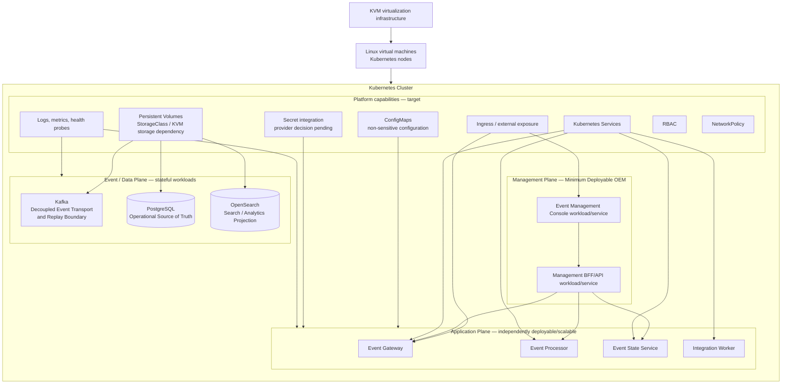
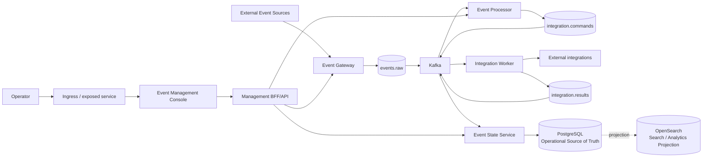

# D2 — DEV KVM + Kubernetes Deployment Architecture

| Architecture lifecycle | Documentation status | Environment |
|---|---|---|
| `TARGET` | Architecture definition | DEV KVM + Linux VMs + Kubernetes |

D2 defines a portable Kubernetes deployment model for OEM. It changes where and
how OEM executes, not what OEM is. This is not evidence of a deployed,
validated, certified or operational Kubernetes environment.

**Predecessors:** [D0 logical architecture](d0-logical-current.md),
[D1 local deployment](d1-local-current.md), and [D3 RHEL/on-prem](d3-rhel-current.md)
as alternative deployment experience.  
**Consumer:** future D4 QA GKE target.  
**Evolution record:** [Architecture Evolution Register](evolution/index.md).

## Deployment containment

The containment diagram expresses the target platform boundary. It does not
define manifests, node count, ingress controller, storage technology, CIDRs,
ports, replicas, autoscaling or firewall policy.

## Canonical event and management flow

The Console reaches supported OEM APIs through Management BFF/API only. It has
no direct connection to Kafka, PostgreSQL, OpenSearch or Kubernetes nodes.

## Minimum deployable D2

| Plane | Required target components |
|---|---|
| Management | Event Management Console, Management BFF/API |
| Application | Event Gateway, Event Processor, Integration Worker, Event State Service |
| Event/Data | Kafka, PostgreSQL, OpenSearch |
| Runtime | Kubernetes, Linux VMs, KVM |

Development-only mocks, Kafka UI, OpenSearch Dashboards, Open WebUI and E2E
utilities are not part of the minimum D2 deployment.

## Stateful workload considerations

Kafka, PostgreSQL and OpenSearch are stateful infrastructure/workloads. Each
requires persistent storage, recovery, backup, availability and upgrade
strategy before an implementation can be considered operational. StorageClass,
underlying KVM storage, capacity, IOPS, replication and RPO/RTO remain pending
infrastructure decisions.

Strimzi, CloudNativePG and OpenSearch Operator are `CANDIDATE / TARGET`
implementation approaches only; none is selected by D2.

## Networking, security, configuration and observability

- External sources reach Event Gateway through the Kubernetes exposure boundary.
- Operators reach Console/BFF through ingress or an exposed service.
- Internal workload communication uses Kubernetes Services; stateful workloads
  are not unnecessarily exposed externally.
- NetworkPolicy and RBAC are target security boundaries, not implemented claims.
- ConfigMaps hold non-sensitive configuration. Sensitive values require a
  vendor-neutral secret integration; plain Kubernetes Secrets are not selected
  as the final secret-management architecture.
- Logs, metrics and health/probe hooks are required capabilities. The monitoring
  implementation remains pending.

## Relationship to D1, D3 and D4

D1 uses Docker Compose on a Linux development host. D2 uses Kubernetes on Linux
VMs hosted by KVM; it does not claim that Compose definitions are directly
deployable to Kubernetes.

D3 remains an alternative RHEL/on-prem four-role VM architecture. D2 must not
schedule workloads to mimic Database/Core/Gateway/GUI roles.

D2 is intended to establish the portable Kubernetes model that D4 QA GKE will
consume: OEM workloads and logical planes remain invariant while infrastructure
implementation changes from KVM-hosted nodes to GKE-managed Kubernetes.

## Preserved conceptual material

The existing [IaC, GCP and Kubernetes](../deployment/iac-gcp-kubernetes.md)
page remains preserved as `HISTORICAL` conceptual material. It combines GCP,
CI/CD and Kubernetes concerns and is not the canonical D2 definition. D2 keeps
the KVM/Kubernetes target separate from GCP and from any implemented runtime
claim.

## Pending architecture decisions

- Kubernetes distribution/version, control-plane and worker topology.
- Storage, ingress, PKI/TLS and secret provider.
- Stateful operators, HA, backup/recovery and observability implementation.
- Deployment packaging mechanism: pending ADR; candidates include Helm,
  Kustomize, raw manifests and operator-managed resources.
