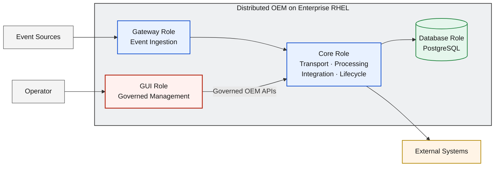
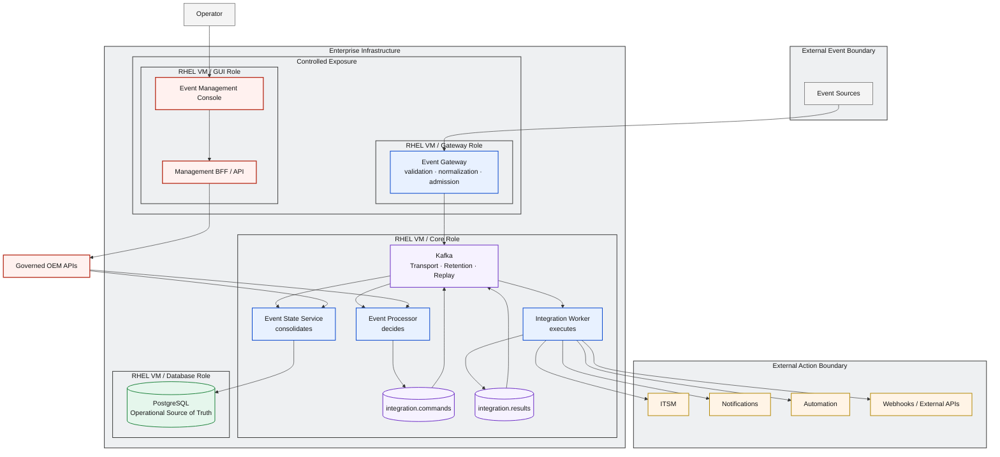
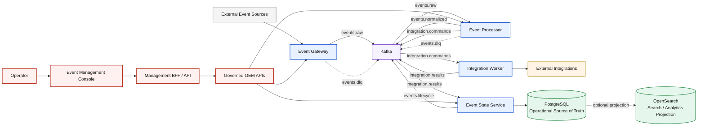
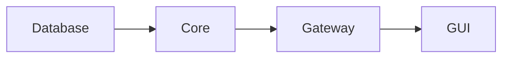
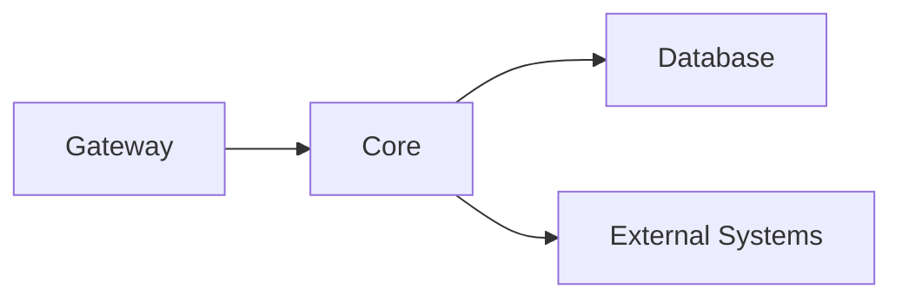
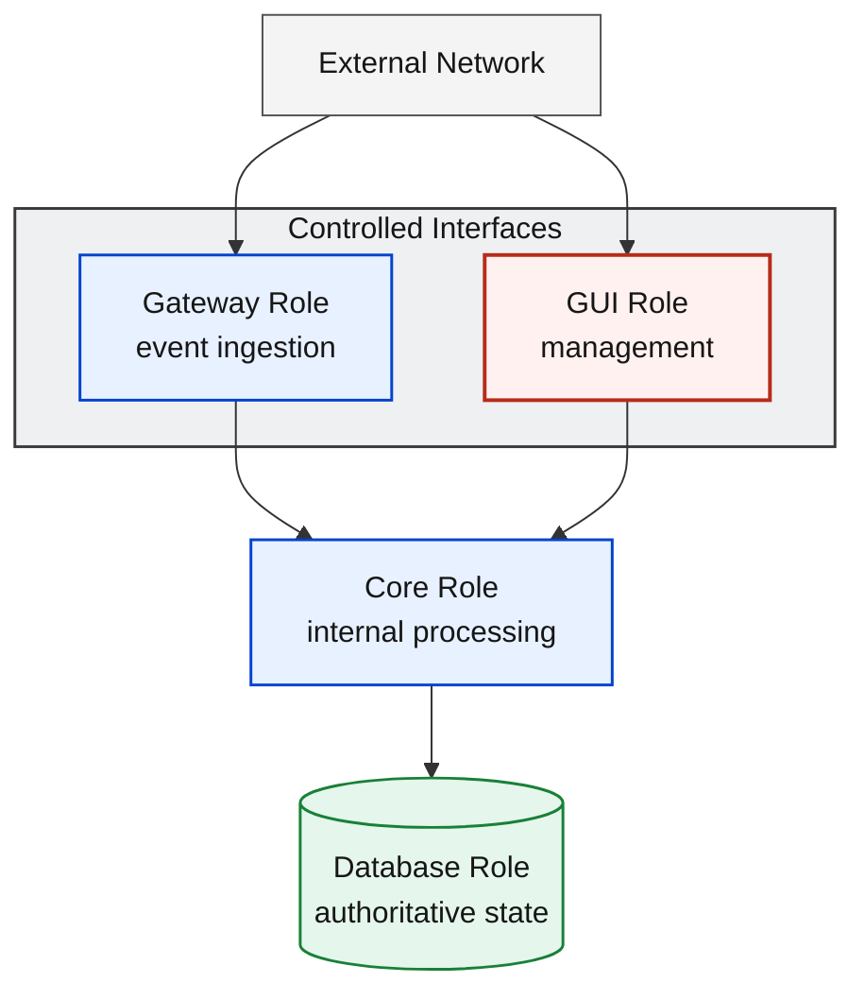

# D3 — On-Premises RHEL Deployment Architecture

| Architecture lifecycle | Documentation status | Environment |
|---|---|---|
| `CURRENT` | `DOCUMENTED` | Enterprise virtualization + RHEL virtual machines |

D3 maps the canonical OEM product architecture to a distributed enterprise
RHEL topology. The deployment defines four roles—Database, Core, Gateway, and
GUI—without changing the logical responsibilities, contracts, or authority
model established by D0.

**Predecessor:** [R79 historical evolution](evolution/d3-rhel-history.md).  
**Successor:** none; this is the current documented D3 profile.  
**Evolution record:** [Architecture Evolution Register](evolution/index.md).

## Architecture Overview

The deployment separates runtime responsibilities across dedicated RHEL virtual
machines. Role placement provides containment, controlled exposure, failure
isolation, and an operational lifecycle boundary for each part of OEM.

Deployment roles are not event-processing stages. The readiness dependency is
**Database → Core → Gateway → GUI**, while event traffic enters through Gateway,
is processed by Core, and is persisted through the Database Role.

## Solution Architecture



The Gateway Role is the controlled external event boundary. The Core Role owns
transport, processing, integration execution, and lifecycle consolidation. The
Database Role owns persistent operational state. The GUI Role provides governed
human management without direct access to runtime infrastructure or data stores.

## Solution Flow

1. **Receive:** Event Sources send events to the Gateway Role.
2. **Admit:** Event Gateway validates, normalizes, and admits canonical events.
3. **Transport:** Gateway publishes admitted events through Kafka.
4. **Process:** Event Processor consumes events and applies processing policy.
5. **Command:** Processor publishes controlled actions to `integration.commands`.
6. **Execute:** Integration Worker executes commands against External Systems.
7. **Result:** Integration Worker publishes outcomes to `integration.results`.
8. **Consolidate:** Event State Service processes lifecycle and result state.
9. **Persist:** Event State Service persists authoritative state in PostgreSQL.
10. **Operate:** Operators use the GUI Role and governed OEM APIs to manage OEM.

## Engineering Architecture



The engineering view shows distributed containment and logical relationships;
it does not prescribe hostnames, ports, IP addresses, firewall rules, or a
customer-specific network design.

## Canonical Event and Management Flow

The distributed RHEL placement does not replace the canonical D0 flow. This
logical view is preserved alongside role containment so that deployment
topology cannot be mistaken for product processing order.



The management path remains Operator → Console → Management BFF / API →
Governed OEM APIs → OEM Core. The Console has no direct connection to Kafka,
PostgreSQL, OpenSearch, or runtime hosts. OpenSearch remains the canonical
Search / Analytics Projection, attached optionally in the D3 operational
profile without changing PostgreSQL authority.

## Deployment Roles

| Role | Primary Components | Responsibility |
|---|---|---|
| Database | PostgreSQL | Provides the Operational Source of Truth and persistent operational state. |
| Core | Kafka, Event Processor, Integration Worker, Event State Service | Provides event transport, processing, integration execution, and lifecycle consolidation. |
| Gateway | Event Gateway | Exposes the controlled event-ingestion boundary and performs validation, normalization, and canonical admission. |
| GUI | Event Management Console, Management BFF / API | Provides human management and governed administration. |

## Runtime Flow

Runtime event flow follows the D0 service contract. Gateway admits events to
Kafka; Processor decides which controlled actions are required; Worker executes
those actions; and ESS consolidates lifecycle and result state before persisting
authoritative operational state in PostgreSQL.

The roles have a separate deployment and readiness dependency:



The primary event path is different:



**Deployment dependency is not event flow.** Dependency order establishes
which role capabilities must be ready for dependent roles; it does not redefine
the direction of event processing.

## Data Persistence Model

| Capability | Architectural responsibility |
|---|---|
| PostgreSQL | Operational Source of Truth for state, history, audit, and operational evidence. |
| Kafka | Decoupled event transport, retention, and replay boundary; not authoritative state. |
| Search / Analytics Projection | Optional attachable capability derived from authoritative state. |

Persistent operational state is independent from application-process lifecycle.
Restarting or replacing an application process does not transfer authority away
from PostgreSQL. See [Data Authority & Replay](data-authority-replay.md).

The D3 minimum operational profile does not require the Search / Analytics
Projection tier. OpenSearch can be attached as an optional platform capability
without changing the operational authority model. PostgreSQL remains the
Operational Source of Truth; OpenSearch remains a Search / Analytics Projection.

## Management Model

```text
Operator
  → Event Management Console
  → Management BFF / API
  → Governed OEM APIs
  → OEM Core
```

The GUI Role provides the controlled management interface. It has no direct
access to PostgreSQL, Kafka, or runtime hosts. Administrative behavior remains
behind the BFF and governed OEM API contracts.

## Network and Security Boundaries



Gateway exposes controlled event-ingestion interfaces. GUI exposes controlled
management interfaces. Core is an internal processing boundary, and Database is
an isolated authoritative-state boundary. Concrete firewall policy, ports, and
CIDRs belong to deployment and operations documentation.

## External Integration Model

Integration Worker executes controlled outbound actions toward ITSM,
Notifications, Automation, and Webhooks / External APIs. Responsibility remains
deliberately separated: **Processor decides, Worker executes, and ESS consolidates
result and lifecycle state**.

External systems do not become part of the OEM authority boundary. Outcomes
return through `integration.results` and are consolidated before authoritative
state is persisted.

## Deployment Packaging

```text
OEM Release
  → Enterprise / Offline Deployment Package
      ├── Database Role
      ├── Core Role
      ├── Gateway Role
      └── GUI Role
```

The package contains or references application artifacts, configuration
templates, role definitions, dependency metadata, validation, and version
metadata. D3 defines this architecture-level contract without prescribing a
specific archive name, packaging format, or installation command.

## Operational Lifecycle

Every deployment role follows a common lifecycle contract: **install, start,
stop, restart, status, health, validate, version, upgrade, rollback, and
uninstall**. Implementations must preserve role dependencies and persistent
state through these operations. Detailed commands and platform procedures
belong to operations runbooks.

## Architectural Principles

| Principle | Deployment rule |
|---|---|
| D0 Preservation | Distributed placement does not change logical ownership, contracts, or authority. |
| Distributed Responsibilities | Each RHEL role contains a distinct operational responsibility set. |
| Failure Isolation | Role boundaries limit failure propagation and support independent recovery. |
| Controlled Exposure | Only Gateway and GUI expose controlled external interfaces. |
| Operational State Protection | PostgreSQL authority and persistent state remain independent from application processes. |
| API-First Management | Operators use Console, BFF, and governed OEM APIs. |
| Search/Analytics Modularity | Projection capability can attach without changing operational authority. |
| Enterprise Deployability | Packaging and lifecycle contracts support controlled enterprise and offline operation. |
| Vendor-Neutral Core | Logical OEM responsibilities do not depend on a customer-specific infrastructure product. |

## Deployment Boundary

D3 defines enterprise virtualization, RHEL virtual machines, and distributed OEM
roles. It does not define Kubernetes orchestration. Kubernetes-based deployment
is defined separately by D2.

## Relationship to D0

[D0](d0-logical-current.md) defines logical product responsibilities. D3 maps
those responsibilities to distributed enterprise deployment roles. No logical
responsibility, Management Plane contract, event flow, or authority model changes.

## Relationship to D1 / D2

[D1](d1-local-current.md) is a single-host containerized local deployment. D3
is a distributed enterprise VM deployment. Both implement the same D0 product
contract through deployment profiles intended for different environments; D3
is not simply a later version of D1.

[D2](d2-kvm-kubernetes-target.md) replaces direct VM-role placement with a
portable orchestration abstraction: KVM → Linux VMs → Kubernetes → OEM
workloads. D3 and D2 are alternative deployment architectures; neither is
inherently superior.

## Related Architectures

- [D0 — OEM Logical Architecture](d0-logical-current.md)
- [D1 — Local Deployment Architecture](d1-local-current.md)
- [D2 — DEV KVM + Kubernetes](d2-kvm-kubernetes-target.md)
- [Data Authority & Replay Boundary](data-authority-replay.md)
- [D3 RHEL / On-Prem Architecture History](evolution/d3-rhel-history.md)
- [Architecture Evolution Register](evolution/index.md)
