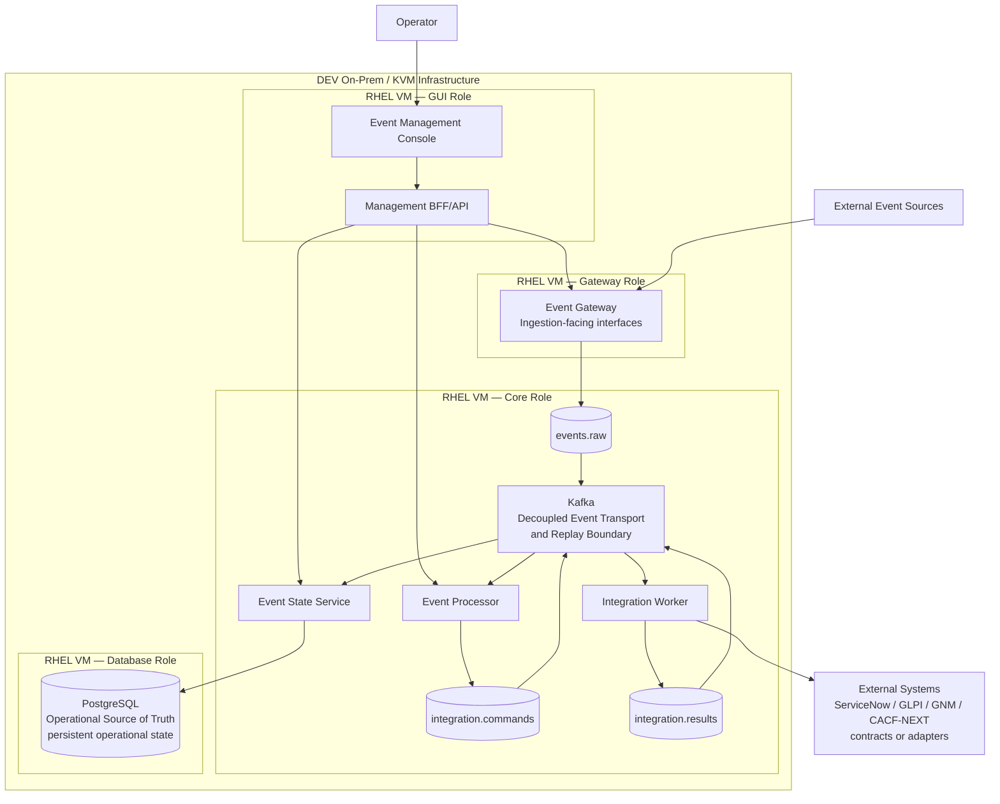
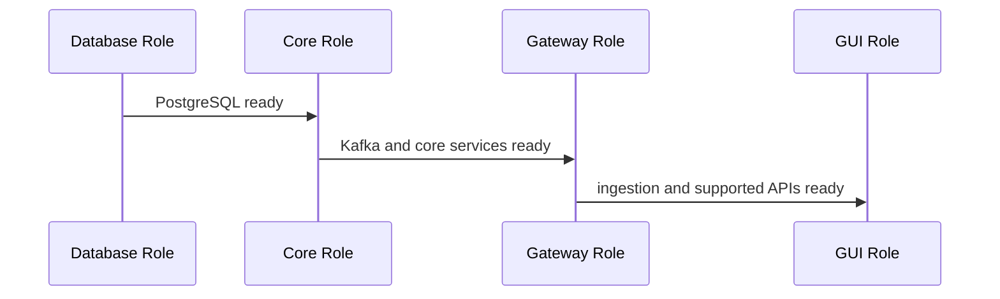

# D3 — DEV RHEL / On-Prem Deployment Architecture

| Architecture lifecycle | Documentation status | Environment |
|---|---|---|
| `CURRENT` | `PROJECT-PROVIDED BASELINE` | DEV RHEL 7.9 / on-prem KVM |

This page synchronizes the project-provided D3 deployment baseline into the
Wiki. It does not assert a currently live runtime, and it does not silently
convert project-provided evidence into repository-verified evidence.

**Predecessor:** [R79 historical evolution](evolution/d3-rhel-history.md).  
**Successor:** none; this is the current documented D3 profile.  
**Evolution record:** [Architecture Evolution Register](evolution/index.md).

## Evidence classification

| Evidence class | What is established |
|---|---|
| `PROJECT-PROVIDED BASELINE` | RHEL 7.9 / KVM profile, four deployment roles, OpenSearch exclusion, offline bundle baseline and DEV-BOOT-01 report. |
| `REPOSITORY-VERIFIED` | The canonical D0 and D1 contracts linked from this page; no attributable RHEL bundle, branch, manifest, log or checkpoint record is present in the currently accessible repository baseline. |

## Deployment topology

The arrows above describe event and management flow. They are not startup or
firewall rules.

## Startup and readiness sequence

The documented dependency order is **Database → Core → Gateway → GUI**.
Shutdown follows the reverse dependency order where applicable. This is a
project-provided baseline; it is not evidence of a current systemd unit or
runtime execution.

## Minimum deployable OEM architecture in D3

| Plane | D3 components |
|---|---|
| Management | Event Management Console and Management BFF/API |
| Application | Event Gateway, Event Processor, Integration Worker and Event State Service |
| Event/Data | Kafka and PostgreSQL |
| Infrastructure | RHEL VM roles: Database, Core, Gateway and GUI |

The Management Plane is mandatory. Console traffic reaches supported OEM APIs
through Management BFF/API; it does not directly access PostgreSQL, Kafka or
runtime hosts. Mocks and diagnostic UIs are not minimum D3 components.

## D3 data profile variation

PostgreSQL remains the **Operational Source of Truth** and Kafka remains the
**Decoupled Event Transport + Replay Boundary**.

**OpenSearch is not deployed in this D3 profile.** OpenSearch remains part of
the OEM logical architecture as the search/analytics projection capability, but
the current D3 RHEL/on-prem deployment profile intentionally operates without
an OpenSearch deployment. This does not make PostgreSQL a search engine or
change D0; it is a D3 capability limitation.

See [D0 logical architecture](d0-logical-current.md) and [Data Authority &
Replay](data-authority-replay.md) for the cross-environment contract.

## Network, security and operations boundary

Application ports and firewall policy are separate concerns. No port number in
this page is a validated RHEL firewall rule. The following concerns are
documented for D3, but their implementation state has not been independently
verified from this repository:

| Concern | Status | Evidence class |
|---|---|---|
| RHEL VM role model | `CURRENT` | `PROJECT-PROVIDED BASELINE` |
| SELinux, firewalld and TLS | `UNKNOWN` | Historical project-provided concern; no repository artifact verified |
| Secrets, filesystem, systemd and logging | `UNKNOWN` | Historical project-provided concern; no repository artifact verified |
| Backup/restore boundary | `CURRENT` (`DOCUMENTED`) | PostgreSQL role is the operational data boundary; implementation evidence is `UNKNOWN` |
| Container runtime | `UNKNOWN` | Requires evidence or an architecture decision; Docker and Podman are not assumed |

## Offline deployment and certification baseline

The architecture workstream supplies an offline deployment package baseline:
`oem-onprem-rhel79-8cd94384.tar.gz`, approximately 865 MiB, associated with
branch `onprem-rhel79` and commit
`8cd94384b99c78314647d1e28428077be0e58588`.

Its stated architectural purpose is offline RHEL deployment. Its manifest,
contents, checksums, timestamps and logs have **not** been inspected from this
repository; the package is therefore `PROJECT-PROVIDED BASELINE`, not
`REPOSITORY-VERIFIED`.

The same baseline reports checkpoint `DEV-BOOT-01`: healthy PostgreSQL, Kafka,
Processor, Worker, ESS, Gateway and GUI; HTTP ingestion `202`; and an ESS
`OPEN` event with severity `4`. This is recorded as project-provided reporting,
not as a runtime claim made by this Wiki.

## D3 is not D2

D3 is a RHEL VM/on-prem deployment profile. It does not include Kubernetes or
Helm. D2 remains a separate KVM + Kubernetes architecture to be documented and
decided independently.
