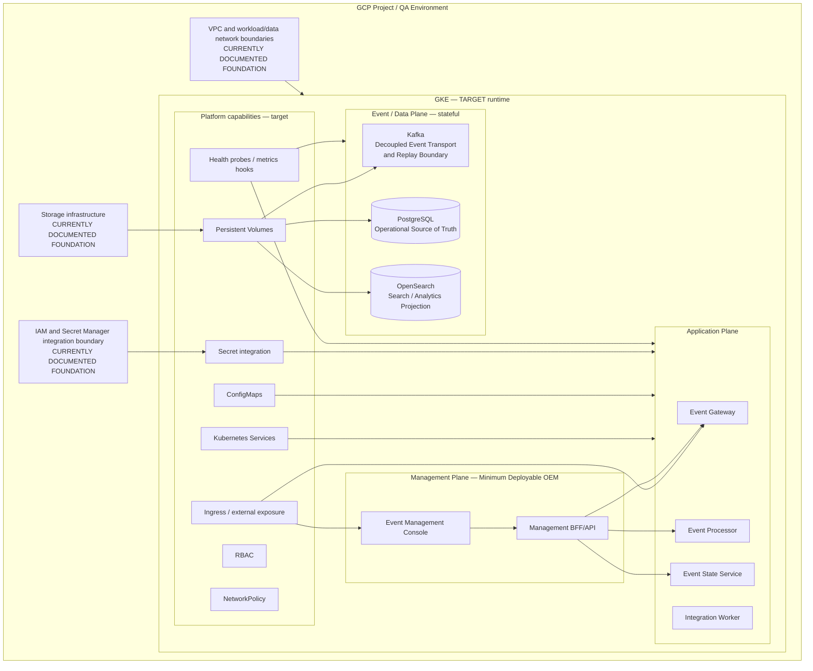

# D4 — QA GKE Minimum Deployment Architecture

| Architecture lifecycle | Documentation status | Environment |
|---|---|---|
| `TARGET` | GCP foundation `CURRENTLY DOCUMENTED`; GKE runtime target | QA GCP / GKE |

D4 is the minimum QA cloud deployment intended to validate OEM's portable
Kubernetes model in GKE. It is not a production architecture, CI/CD design,
complete AIOps/AI architecture, full DR plan, final HA design or full SRE
implementation.

**Predecessors:** [D0 logical architecture](d0-logical-current.md),
[D1 local deployment](d1-local-current.md), and
[D2 KVM + Kubernetes target](d2-kvm-kubernetes-target.md).  
**Alternative profile:** [D3 RHEL/on-prem](d3-rhel-current.md).  
**Evolution record:** [Architecture Evolution Register](evolution/index.md).

## D2 → D4 portability

```text
D2: KVM → Linux VMs → Kubernetes → OEM
                         │ portability
                         ▼
D4: GCP → GKE-managed Kubernetes → OEM
```

The infrastructure provider, control-plane responsibility, storage, networking,
ingress and identity integration change. OEM logical architecture, Management
Plane, service responsibilities, topics, PostgreSQL authority, OpenSearch
projection and API boundaries remain invariant.

## GCP/GKE containment



The presence of Terraform definitions does not prove that a GCP resource exists.
The diagram does not prescribe a cluster name, GKE version, node count, machine
type, regional/zonal mode, replicas, autoscaling thresholds, CIDRs or CI/CD.

## Minimum QA deployment

| Plane | Required D4 target components |
|---|---|
| Management | Event Management Console, Management BFF/API |
| Application | Event Gateway, Event Processor, Integration Worker, Event State Service |
| Event/Data | Kafka, PostgreSQL, OpenSearch |
| Runtime | GKE, Kubernetes and required network/storage/identity abstractions |

Development-only tooling is not part of D4. The Console reaches supported OEM
APIs through Management BFF/API only, never directly through Kafka, PostgreSQL,
OpenSearch or GKE nodes.

## Event, data and stateful services

The D0 event contract remains unchanged: sources reach Gateway through an
exposure boundary; Kafka transports events; Processor and Worker perform their
separate responsibilities; ESS consolidates state in PostgreSQL; and PostgreSQL
projects searchable/analytic state to OpenSearch.

Kafka, PostgreSQL and OpenSearch are stateful requirements. Persistent storage,
recovery, backup, availability and upgrade strategy are required before an
implementation is operational. Strimzi, CloudNativePG and OpenSearch Operator
remain `CANDIDATE / TARGET`; no operator is selected.

## QA minimum principle

D4 is intended to prove portable Kubernetes deployment, basic GKE integration,
the OEM minimum runtime, Management Plane, event flow, persistence and search
projection. It does not require production HA, full CI/CD, full AIOps, full DR
or advanced SRE automation.

## AIOps / AI scope boundary

OpenSearch belongs to D4 because it supplies the Search / Analytics Projection.
Deploying OpenSearch does not deploy AIOps or AI. LLM/OLLM, RAG/retrieval,
agents, model providers, inference, AI governance and AI observability are
outside D4 minimum scope and are registered as future work in the
[Future Architecture Register](evolution/future-architecture-register.md).

## Pending architecture decisions

- GKE cluster mode/version, node topology, storage, ingress and PKI/TLS.
- Identity integration, secret provider, NetworkPolicy/RBAC details.
- Stateful availability, backup/recovery and observability implementation.
- Deployment packaging remains pending ADR; Helm is not a D4 dependency.
- GCP + CI/CD and D5B are separate future architectures.
