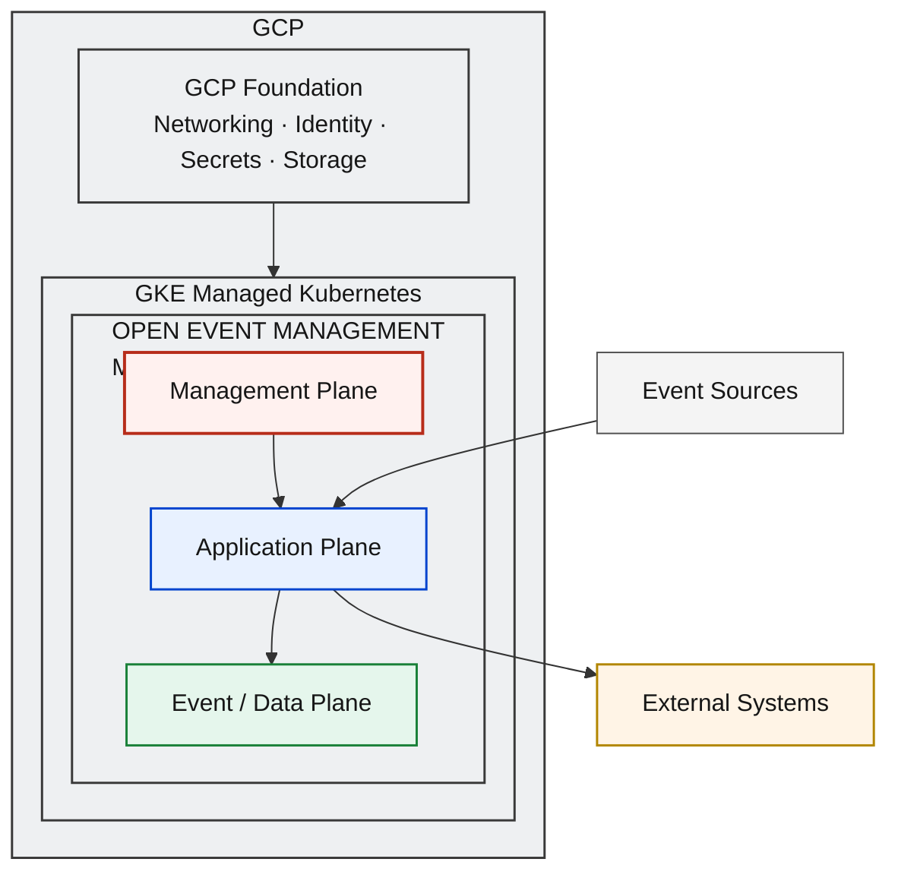
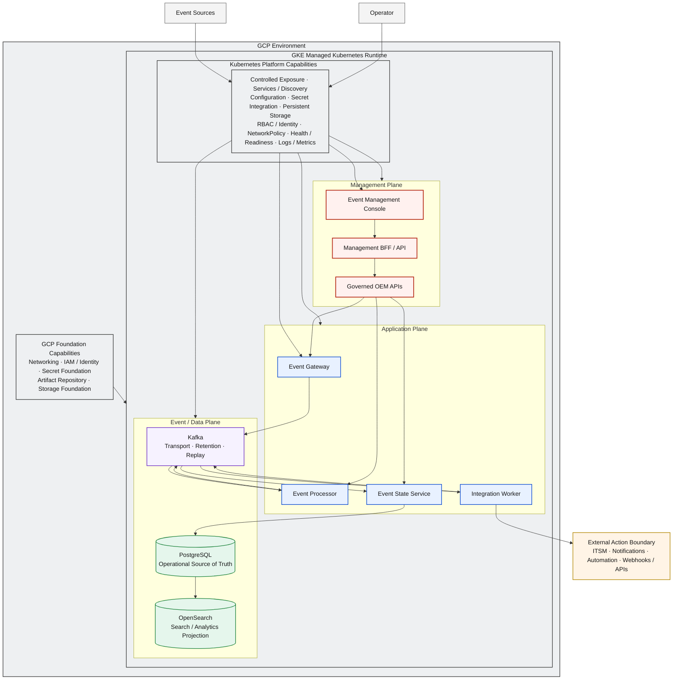

# D4 — QA GKE Minimum Deployment Architecture

| Architecture lifecycle | Documentation status | Environment |
|---|---|---|
| `TARGET` | `DOCUMENTED` | QA on GCP / GKE |

D4 defines the minimum OEM Kubernetes runtime on Google Kubernetes Engine for
QA validation. It consumes the portable Kubernetes contract defined by D2 while
GKE provides the managed Kubernetes runtime. OEM product responsibilities,
workloads, event contracts, management boundaries, and data authority remain
invariant.

**Predecessors:** [D0 logical architecture](d0-logical-current.md) and
[D2 KVM + Kubernetes](d2-kvm-kubernetes-target.md).

**Foundation:** [GCP-01 OEM GCP Foundation](gcp-foundation-current.md).

**Production successor:** [D5A Production GKE Runtime](d5a-prod-gke-runtime-target.md).

**Evolution record:** [Architecture Evolution Register](evolution/index.md).

## Architecture Overview

D4 transforms the infrastructure implementation of D2 while preserving its OEM
and Kubernetes workload contracts:

```text
D2: KVM → Linux VMs → Kubernetes → OEM
                         │ portability
                         ▼
D4: GCP → GKE → Kubernetes → OEM
```

GKE replaces the self-managed Kubernetes infrastructure of D2. The QA
deployment contains the same Management, Application, and Event / Data planes
and validates them through a cloud-managed Kubernetes environment.

## Solution Architecture



OEM remains the product. GCP Foundation supports the environment, and GKE
provides the runtime. Event Sources and External Systems remain outside the OEM
boundary. CI/CD is deliberately absent from this runtime view.

## Solution Flow

1. **Enter:** Event Sources reach the controlled GKE exposure boundary.
2. **Ingest:** Event Gateway validates, normalizes, and admits events.
3. **Transport:** Kafka carries canonical event contracts and provides replay boundaries.
4. **Process:** Event Processor applies policy, enrichment, correlation, suppression, and routing.
5. **Command:** Processor emits controlled integration intent.
6. **Execute:** Integration Worker invokes approved external adapters.
7. **Consolidate:** Event State Service assembles lifecycle, history, results, and state.
8. **Persist:** PostgreSQL records authoritative operational state.
9. **Project:** OpenSearch materializes search and analytics projections.
10. **Validate / Operate:** QA operators validate runtime behavior through the Console and governed OEM APIs.

GKE orchestrates workload lifecycle. OEM services execute the product behavior
defined by D0.

## Engineering Architecture



The Engineering Architecture shows the GCP Foundation as a supporting boundary
without reproducing GCP-01. GKE contains the portable Kubernetes and OEM
contracts; cluster mode, version, node topology, replicas, ports, and concrete
cloud resource design remain outside this architecture view.

## GCP Foundation Relationship

D4 consumes networking, IAM and identity, secret foundation, artifact
repository capability, and storage foundation from GCP-01. Those capabilities
support the GKE runtime but remain separately owned.

**Foundation is not runtime.** GCP-01 answers which cloud capabilities support
OEM. D4 answers how OEM runs on GKE for QA. VPC topology, subnet definitions,
service-account design, Terraform workflow, and bucket architecture remain in
GCP-01.

## GKE Runtime Model

GKE provides managed Kubernetes control-plane capability, workload scheduling,
service discovery, health reconciliation, network integration,
persistent-storage integration, identity integration, and controlled exposure.

D4 does not prescribe GKE mode, Kubernetes version, node count, machine type,
regional or zonal topology, or autoscaling configuration. Those choices belong
to environment implementation and operational design.

## OEM Workload Model

Event Management Console, Management BFF / API, Event Gateway, Event Processor,
Integration Worker, and Event State Service preserve the workload
responsibilities defined by D2. QA validates the same OEM product; it introduces
no QA-specific application semantics.

Kubernetes manages placement and lifecycle while D0 continues to own component
behavior and contracts.

## Kubernetes Platform Capabilities

| Capability | D4 architecture contract |
|---|---|
| Controlled Exposure / Ingress | Routes required event-ingestion and management interfaces into GKE. |
| Services / Discovery | Provides stable internal identities for OEM workloads. |
| Configuration | Distributes externalized non-sensitive configuration. |
| Secret Integration | Injects approved secrets through the GCP-compatible security boundary. |
| Persistent Storage | Attaches durable capacity to stateful services. |
| RBAC / Identity | Enforces least-privilege workload and operator boundaries. |
| NetworkPolicy | Constrains service connectivity and supports controlled egress. |
| Health / Readiness | Supplies orchestration signals for workloads and stateful services. |
| Logs / Metrics | Exposes QA observability signals without defining production SLO monitoring. |

## Stateful Services

Kafka, PostgreSQL, and OpenSearch remain stateful platform capabilities. Each
requires persistent storage, health, capacity, recovery, and upgrade strategies.
D4 defines this minimum contract without expanding into the production HA/DR
design owned by D5A.

Stateful-service implementation and operator selection remain behind the D2
platform contract.

## Event Processing Flow

The canonical D0 event and management flow remains visible independently from
GKE placement:

```mermaid
flowchart LR
  OP[Operator] --> ENTRY[Controlled Entry] --> CON[Event Management Console] --> BFF[Management BFF / API] --> APIS[Governed OEM APIs]
  SRC[Event Sources] --> ENTRY --> GATE[Event Gateway] -->|events.raw| K[Kafka]
  K -->|events.raw| EP[Event Processor]
  EP -->|integration.commands| K
  K -->|integration.commands| IW[Integration Worker] --> EXT[External Systems]
  IW -->|integration.results| K
  K -->|integration.results| ESS[Event State Service]
  ESS --> PG[(PostgreSQL<br/>Operational Source of Truth)]
  PG -->|authoritative projection| OS[(OpenSearch<br/>Search / Analytics Projection)]
  APIS --> GATE
  APIS --> EP
  APIS --> ESS

  classDef external fill:#f4f4f4,stroke:#525252,color:#161616,stroke-width:1px;
  classDef management fill:#fff1ef,stroke:#b72c1a,color:#161616,stroke-width:2px;
  classDef application fill:#e8f1ff,stroke:#0043ce,color:#161616,stroke-width:1.5px;
  classDef messaging fill:#f6f2ff,stroke:#6929c4,color:#161616,stroke-width:1.5px;
  classDef data fill:#e5f6ec,stroke:#198038,color:#161616,stroke-width:1.5px;
  classDef integration fill:#fff4e6,stroke:#b28600,color:#161616,stroke-width:1.5px;
  classDef infrastructure fill:#eef0f2,stroke:#393939,color:#161616,stroke-width:1.5px;

  class OP,SRC external;
  class CON,BFF,APIS management;
  class GATE,EP,IW,ESS application;
  class K messaging;
  class PG,OS data;
  class EXT integration;
  class ENTRY infrastructure;
```



GKE orchestrates the flow's workloads; it does not redefine Gateway, Processor,
Worker, ESS, Kafka, PostgreSQL, or OpenSearch responsibilities.

## Data Authority Model

| Service | Data responsibility |
|---|---|
| Kafka | Decoupled Event Transport and Replay Boundary; not authoritative state. |
| PostgreSQL | Operational Source of Truth for state, history, audit, and operational evidence. |
| OpenSearch | Search / Analytics Projection derived from authoritative state. |

GKE storage integration does not change these semantics. See
[Data Authority & Replay](data-authority-replay.md).

## Management Model

```text
Operator
  → Controlled Entry
  → Event Management Console
  → Management BFF / API
  → Governed OEM APIs
  → OEM Core
```

Operators do not manage OEM through direct access to Kafka, PostgreSQL,
OpenSearch, or GKE nodes. Governed APIs and Kubernetes identity boundaries
separate product management from infrastructure administration.

## Networking and Security

External Event Sources reach Event Gateway through controlled exposure.
Operators reach the Management Plane through a separately governed entry path.
Kubernetes Services provide internal discovery among application and stateful
services. Integration Worker uses controlled egress for external actions.

Kafka, PostgreSQL, and OpenSearch remain internal. NetworkPolicy capability,
RBAC, workload identity, and GCP network integration enforce approved
boundaries without prescribing CIDRs, firewall rules, or concrete ingress
products.

## Configuration and Secrets

Configuration remains externalized and is distributed through Kubernetes
configuration mechanisms. Sensitive values are injected through an approved
secret integration compatible with the GCP Secret Manager foundation boundary.

D4 does not hardcode secret values, make Kubernetes Secrets the enterprise
authority, or duplicate the GCP-01 secret architecture.

## QA Validation Boundary

D4 provides the minimum environment for validating:

| QA responsibility | Architecture evidence boundary |
|---|---|
| Deployment portability | D2 workload contract deploys through GKE abstractions. |
| Kubernetes workload behavior | Scheduling, reconciliation, discovery, and health signals operate through GKE. |
| Service connectivity | Controlled exposure and internal Services connect approved paths. |
| Event processing | Gateway, Kafka, Processor, Worker, and ESS preserve canonical responsibilities. |
| Management access | Console, BFF, and governed APIs provide the operator path. |
| State persistence | Stateful storage supports Kafka, PostgreSQL, and OpenSearch lifecycles. |
| Search projection | PostgreSQL-authoritative state projects to OpenSearch. |
| Integration behavior | Worker reaches approved external systems through controlled egress. |
| Configuration and secrets | Externalized configuration and approved secret integration reach workloads. |
| Health and readiness | Workload and stateful-service signals support QA runtime validation. |

D4 is deliberately scoped as a minimum QA runtime. D5A extends the same OEM
and GKE contracts with production availability, resilience, capacity, recovery,
security hardening, operability, and production observability qualities.

## CI/CD Boundary

D4 can consume deployable artifacts, but its primary architecture does not
contain the GCP-02 delivery pipeline. Git, Cloud Build, Artifact Registry
lifecycle, Release Manifest, promotion, and deployment authorization belong to
[GCP-02](gcp-cicd-current.md) and D5B.

Runtime architecture and delivery architecture remain independently reviewable.

## AI / AIOps Boundary

D4 does not depend on AI-01. OpenSearch belongs to D4 as the Search / Analytics
Projection, not as an AI runtime. AI-01 can attach to compatible OEM
environments only through governed interfaces and its separately defined
architecture.

## Architectural Principles

| Principle | Deployment rule |
|---|---|
| D0 Preservation | GKE placement does not change product responsibilities or contracts. |
| D2 Portability | D4 consumes the portable Kubernetes workload model without redefining it. |
| Managed Kubernetes | GKE provides the Kubernetes runtime while OEM remains the product. |
| Minimum QA Runtime | D4 contains the capabilities required for QA validation of OEM on GKE. |
| Environment Parity | QA exercises the same OEM planes and workload responsibilities used by later environments. |
| Stateful Persistence | Persistent state lifecycle remains distinct from workload-process lifecycle. |
| Controlled Exposure | Only required ingestion and management interfaces cross the runtime boundary. |
| API-First Management | Operators use Console, BFF, and governed OEM APIs. |
| Cloud Foundation Separation | GCP-01 capabilities support but do not become the D4 runtime definition. |
| CI/CD Separation | Delivery pipelines and promotion remain outside the D4 runtime boundary. |
| AI Independence | Search projection does not make AI a dependency of the QA runtime. |

## Deployment Boundary

D4 defines GCP, GKE, the minimum OEM Kubernetes runtime, and QA validation
responsibilities. It does not define full production topology, production
HA/DR, delivery-pipeline architecture, or AI architecture. Those concerns
belong to D5A, GCP-02/D5B, and AI-01 respectively.

## Relationship to D0

[D0](d0-logical-current.md) defines OEM product semantics. D4 deploys those
semantics on GKE without changing logical responsibilities, event contracts,
management boundaries, or data authority.

## Relationship to D2

[D2](d2-kvm-kubernetes-target.md) defines KVM → Linux VMs → Kubernetes → OEM.
D4 defines GCP → GKE → OEM. OEM workloads, planes, event contracts, management
contracts, and data authority remain invariant; infrastructure implementation
is the variable.

## Relationship to GCP-01

[GCP-01](gcp-foundation-current.md) provides the cloud foundation consumed by
D4. Foundation and runtime remain separate: GCP-01 defines supporting cloud
capabilities, while D4 defines OEM execution on GKE for QA.

## Relationship to D5A

[D5A](d5a-prod-gke-runtime-target.md) extends the D4 GKE runtime model with
production operating qualities. It preserves the same OEM application and GKE
contracts; no application redesign is implied.

## Related Architectures

- [D0 — OEM Logical Architecture](d0-logical-current.md)
- [D2 — KVM + Kubernetes Deployment Architecture](d2-kvm-kubernetes-target.md)
- [GCP-01 — OEM GCP Foundation Architecture](gcp-foundation-current.md)
- [GCP-02 — OEM GCP Build, Delivery & CI/CD Architecture](gcp-cicd-current.md)
- [D5A — Production GKE Runtime Architecture](d5a-prod-gke-runtime-target.md)
- [AI-01 — OEM AIOps / AI Architecture](ai-01-aiops-ai-architecture.md)
- [Data Authority & Replay Boundary](data-authority-replay.md)
- [D4 QA GKE Evolution Context](evolution/d4-qa-gke-history.md)
- [Architecture Evolution Register](evolution/index.md)
