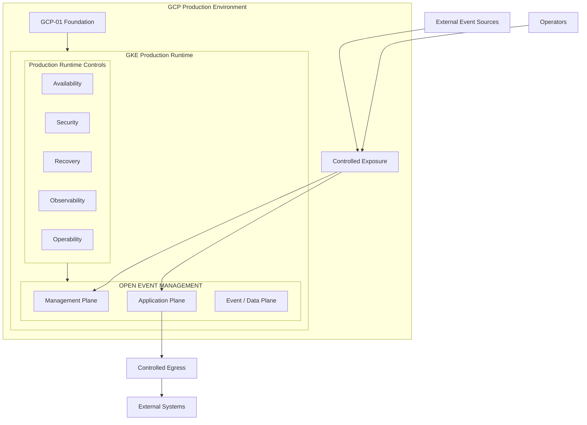
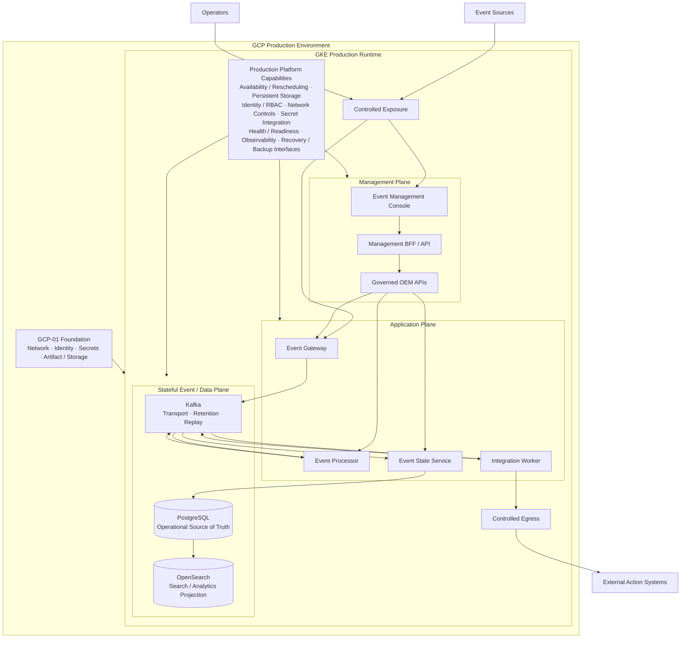
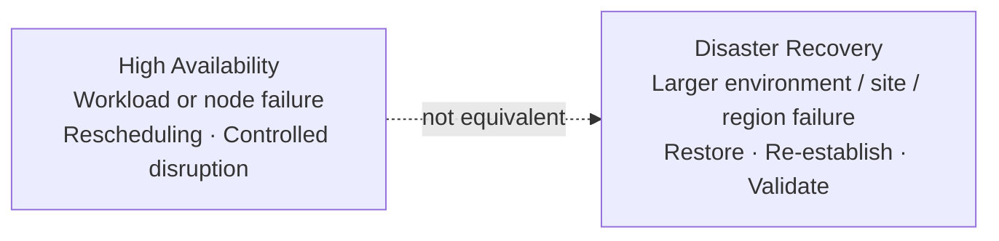
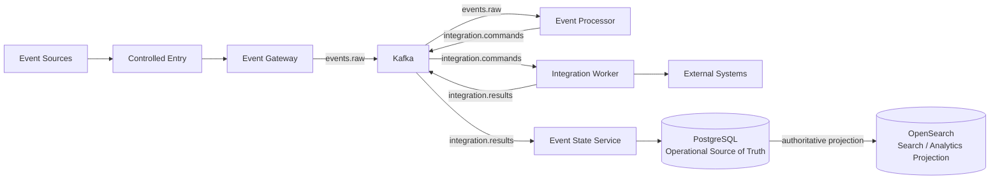

# D5A — Production GKE Runtime Architecture

## Architecture Overview

D5A defines the production operating architecture for Open Event Management on Google Kubernetes Engine. It preserves the D0 logical responsibilities, the D2 Kubernetes contract and the D4 workload model while adding the availability, resilience, security, operability, recovery, observability, capacity and controlled-change qualities required by a production platform.

D5A consumes the [GCP-01 foundation](gcp-foundation-current.md). It intentionally excludes the GCP-02 build and delivery architecture; D5B composes that separate delivery contract with this unchanged production runtime.

## Solution Architecture



OEM remains the product running on GKE. The same Management, Application and Event / Data planes used by D4 remain inside the runtime. Production controls surround those planes; they are platform qualities rather than additional OEM business services. GCP-02 remains outside this view.

## Production Runtime Qualities

| Quality | Production architecture responsibility |
|---|---|
| Availability | Health-aware scheduling, workload replacement, controlled disruption and service-specific continuity. |
| Resilience | Failure isolation and recovery behavior appropriate to each workload role. |
| Security | Controlled exposure, identity, RBAC, network controls, secret integration and auditability. |
| Operability | Consistent status, startup, shutdown, diagnostics, upgrade and rollback interfaces. |
| Recovery | Authority-aware backup, restore, replay and projection-rebuild boundaries. |
| Observability | Health, metrics, logs, traces where applicable, audit and capacity signals. |
| Capacity | Governed compute, storage, throughput, retention and concurrency planning. |
| Controlled Change | Compatibility validation, controlled rollout, health verification and rollback decision. |

## Engineering Architecture



The production foundation supports the GKE runtime without becoming the runtime. GKE contains the OEM workload and stateful contracts. No replica count, zone topology, autoscaling threshold, storage class, stateful operator or concrete ingress product is selected by this architecture.

## D4 → D5A Evolution

| Concern | D4 — QA GKE Minimum | D5A — Production GKE Runtime |
|---|---|---|
| Architectural question | Can OEM run and be validated correctly on GKE? | How does OEM operate safely and sustainably on production GKE? |
| OEM Core | Preserved | Preserved |
| Event and management contracts | Preserved | Preserved |
| Kubernetes workload model | Minimum portable runtime | Same model with production operating qualities |
| Runtime qualities | QA validation boundary | Availability, resilience, security, operability, recovery, observability, capacity and controlled change |

This evolution adds production qualities around unchanged OEM responsibilities; it is not a redesign of OEM or a simple increase in replica counts.

## Application Plane

Event Gateway, Event Processor, Integration Worker and Event State Service remain independently operable responsibilities. Each supports health/readiness, resource governance, controlled rollout, failure isolation, role-appropriate scaling and diagnostic visibility. D5A does not prescribe replica counts or autoscaling thresholds.

## Stateful Services

Kafka, PostgreSQL and OpenSearch are critical stateful capabilities, not ordinary stateless image replacements. Each requires persistent storage, an availability strategy, capacity management, health monitoring, applicable backup/recovery, an upgrade strategy and integrity protection.

## Data Authority and Recovery

| Capability | Authority | Recovery concern |
|---|---|---|
| Kafka | Decoupled Event Transport and Replay Boundary | Retention, stream continuity and replay of retained events |
| PostgreSQL | Operational Source of Truth | Backup, restore, consistency, integrity, recovery objectives and schema compatibility |
| OpenSearch | Search / Analytics Projection | Rebuild, reconciliation and search-projection recovery |

Kafka replay does not replace PostgreSQL backup. OpenSearch recovery does not restore PostgreSQL authority. PostgreSQL receives the strongest integrity and recovery treatment; business RPO/RTO values require separate operational decisions.

## Availability Model

Production workloads support health-aware scheduling, readiness/liveness signals, workload replacement, node-failure recovery, controlled disruptions and independent service scaling where appropriate. Each stateful service applies its own continuity strategy. D5A does not prescribe exact replicas, zones or topology.

## HA vs DR



High Availability provides continuity within the runtime's designed failure domains. Disaster Recovery restores service after a larger environment, site or region failure. **HA ≠ DR.** D5A defines the production runtime requirements and recovery boundary but does not imply automatic regional failover or select a complete DR architecture.

## Network Exposure Model

External event sources reach only the controlled Event Gateway exposure. Operators reach only the controlled Management Plane entry. Integration Worker reaches external action systems through controlled egress. Kafka, PostgreSQL, OpenSearch and internal application endpoints remain private to approved runtime paths.

## Identity and Access

D5A consumes foundation identities from GCP-01 and requires workload identity, Kubernetes RBAC, least privilege, service-specific permissions, separation of runtime and administrative access, and auditable actions. Concrete GCP IAM bindings remain a foundation and implementation concern.

## Secret Management

The runtime consumes the GCP-01 secret-management boundary through approved secret injection or integration. Secret payloads do not appear in Git, images, Wiki pages, release metadata or plain committed configuration. D5A does not select a mechanism beyond the approved foundation/runtime contract.

## Observability

The production runtime exposes service health and readiness, metrics, logs, traces where applicable, Kafka lag and transport health, PostgreSQL health, OpenSearch health, integration execution, audit events and resource/capacity signals. The architecture does not prescribe an observability vendor.

## Operability

Production services expose consistent status, health, version, configuration validation, controlled startup and shutdown, diagnostics, upgrade, rollback and recovery interfaces or procedures. Detailed operating commands remain in service runbooks.

## Capacity Model

Capacity engineering covers event-ingestion rate, Kafka throughput and retention, processing concurrency, integration concurrency, PostgreSQL growth, OpenSearch index growth, persistent storage and compute. D5A establishes capacity as a runtime responsibility without inventing sizing values.

## Controlled Change

```text
Approved Runtime Change
  → Compatibility Validation
  → Controlled Rollout
  → Health Verification
  → Accept or Roll Back
```

D5A defines the runtime capabilities required for safe change. GCP-02 and D5B own delivery automation; this view does not introduce a CI/CD implementation.

## Management Model

```text
Operator
  → Controlled Entry
  → Event Management Console
  → Management BFF / API
  → Governed OEM APIs
  → OEM Core
```

The Console never accesses Kafka, PostgreSQL, OpenSearch or Kubernetes nodes directly. Governed APIs separate product management from infrastructure administration.

## Event Processing Flow



Production qualities surround this canonical D0 behavior; they do not replace or redesign Gateway, Processor, Worker, ESS, Kafka, PostgreSQL or OpenSearch responsibilities.

## Multi-Surface Readiness

The production runtime supports GUI, CLI/API and future AIOps/AI interaction through governed OEM interfaces. No interaction surface receives direct authority over internal stores. See [Multi-Surface Interaction Architecture](multi-surface-interaction.md).

## AI / AIOps Boundary

D5A operates fully without AI. AI-01 remains an optional, separate architecture that accesses OEM through governed interfaces. OpenSearch remains the Search / Analytics Projection and a potential retrieval/context attachment point; it is not intelligence or an authoritative store.

## CI/CD Boundary

D5A excludes Terraform delivery workflow, Cloud Build pipeline, artifact promotion, Release Manifest workflow and Continuous Delivery executor. Those responsibilities belong to [GCP-02](gcp-cicd-current.md). [D5B](d5b-prod-gke-cicd-target.md) composes D5A with GCP-02.

## Architectural Principles

| Principle | Architectural consequence |
|---|---|
| D0 Preservation | Production deployment does not change OEM logical responsibilities or contracts. |
| Production Runtime Isolation | Runtime workloads and state remain inside controlled GKE boundaries. |
| Availability by Design | Workloads expose health and recovery signals appropriate to their role. |
| Stateful Integrity | Kafka, PostgreSQL and OpenSearch receive service-specific storage and upgrade treatment. |
| Authority-Aware Recovery | PostgreSQL restore, Kafka replay and OpenSearch rebuild remain distinct. |
| Controlled Exposure | Only approved ingestion, management and egress paths cross the runtime boundary. |
| Least Privilege | Human, workload and administrative access remains purpose-specific. |
| Secret Externalization | Runtime receives approved secret references or injected values, never source-embedded payloads. |
| Observable Operations | Health, activity, failure and capacity signals remain reviewable. |
| Capacity Awareness | Throughput, concurrency, growth, retention, storage and compute are engineered explicitly. |
| Controlled Change | Compatibility, rollout, verification and rollback are separate governed stages. |
| Runtime / Delivery Separation | D5A remains independent from GCP-02 delivery automation. |
| AI Independence | The production runtime operates without an AI/AIOps dependency. |

## Production Runtime Boundary

D5A defines the GKE production runtime, OEM workloads, stateful runtime and production operating qualities. It does not define CI/CD implementation, Git workflow, artifact build, promotion automation, full AI architecture or business-specific DR objectives.

## Relationship to D0

[D0](d0-logical-current.md) remains the source of OEM component responsibilities, event contracts, management contracts and data authority. D5A changes placement and operating qualities, not product semantics.

## Relationship to D4

[D4](d4-qa-gke-minimum-target.md) establishes the minimum QA GKE runtime and portable workload contract. D5A retains that workload model and adds production operating qualities.

## Relationship to GCP-01

[GCP-01](gcp-foundation-current.md) supplies network, identity, secret, artifact and storage foundation capabilities. D5A consumes the relevant capabilities while retaining runtime ownership. Foundation is not runtime.

## Relationship to GCP-02 / D5B

D5A is the Production Runtime. [GCP-02](gcp-cicd-current.md) is Build and Delivery. [D5B](d5b-prod-gke-cicd-target.md) is their composition: **D5A + GCP-02 = D5B**.

## Related Architectures

- [D0 — OEM Logical Architecture](d0-logical-current.md)
- [D2 — KVM + Kubernetes Deployment Architecture](d2-kvm-kubernetes-target.md)
- [D4 — QA GKE Minimum Deployment Architecture](d4-qa-gke-minimum-target.md)
- [GCP-01 — OEM GCP Foundation Architecture](gcp-foundation-current.md)
- [GCP-02 — Build, Delivery & CI/CD Architecture](gcp-cicd-current.md)
- [D5B — PROD GKE + CI/CD Architecture](d5b-prod-gke-cicd-target.md)
- [Data Authority & Replay Boundary](data-authority-replay.md)
- [D5 production evolution context](evolution/d5-prod-gke-history.md)
