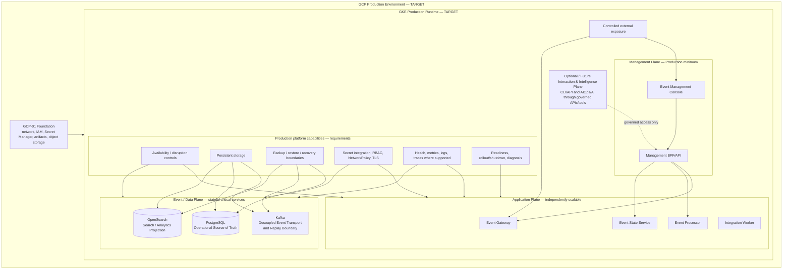

# D5A — PROD GKE Runtime Architecture

| Architecture lifecycle | Evidence status | Environment |
|---|---|---|
| `TARGET` | Production runtime definition; no runtime evidence claimed | PROD GCP / GKE |

D5A defines the production GKE runtime independently from CI/CD. It is not D4 with more replicas: it introduces availability, resilience, security, recovery, operability, capacity, isolation, controlled exposure and observability requirements without prescribing implementation or sizing.

**Composition:** D0 + D2 + D4 + [GCP-01 Foundation](gcp-foundation-current.md).  
**Future extension:** D5B adds [GCP-02 Build, Delivery & CI/CD](gcp-cicd-current.md).  
**Evolution record:** [Architecture Evolution Register](evolution/index.md).

## Production containment



This diagram contains no Git pipeline, Cloud Build, Terraform automation, release promotion or CI/CD flow. Those are D5B/GCP-02 concerns.

## Production minimum and interaction boundary

| Plane | D5A target requirement |
|---|---|
| Management | Event Management Console and Management BFF/API |
| Application | Event Gateway, Event Processor, Integration Worker, Event State Service |
| Event/Data | Kafka, PostgreSQL and OpenSearch |
| Platform | GKE/Kubernetes, controlled exposure, persistent storage, secret integration, RBAC, NetworkPolicy and observability hooks |

The Management Plane is mandatory. Console reaches supported OEM APIs through BFF/API and never directly accesses Kafka, PostgreSQL, OpenSearch or Kubernetes nodes. CLI/API and optional future AIOps/AI remain governed interaction surfaces over the API-first OEM Core; no surface receives direct store authority.

## Production qualities

Application workloads require independent scaling capability, health/readiness, controlled rollout, resource policies and failure isolation. No replica count, autoscaling threshold, zone count or topology is selected.

Kafka, PostgreSQL and OpenSearch are stateful critical capabilities. Persistent storage, availability, integrity, recovery, backup/restore, upgrade, capacity management and monitoring require explicit production decisions. Strimzi, CloudNativePG and OpenSearch Operator remain `CANDIDATE / TARGET`, not approved implementation choices.

## Availability and disaster recovery

**High Availability (HA)** is continuity within production runtime failure domains: workload/node failure, disruption controls, readiness/liveness and stateful availability strategy.

**Disaster Recovery (DR)** is recovery from a larger environment, site or region failure. D5A requires HA architecture; full DR remains a separate supporting architecture. HA and DR are not interchangeable. Failure domains to address include node, workload, stateful service, zone/failure domain and external-integration failure. No automatic DR is claimed.

## Networking, security and secrets

External event sources use controlled Gateway exposure. Operators use controlled Management Plane exposure. Integration Worker needs controlled outbound connectivity to external providers. Kafka, PostgreSQL and OpenSearch must not be publicly exposed.

GCP-01 supplies foundation IAM and Secret Manager boundaries. D5A requires workload identity, RBAC, NetworkPolicy, TLS, least privilege, auditability and approved secret injection, but does not select an implementation. Secret payloads must not reside in Git, Wiki, release manifests, images or plain configuration.

## Observability, operability and recovery

D5A requires health, metrics, logs, traces where supported, Kafka lag, database/OpenSearch health, application and integration health, and audit events. It also requires status, startup/readiness, controlled shutdown, version/configuration validation, upgrade/rollback and incident diagnosis capabilities.

PostgreSQL authoritative state requires backup/restore strategy. Kafka replay/retention does not replace PostgreSQL backup. OpenSearch projection needs rebuild/reconciliation strategy and its backup is not PostgreSQL recovery.

## D4 → D5A evolution

```text
D4 QA GKE Minimum
  + availability, resilience, security, operability, recovery,
    production observability
  → D5A PROD GKE
```

D4 validates minimum portability; D5A introduces production qualities. This is not a simple promotion of identical configuration.

## Boundaries and pending decisions

AI-01 remains separate; OpenSearch is a projection and future retrieval/context attachment, not an AIOps deployment. Helm remains a pending ADR.

Pending decisions include GKE regional/multi-zone topology, stateful operators, storage classes/capacity, RPO/RTO, backup/restore, PKI/TLS, workload identity, ingress/load balancing, NetworkPolicy, observability, HA, DR and packaging.
