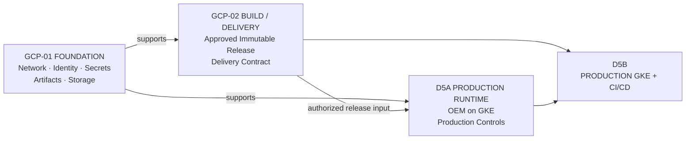
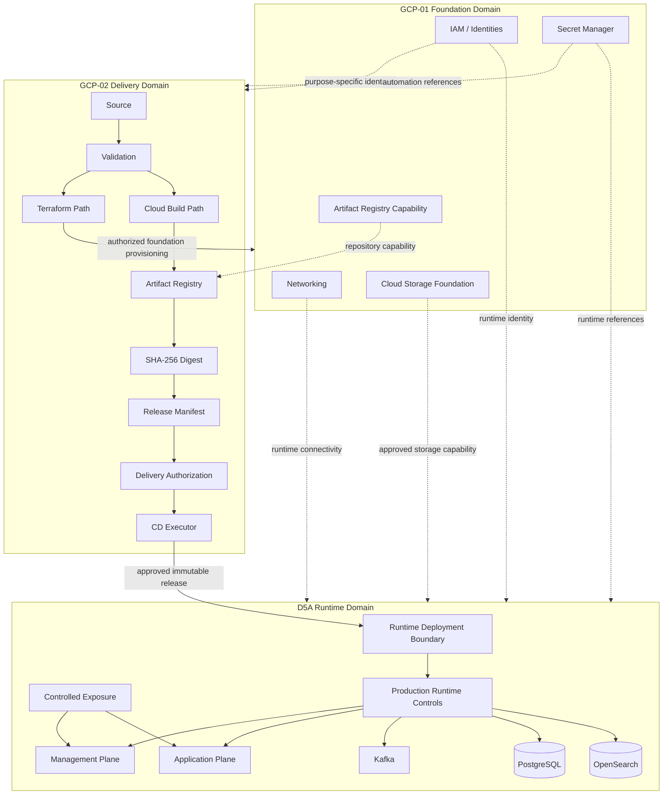
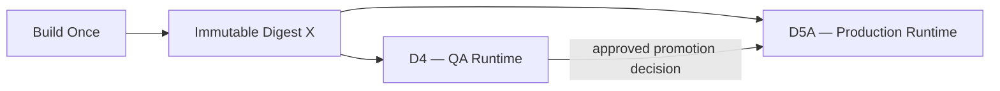
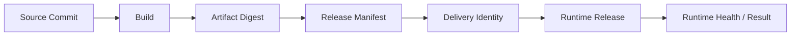

# D5B — Production GKE + CI/CD Composition Architecture

## Architecture Overview

D5B composes three independently governed architecture domains into an integrated OEM production platform: GCP-01 supplies the cloud foundation, D5A defines the production GKE runtime, and GCP-02 defines governed build and delivery. Composition connects their approved interfaces without redefining their internal contracts.

The production runtime consumes only authorized, immutable release inputs. Foundation, Delivery and Runtime remain separately reviewable even when they operate as the D5B composition.

## Composition Model

```text
GCP-01 Foundation
  + D5A Production Runtime
  + GCP-02 Build / Delivery
  = D5B Production GKE + CI/CD
```

| Domain | Source architecture | Composed responsibility |
|---|---|---|
| Foundation | GCP-01 | Network, identity, secrets, artifact repository and object-storage capabilities |
| Runtime | D5A | OEM on production GKE with production operating qualities |
| Delivery | GCP-02 | Infrastructure automation, application build, immutable release and authorized delivery |

## Solution Architecture



GCP-01 supports both domains without becoming either one. GCP-02 produces an approved immutable release and authorized delivery input. D5A consumes that input through its runtime boundary. The combined relationship is D5B.

## Production Release Flow

1. **Define:** version infrastructure definitions and application source.
2. **Validate:** evaluate infrastructure, application and policy inputs.
3. **Build:** produce the application artifact; provision infrastructure through the separate Terraform lane where applicable.
4. **Identify:** resolve the immutable SHA-256 digest.
5. **Describe:** create the governed Release Manifest.
6. **Authorize:** validate release policy and the delivery identity.
7. **Deliver:** cross the controlled Delivery → Runtime boundary.
8. **Start / Roll Out:** apply the release through the selected runtime mechanism.
9. **Verify Health:** evaluate runtime health, metrics, logs and audit evidence.
10. **Accept or Roll Back:** retain the release or authorize a compatible previous release.

## Engineering Architecture



The three domains retain independent failure, authorization and ownership boundaries. Their interfaces are foundation capability consumption, controlled infrastructure provisioning, secret references and the authorized immutable release entering D5A.

## Foundation Domain

[GCP-01](gcp-foundation-current.md) owns the network, IAM and service-identity, Secret Manager, Artifact Registry and Cloud Storage foundations. GCP-02 consumes delivery capabilities and D5A consumes runtime capabilities. Foundation is neither Delivery nor Runtime.

## Delivery Domain

[GCP-02](gcp-cicd-current.md) owns the infrastructure-delivery lane, application build, Artifact Registry lifecycle, immutable digest, Release Manifest, authorization, promotion, rollback contract and traceability. It supplies release inputs; it does not own D5A runtime behavior.

## Runtime Domain

[D5A](d5a-prod-gke-runtime-target.md) owns controlled exposure, Management Plane, Application Plane, Kafka, PostgreSQL, OpenSearch and production runtime controls. It consumes an authorized release without transferring availability, recovery, security, observability or operability responsibility to the delivery domain.

## Delivery → Runtime Contract

```text
Approved Source
  → Build
  → Immutable Digest
  → Release Manifest
  → Delivery Authorization
  → Runtime Deployment Boundary
  → D5A Production Runtime
```

The runtime accepts only approved release inputs. GCP-02 controls the release contract and delivery authorization; D5A controls rollout behavior, workload health and runtime acceptance.

## Artifact Identity

The SHA-256 digest remains the immutable deployment identity. Mutable tags, branch names, environment labels and build numbers remain descriptive metadata. D5B follows **build once, promote the same immutable artifact** and introduces no environment-specific rebuild semantics.

## Release Manifest

The Release Manifest records release metadata, provenance, health and dependency expectations, configuration references and logical secret references. It contains no secret payloads, does not execute deployment, does not replace runtime configuration and does not itself authorize delivery.

## Environment Configuration

```text
Immutable Application Artifact
  + Environment Configuration
  + Secret References
  + Runtime Policy
  = Environment Release
```

QA and production differences are supplied through governed configuration, secret references and policy rather than rebuilt application images.

## Identity Chain

Human/Developer, Cloud Build, Continuous Delivery Executor and Runtime Workload identities remain distinct trust boundaries. Terraform Deployment Identity is a separate infrastructure actor. No identity implicitly inherits the responsibilities or permissions of another.

## Secret Flow

Secret Manager supplies separately authorized automation and runtime references. Secret payloads do not pass through Git, Cloud Build artifacts, the Release Manifest, container images or Wiki documentation. Runtime resolution and injection remain D5A security integration responsibilities.

## Deployment Authorization

Artifact availability is not deployment authorization. Delivery proceeds only when the immutable artifact exists, the release contract is valid, applicable policy authorizes the action and the Continuous Delivery Executor has the required purpose-specific authority.

## Promotion Model



The same digest can progress from QA validation to production selection. D5B preserves this cross-environment principle without claiming that promotion is automated.

## Controlled Change

An approved release crosses the authorized delivery boundary, enters a controlled rollout, undergoes runtime health verification and is then accepted or rolled back. This composes the GCP-02 delivery contract with the D5A controlled-change contract without selecting a new deployment technology.

## Rollback Model

Rollback selects a previous approved immutable release and performs a newly authorized delivery after validating runtime, configuration, database and stateful-service compatibility. Rollback is not a mutable tag switch, and automated safety is not implied.

## Database Migration Boundary

PostgreSQL remains the Operational Source of Truth. Production release sequencing accounts for application change, database migration, forward/backward/restore compatibility and rollback constraints. D5B does not select a migration engine or equate application rollback with database rollback.

## Stateful Upgrade Boundary

Kafka, PostgreSQL and OpenSearch retain D5A service-specific availability, compatibility, backup, recovery, integrity and upgrade requirements. Delivery automation must not treat them as ordinary stateless application-image replacements.

## Observability and Release Feedback

Release identity follows the runtime deployment and is correlated with health, metrics, logs and audit evidence. Runtime verification provides the feedback used to accept or roll back the release. This feedback path does not require AI/AIOps.

## Auditability



End-to-end lineage makes the source, build, artifact, contract, delivery actor, runtime release and verification result reviewable without prescribing a specific audit backend.

## Failure Domain Separation

| Failure domain | Independent concern |
|---|---|
| Foundation | Network, identity, secret, artifact or storage capability |
| Build | Validation or artifact-production failure |
| Artifact storage | Availability or integrity of the repository capability |
| Authorization | Invalid contract, policy or actor permissions |
| Delivery | Failure crossing the runtime deployment boundary |
| Runtime | Rollout, workload health or platform failure |
| Stateful services | Compatibility, integrity, availability or recovery failure |
| External integrations | Provider or controlled-egress failure |

Composition preserves these boundaries so one failure is not misclassified as another.

## AI / AIOps Boundary

AI-01 remains optional and separate. AI is not required to build, authorize, deliver or operate the minimum production platform. Future AIOps may consume release and runtime telemetry only through governed interfaces.

## Architectural Principles

| Principle | Architectural consequence |
|---|---|
| Architecture Composition | D5B connects approved interfaces instead of redefining source architectures. |
| Foundation / Delivery / Runtime Separation | GCP-01, GCP-02 and D5A retain independent ownership. |
| Build Once | QA and production can consume the same immutable artifact. |
| Immutable Artifact Identity | A SHA-256 digest identifies exact deployable content. |
| Controlled Authorization | Artifact existence never implies permission to deploy. |
| Identity Separation | Human, Terraform, build, delivery and runtime identities remain distinct. |
| Secret Externalization | Delivery and runtime consume references rather than secret payloads. |
| Environment Configuration Separation | Environment policy and configuration do not require image rebuilds. |
| Traceable Releases | Commit-to-runtime lineage and result remain attributable. |
| Controlled Change | Authorization, rollout, verification and acceptance remain distinct stages. |
| Authority-Aware Rollback | Runtime and data compatibility govern rollback safety. |
| Stateful Upgrade Awareness | Stateful capabilities retain service-specific change strategies. |
| Observable Delivery | Release verification combines delivery identity with runtime signals. |
| AI Independence | Production delivery and operation require no AI dependency. |

## Composition Boundary

D5B defines the composition of GCP Foundation, Production GKE Runtime, Build/Delivery and their controlled release interaction. It does not redefine OEM business logic, GCP foundation internals, D5A runtime internals, GCP-02 supply-chain internals or AI/AIOps architecture.

## Relationship to GCP-01

GCP-01 supplies foundation capabilities to Delivery and Runtime. D5B consumes those capabilities without turning GCP-01 into a pipeline or runtime.

## Relationship to GCP-02

GCP-02 supplies infrastructure automation, immutable release inputs, authorization, promotion, rollback and traceability contracts. D5B does not alter those contracts.

## Relationship to D5A

D5A supplies the production GKE runtime and owns rollout behavior, runtime health, data authority and production operating qualities. D5B does not alter those responsibilities.

## Relationship to D4

[D4](d4-qa-gke-minimum-target.md) provides QA runtime validation. The same immutable digest can be validated by D4 and, after an approved promotion decision, delivered to D5A. D5B defines the production composition around that release model.

## Related Architectures

- [GCP-01 — OEM GCP Foundation Architecture](gcp-foundation-current.md)
- [GCP-02 — Build, Delivery & CI/CD Architecture](gcp-cicd-current.md)
- [D5A — Production GKE Runtime Architecture](d5a-prod-gke-runtime-target.md)
- [D4 — QA GKE Minimum Deployment Architecture](d4-qa-gke-minimum-target.md)
- [D0 — OEM Logical Architecture](d0-logical-current.md)
- [Data Authority & Replay Boundary](data-authority-replay.md)
- [D5 production evolution context](evolution/d5-prod-gke-history.md)
- [Architecture Evolution Register](evolution/index.md)
