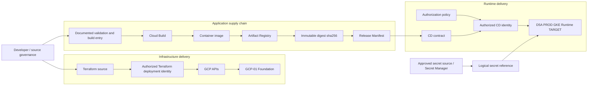

# D5B — PROD GKE + CI/CD Architecture

| Architecture lifecycle | Documentation status | Environment |
|---|---|---|
| `TARGET` | Delivery composition based on currently documented contracts | PROD GCP / GKE |

D5B composes the [D5A production GKE runtime](d5a-prod-gke-runtime-target.md) with the [GCP-02 build, delivery and CI/CD architecture](gcp-cicd-current.md). It is a target delivery model, not evidence that a production cluster, pipeline or deployment controller is operating. D5B does not redefine D5A runtime ownership, data authority or production qualities; it makes the delivery boundary to that runtime reviewable.

## Composition and delivery path

The diagram separates four domains: source and governance, infrastructure delivery, the application supply chain, and runtime delivery. Terraform provisions only the documented infrastructure boundary through its own authorized identity; it neither builds application images nor turns Terraform manifests into application artifacts. Cloud Build produces application artifacts but does not itself authorize or execute a runtime deployment. The [GCP-01 foundation](gcp-foundation-current.md) remains the cloud foundation attachment, while D5A remains the runtime destination.

## Source and governance boundary

Source, commit identity, branch or release governance, review and approval remain governed where they are documented. D5B does not introduce a new branch policy, approval product or release workflow. Human/developer identity is distinct from automation identities and must not be reused as deployment credentials.

## Infrastructure delivery

Terraform source is evaluated and applied only through an authorized Terraform deployment identity to the applicable GCP APIs and GCP-01 foundation. This path represents infrastructure delivery, not an application build or runtime deployment. Its authorization, least-privilege permissions and change controls remain requirements of the target model; D5B does not claim they have been executed.

## Application supply chain and artifact identity

The supported target path is source to documented validation/build entry, Cloud Build, container image, Artifact Registry, immutable `sha256` digest, and Release Manifest. The digest is the immutable deployment identity. Tags such as `latest`, a branch name, environment name or build number can be descriptive metadata, but they are not the deployment identity.

An artifact existing in Artifact Registry is not an authorized deployment. The artifact becomes eligible for a later delivery decision through its immutable digest and release contract; it does not automatically reach D5A.

## Release contract

The Release Manifest is the portable control contract between the supply chain and runtime delivery. It records the relevant commit, build identifier, immutable digest, health and dependency expectations, and logical secret references or provenance. It contains no secret payloads, no credentials and no deployment execution instructions. A Release Manifest is therefore neither a secret store nor a deployment execution engine.

## Identity and secret boundary

Five identity classes are intentionally separate: human/developer identity, Terraform deployment identity, Cloud Build identity, CD identity and runtime workload identity. Static credentials are not an acceptable substitute for these boundaries. The final workload-identity mechanism remains a pending decision.

Secrets originate from Secret Manager or another approved secret source and are supplied to the runtime only by reference or approved injection. CI/CD must not place secret values in Git, container images, Release Manifests, wiki pages or ordinary build artifacts. D5B does not select a runtime secret provider or claim that secret injection is implemented.

## Deployment authorization, promotion and rollback

Deployment requires a separately authorized CD identity and applicable policy; artifact availability alone is insufficient. D5B deliberately does not name a specific approval product or controller. Helm, Kustomize, GitOps, Argo CD, Flux, rolling deployment, blue/green and canary strategies are all unresolved, not implied by this document.

The target promotion model is build once and promote the same immutable digest through QA and PROD, while configuration and secret references remain environment-specific. This is an intended model, not evidence of an executed promotion.

Rollback selects a known prior immutable release identity only after compatibility is evaluated. Schema, stateful data and configuration compatibility can limit rollback; automated rollback is not claimed.

## Database and stateful upgrade boundary

PostgreSQL remains the authoritative operational source of truth. Database migrations need controlled sequencing and a compatibility classification covering forward, backward and restore behavior; D5B does not choose a migration engine.

Kafka, PostgreSQL and OpenSearch upgrades are stateful changes, not ordinary application-image replacements. Each requires a distinct strategy for compatibility, availability, backup, recovery, integrity and rollback. No operator, storage class or automatic recovery mechanism is selected here.

## Supply-chain security and auditability

The target security properties are provenance, immutable artifact identity, least privilege, separated identities, logical secret references, and source-to-build-to-artifact-to-release traceability. Image signing, SBOM generation and attestations remain future decisions unless independently evidenced.

An audit must be able to ask which commit produced a digest, which build produced it, which Release Manifest selected it, which authorized identity delivered it, and which runtime release identity resulted. The document establishes these questions and contracts; it does not claim a completed audit trail.

## Explicit non-goals and next evolution

D5B contains no AIOps, LLM, OLLM, agent or prompt delivery lifecycle. AI-01 remains a separate future architecture, and GUI, CLI/API and future AIOps interaction surfaces remain governed alternatives over the same OEM Core. D6 may later compare Local, RHEL, KVM/Kubernetes, QA GKE and PROD GKE + CI/CD without changing the D5A runtime semantics recorded here.

See the [D5 production evolution context](evolution/d5-prod-gke-history.md), [Architecture Evolution Register](evolution/index.md), [GCP-02](gcp-cicd-current.md) and [D5A](d5a-prod-gke-runtime-target.md) for the predecessor and composition boundaries.
