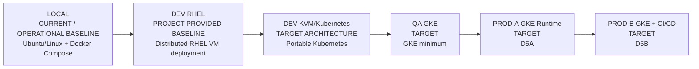
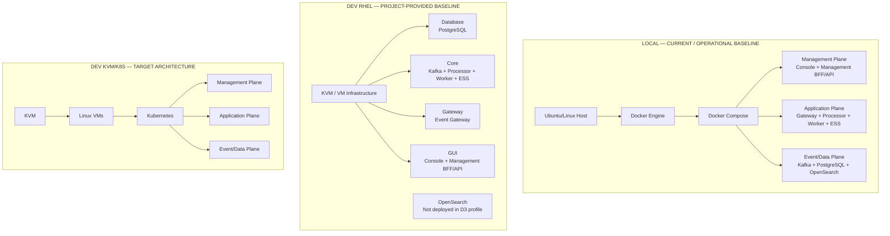
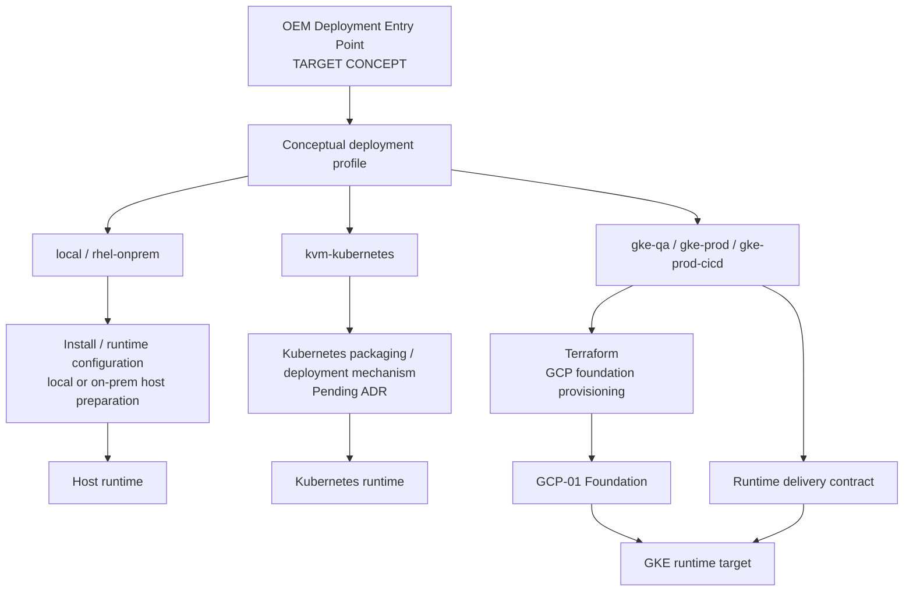

# D6 — Environment Evolution and Deployment Model

| Architecture lifecycle | Documentation status | Scope |
|---|---|---|
| `CURRENT` | Documentation view of current baselines and target architectures | Cross-environment |

D6 is the architecture-committee navigation hub for the same Open Event Management responsibilities across environments. It is a documentation view, not a runtime. The sequence below is an evolution and presentation flow; it does not imply that each environment is deployed.

## D6-1 — Environment evolution

### Status legend

| Status | Meaning in this page |
|---|---|
| `CURRENT / OPERATIONAL BASELINE` | Documented local operating baseline; individual current process state is not asserted without runtime inspection. |
| `PROJECT-PROVIDED BASELINE` | Supplied project evidence, preserved without upgrading it to repository-verified or live-runtime evidence. |
| `CURRENTLY DOCUMENTED` | A defined documentation or foundation contract, not proof of a running target. |
| `TARGET` | Intended architecture, not deployment evidence. |
| `PLANNED` | Identified future architecture or capability without target implementation detail. |

## D6-2 — What We Have Today

The local profile is the documented current baseline from [D1](d1-local-current.md). The RHEL profile is the [D3 project-provided baseline](d3-rhel-current.md), including its explicit absence of OpenSearch. The KVM/Kubernetes profile is [D2](d2-kvm-kubernetes-target.md), a target architecture rather than a running environment. Development tooling may exist beside the local stack but is not part of the OEM runtime contract.

## Environment invariants matrix

| Capability | Local | DEV RHEL | DEV K8s | QA GKE | PROD GKE | PROD + CI/CD |
|---|---|---|---|---|---|---|
| Management Plane | Current baseline | Project baseline | Target | Target | Target | Target |
| Gateway | Current baseline | Project baseline | Target | Target | Target | Target |
| Processor | Current baseline | Project baseline | Target | Target | Target | Target |
| Worker | Current baseline | Project baseline | Target | Target | Target | Target |
| ESS | Current baseline | Project baseline | Target | Target | Target | Target |
| Kafka | Current baseline | Project baseline | Target | Target | Target | Target |
| PostgreSQL | Current baseline; authoritative | Project baseline; authoritative | Target; authoritative | Target; authoritative | Target; authoritative | Target; authoritative |
| OpenSearch | Current baseline projection | Not deployed in D3 profile | Target projection | Outside minimum | Target projection | Target projection |
| Container runtime / orchestration | Docker Engine + Compose | VM service profile | Kubernetes target | GKE target | GKE target | GKE target |
| Persistent storage | Local documented baseline | Database VM baseline | Pending architecture decisions | Pending target decisions | Pending target decisions | Pending target decisions |
| Secrets | Local configuration boundary | Project-provided boundary | Pending integration | Pending integration | Pending integration | Logical references; provider pending |
| HA | Not a local baseline claim | Not established | Target decision | Outside minimum | Target requirement | Target requirement |
| CI/CD | Not asserted | Not asserted | Pending | Not part of D4 minimum | Separate from D5A | D5B target composition |
| AIOps | Only where independently evidenced | Not part of D3 minimum | Future-capable through OpenSearch | Outside minimum | Optional AI-01 attachment | Optional AI-01 attachment |

## What stays the same

Across profiles, OEM preserves the Management Plane contract, application responsibilities, event schemas and contracts, Kafka topic contracts, PostgreSQL authority, Kafka transport and replay semantics, API-first interaction, and governed interaction surfaces. PostgreSQL remains the operational source of truth; Kafka remains the decoupled transport and replay boundary; OpenSearch remains a projection rather than an authority.

Regardless of environment, OEM Core is intended to support governed GUI, CLI/API and future AIOps interaction. The full design remains outside D6; see [Multi-Surface Interaction](multi-surface-interaction.md), [AI-01](ai-01-aiops-ai-architecture.md) and the [Future Architecture Register](evolution/future-architecture-register.md).

## What changes by environment

Host/runtime, orchestration, networking, storage, secret integration, availability, recovery, delivery mechanism, automation and optional AIOps capability vary by environment. Those differences do not move product ownership between Gateway, Processor, Worker, ESS, PostgreSQL, Kafka or the Management Plane.

## D6-3 — OEM Environment-Aware Installation & Deployment Model

The profile names are conceptual deployment profiles, not asserted CLI flags. Current installation capability is limited to documented local/Docker Compose behavior and isolated existing CLI concepts such as Kafka administration. A universal installer or `oemctl` entry point is a target architectural direction, not an implemented universal capability.

### Install and runtime configuration responsibility

An installer or runtime configuration mechanism is responsible conceptually for application/runtime installation, configuration, readiness and local or on-prem preparation. It does not replace cloud infrastructure infrastructure-as-code.

### Terraform responsibility

Terraform is responsible for cloud infrastructure provisioning: networking, IAM, storage foundation, registry, secret foundation and cloud runtime infrastructure where later implemented. Terraform does not replace application runtime configuration or act as an application installer.

### Kubernetes and GCP boundary

Kubernetes packaging and deployment mechanism remain a pending ADR: Helm, Kustomize, operators and GitOps are possible future directions, not selected implementations. For `gke-prod-cicd`, the intended composition is Terraform plus [GCP-02](gcp-cicd-current.md) build/delivery contracts plus [D5A](d5a-prod-gke-runtime-target.md) runtime, as specified by [D5B](d5b-prod-gke-cicd-target.md). This page intentionally does not duplicate D5B.

## Architecture references

D6 connects the canonical logical and environment views: [D0](d0-logical-current.md), [D1 Local](d1-local-current.md), [D3 RHEL](d3-rhel-current.md), [D2 KVM/Kubernetes](d2-kvm-kubernetes-target.md), [D4 QA GKE](d4-qa-gke-minimum-target.md), [GCP-01](gcp-foundation-current.md), [GCP-02](gcp-cicd-current.md), [D5A](d5a-prod-gke-runtime-target.md) and [D5B](d5b-prod-gke-cicd-target.md). The [Evolution Register](evolution/index.md) preserves their lifecycle meanings.
