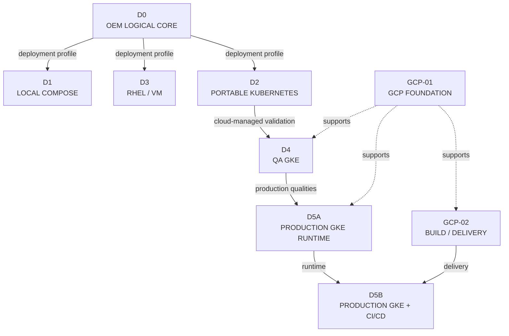
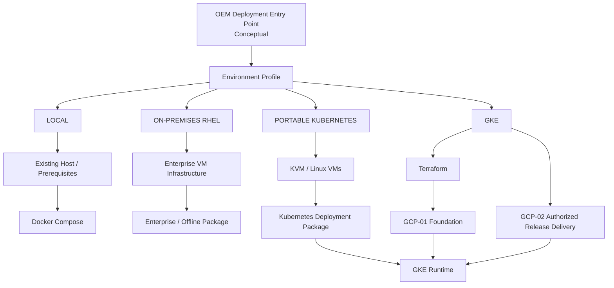

# D6 — Environment Evolution & Deployment Model

## Architecture Overview

D6 is the navigation and environment-composition view for Open Event Management. It maps one invariant OEM logical architecture across Local, On-Premises RHEL, portable Kubernetes, QA GKE and Production GKE profiles, and explains how deployment mechanisms adapt to each operating context.

D6 is not another runtime architecture and does not prescribe a mandatory migration sequence. D1, D3 and D2 are alternative deployment profiles; D4 and D5A specialize the Kubernetes model for QA and production GKE; D5B composes the production runtime with governed delivery.

## OEM Architecture Map



D0 is the invariant product contract. The branches from D0 express deployment alternatives, not a required D1 → D3 → D2 migration. D2 provides the portable Kubernetes contract consumed by D4; D5A adds production runtime qualities; D5B composes D5A with GCP-02 on GCP-01 capabilities.

## Environment Profiles

| Profile | Architecture | Containment / composition | Operating purpose |
|---|---|---|---|
| Local | D1 | Linux Host → Docker Engine → Docker Compose → OEM | Local development, functional validation and self-contained execution |
| On-Premises RHEL | D3 | Enterprise Virtualization → RHEL VMs → Database/Core/Gateway/GUI roles | Distributed enterprise deployment |
| Portable Kubernetes | D2 | KVM → Linux VMs → Kubernetes → OEM workloads | Provider-neutral orchestration model |
| QA GKE | D4 | GCP Foundation → GKE → OEM workloads | Managed-Kubernetes validation of the portable workload contract |
| Production GKE | D5A | GCP Foundation → GKE Production Runtime → OEM | Production availability, resilience, security, recovery and operability |
| Production GKE + CI/CD | D5B | GCP-01 + GCP-02 + D5A | Production runtime plus governed build and delivery |

Each profile serves a distinct operating context. Selection depends on environment requirements rather than an assumed ranking among profiles.

## Environment Invariants Matrix

| Concern | D1 | D3 | D2 | D4 | D5A | D5B |
|---|---|---|---|---|---|---|
| OEM Logical Core | D0 | D0 | D0 | D0 | D0 | D0 |
| Management Plane | Compose | GUI role | Kubernetes workloads | GKE workloads | Production GKE | D5A runtime |
| Application Plane | Compose | Distributed roles | Kubernetes workloads | GKE workloads | Production GKE | D5A runtime |
| Kafka | Local transport/replay | Core role | Stateful workload | Stateful workload | Production stateful | D5A runtime |
| PostgreSQL | Local authority | Database role | Authoritative state | Authoritative state | Production authority | D5A runtime |
| OpenSearch | Local projection | Modular capability | Projection workload | Projection workload | Production projection | D5A runtime |
| Orchestration | Docker Compose | VM/service lifecycle | Kubernetes | GKE | Production GKE | D5A + delivery |
| Infrastructure | Linux host | Enterprise VMs | KVM/Linux VMs | GCP/GKE | GCP/GKE | GCP-01 |
| Secrets | Externalized local boundary | Enterprise boundary | Kubernetes integration | GCP-compatible integration | GCP-01 integration | References across delivery/runtime |
| Persistent Storage | Local/container | Enterprise VM | Kubernetes abstraction | GKE abstraction | Production GKE abstraction | D5A runtime |
| Production Qualities | Local scope | Profile-specific operations | Portable contract | QA validation | Required | Required through D5A |
| CI/CD | External | External | External | External | Separate GCP-02 | Composed GCP-02 |
| AI Dependency | None | None | None | None | None | None |

## What Stays the Same

The portable product contract consists of:

- OEM service responsibilities and the Management, Application and Event / Data planes;
- canonical event contracts and the external integration boundary;
- PostgreSQL as Operational Source of Truth;
- Kafka as decoupled transport and replay boundary;
- OpenSearch as Search / Analytics Projection;
- API-first management through governed interfaces; and
- a vendor-neutral OEM Core independent from deployment infrastructure.

## What Changes by Environment

Environment implementation changes the host/runtime containment, orchestrator, networking, persistent-storage integration, secret and identity integration, availability and recovery strategies, deployment mechanism, operational controls and delivery automation.

Product semantics remain stable while environment implementation varies. A platform choice does not reassign Gateway, Processor, Worker, ESS, Kafka, PostgreSQL, OpenSearch or Management Plane responsibilities.

## Environment-Aware Deployment Model



The entry point and profile selection are an implementation-neutral control-plane concept, not an assertion that one universal installer exists. Each branch delegates infrastructure and application responsibilities to the mechanism appropriate for its profile.

## Deployment Control Plane

```text
Deployment Request
  → Environment Profile
  → Deployment Adapter
  → Environment Mechanism
```

The conceptual OEM Deployment Entry Point selects a local, RHEL, Kubernetes or GKE profile and delegates to an adapter. It does not replace the adapter, Terraform, packaging or runtime. A concrete `oemctl` implementation requires a separate approved contract.

## Deployment Adapter Model

| Profile | Infrastructure mechanism | Application mechanism |
|---|---|---|
| Local | Existing host and prerequisites | Docker Compose |
| RHEL | Enterprise VM infrastructure | Enterprise/offline installation package |
| Kubernetes | KVM / VM infrastructure | Kubernetes deployment package |
| GKE | Terraform and GCP-01 foundation | Kubernetes deployment package |
| Production + CI/CD | Terraform plus GCP-01/GCP-02 capabilities | Authorized immutable release delivery to D5A |

This table expresses architectural delegation, not installation commands.

## Installer Responsibility

Installer or deployment tooling can validate prerequisites, prepare runtime configuration, install application components, initialize the environment-specific runtime, validate readiness and support uninstall/rollback contracts. It does not replace cloud infrastructure-as-code, become OEM business logic or own authoritative operational state.

## Terraform Responsibility

Terraform provisions infrastructure such as networking, IAM, storage, artifact and secret foundations, and cloud runtime prerequisites. It does not replace the application installer or Kubernetes package, build OEM images or execute OEM business logic.

## Kubernetes Packaging Responsibility

A Kubernetes package is the declarative OEM workload definition for Kubernetes environments. Helm, Kustomize, raw manifests and operators remain ADR-controlled implementation choices; D6 selects none of them.

Terraform provisions infrastructure. Installer/package tooling deploys and configures OEM. CI/CD moves validated immutable releases. Kubernetes orchestrates workloads. These responsibilities are complementary, not interchangeable.

## Deployment Flow

1. **Select Environment:** choose the applicable deployment profile.
2. **Validate Profile:** check required inputs, prerequisites and policy.
3. **Provision Infrastructure:** create infrastructure where the profile requires it.
4. **Prepare Runtime:** establish the host, VM, Kubernetes or GKE runtime.
5. **Deploy OEM:** apply the profile-specific application mechanism.
6. **Configure Environment:** supply externalized product and environment inputs.
7. **Validate Health:** evaluate workload and stateful-service readiness.
8. **Expose Governed Interfaces:** enable only approved management, ingestion and integration paths.
9. **Operate:** use the profile's operational controls.
10. **Upgrade / Roll Back:** follow profile-specific compatibility and recovery contracts.

## Configuration Model

```text
OEM Product Configuration
  + Environment Profile
  + Secret References
  + Runtime Policy
  = Environment Configuration
```

Environment-specific configuration remains external to immutable application artifacts and deployment packages.

## Secret Model

Secrets remain externalized in every profile. Local environments use a development-safe mechanism, enterprise deployments use an approved enterprise integration, and GCP environments consume the Secret Manager boundary defined by GCP-01. D6 does not select an implementation where a source architecture leaves it open.

## Storage Model

Kafka transport/replay, PostgreSQL authority and OpenSearch projection semantics remain invariant. Their storage integrations vary:

| Profile | Storage integration |
|---|---|
| D1 | Local/container persistence |
| D3 | Enterprise VM storage |
| D2 | Kubernetes persistent-storage abstraction |
| D4 / D5A / D5B | GKE-integrated persistent-storage abstraction |

D6 does not select storage classes, products or vendors.

## Network Model

| Profile | Network implementation |
|---|---|
| D1 | Docker networking and controlled host exposure |
| D3 | Enterprise VM/network segmentation |
| D2 | Kubernetes networking, Services and policy capability |
| D4 / D5A / D5B | GCP and GKE networking integration |

The external ingestion, management, internal-service and controlled-egress contracts remain stable.

## Management Invariant

```text
Operator
  → Event Management Console
  → Management BFF / API
  → Governed OEM APIs
  → OEM Core
```

No deployment profile grants the GUI direct authority over Kafka, PostgreSQL, OpenSearch, VM hosts or Kubernetes nodes.

## Environment Promotion

GCP-02 defines **build once, promote the same immutable artifact**. Local/development and D4 QA validation can precede a production authorization for D5A/D5B without rebuilding application content for each environment. Environment configuration, secret references and runtime policy remain separate from artifact identity.

## Cross-Cutting Architectures

| Architecture | Cross-environment concern |
|---|---|
| Multi-Surface | Governed GUI, CLI/API and AIOps interaction alternatives |
| AI-01 | Optional AI/AIOps attachment through governed interfaces |
| Data Authority & Replay | PostgreSQL authority, Kafka transport/replay and OpenSearch projection |

These are transverse product architectures, not deployment profiles or stages in a Local-to-Production progression. OEM remains operational without an AI dependency.

## Architectural Principles

| Principle | Architectural consequence |
|---|---|
| One OEM Logical Core | D0 responsibilities remain invariant across profiles. |
| Environment Portability | Product contracts survive changes in containment and infrastructure. |
| Deployment Profile Separation | Local, RHEL and Kubernetes are alternatives, not mandatory sequential stages. |
| Infrastructure / Application Separation | Provisioning and application deployment retain distinct tools and ownership. |
| Declarative Deployment | Runtime intent is expressed through profile-appropriate controlled definitions. |
| Externalized Configuration | Environment values remain separate from product artifacts. |
| Externalized Secrets | Profiles consume approved secret references or injection. |
| Immutable Artifact Promotion | QA and production can consume the same digest. |
| Stable Management Contract | Operators use Console, BFF and governed APIs in every profile. |
| Stable Data Authority | PostgreSQL, Kafka and OpenSearch retain distinct semantics. |
| Environment-Specific Infrastructure | Networks, storage, identity and runtime mechanisms adapt by profile. |
| Vendor-Neutral Product Core | OEM semantics do not depend on a deployment provider. |
| Cross-Cutting AI Independence | AI remains optional and outside environment progression. |

## Architecture Boundaries

D6 defines no new runtime and does not replace D1, D3, D2, D4, D5A, D5B, GCP-01 or GCP-02. It maps their relationships and deployment responsibilities.

D6 does not select Helm, Kustomize, a GitOps controller, stateful operators, storage classes or a universal installer implementation. Those decisions require their own approved architecture or ADR.

## Related Architectures

- [D0 — OEM Logical Architecture](d0-logical-current.md)
- [D1 — Local Deployment Architecture](d1-local-current.md)
- [D3 — On-Premises RHEL Deployment Architecture](d3-rhel-current.md)
- [D2 — KVM + Kubernetes Deployment Architecture](d2-kvm-kubernetes-target.md)
- [D4 — QA GKE Minimum Deployment Architecture](d4-qa-gke-minimum-target.md)
- [GCP-01 — OEM GCP Foundation Architecture](gcp-foundation-current.md)
- [GCP-02 — Build, Delivery & CI/CD Architecture](gcp-cicd-current.md)
- [D5A — Production GKE Runtime Architecture](d5a-prod-gke-runtime-target.md)
- [D5B — Production GKE + CI/CD Composition Architecture](d5b-prod-gke-cicd-target.md)
- [Multi-Surface Interaction Architecture](multi-surface-interaction.md)
- [AI-01 — OEM AIOps / AI Architecture](ai-01-aiops-ai-architecture.md)
- [Data Authority & Replay Boundary](data-authority-replay.md)
- [Architecture Evolution Register](evolution/index.md)
