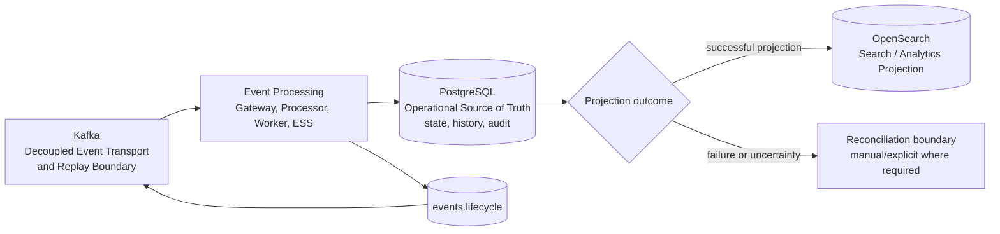

# Data Authority & Replay Boundary

| Architecture lifecycle | Validation context | Scope |
|---|---|---|
| `CURRENT` | `DOCUMENTED` | Supporting logical architecture view |

This supporting view explains data authority and replay boundaries. It is not a
second D0 and does not claim recovery mechanisms that are not documented.

## Authority and projection

## Contract

- **Kafka** is the decoupled event transport and replay boundary. It is not the
  authoritative state store.
- **PostgreSQL** is the Operational Source of Truth for state, history and
  operational evidence.
- **OpenSearch** is a Search / Analytics Projection. A failed or uncertain
  projection must not make it the source used to decide authoritative state.
- **Lifecycle events** are transported through Kafka and remain distinct from
  state authority.

## Reconciliation and recovery status

`TARGET`: the documented ESS flow performs PostgreSQL commit, OpenSearch
projection and Kafka acknowledgement, while reconciliation/outbox handling is
not yet a completed general mechanism. The boundary is deliberately visible so
that an uncertain projection result is investigated against PostgreSQL rather
than inferred from OpenSearch.

The detailed ESS gap record documents the dual-write sequence and its current
limitations. See [ESS gaps](../platform/event-state-service/gaps.md) and the
[Processor ADRs](../platform/event-processor/decisions-adr.md). Detailed
operational flows remain in [solution flows](solution-flows.md).

## Relationship to D0 and D1

This view is a supporting explanation for [D0 logical architecture](d0-logical-current.md)
and [D1 local deployment](d1-local-current.md). It applies to their data
contract without adding environment-specific recovery infrastructure.
