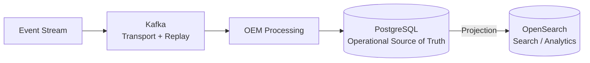
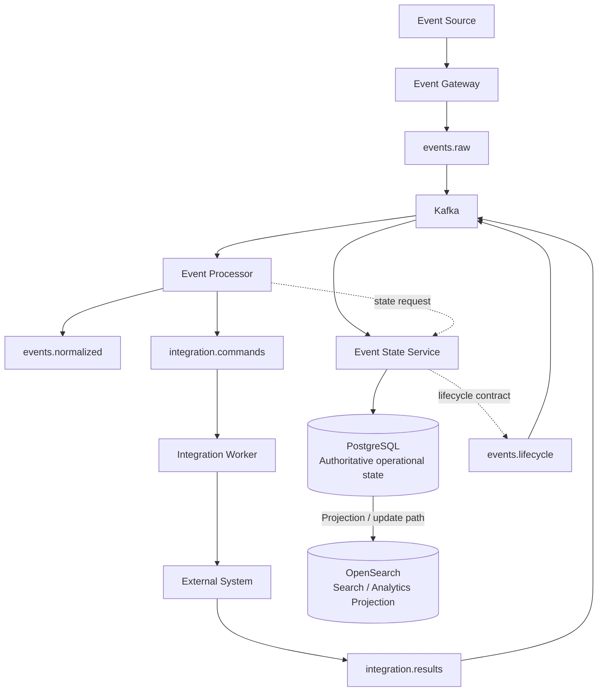
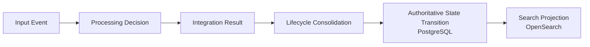
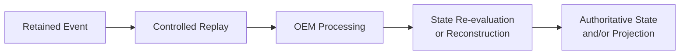
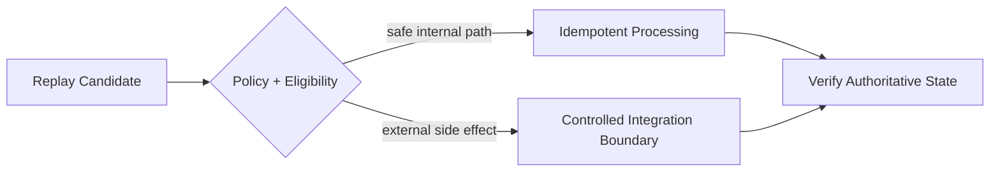
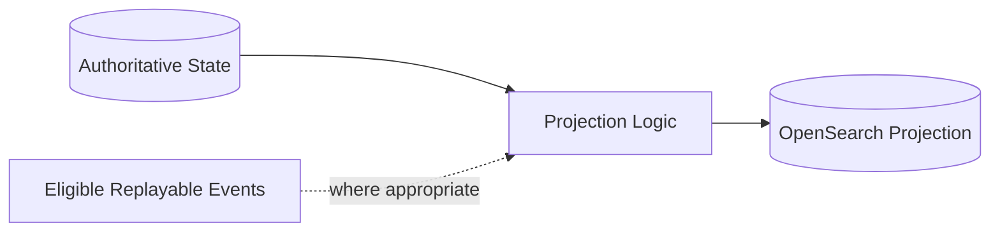

# Data Authority & Replay Architecture

| Architecture lifecycle | Validation context | Scope |
|---|---|---|
| `CURRENT` | `DOCUMENTED` | Cross-cutting architecture |

## Architecture Overview

This architecture defines one invariant authority model for every compatible OEM
deployment profile:

> **TRANSPORT != AUTHORITY != PROJECTION**

> **REPLAY != BACKUP / RESTORE != PROJECTION REBUILD**

Kafka decouples services and retains event streams for bounded replay.
PostgreSQL owns authoritative operational state. OpenSearch derives searchable
and analytical representations of that state. Durability in any one technology
does not make the three roles interchangeable.

## Solution Architecture

The hierarchy is deliberate: processing consumes transport, authoritative state
is committed in PostgreSQL, and search/analytics are projected into OpenSearch.

## Authority Model

| Capability | Architectural role | Authority |
|---|---|---|
| Kafka | Asynchronous transport, buffering and replay boundary | Non-authoritative transport state; retained events do not become operational truth |
| PostgreSQL | Operational persistence, integrity and state history | **Authoritative Operational Source of Truth** |
| OpenSearch | Search, analytics, exploration and approved retrieval context | Derived, rebuildable projection |

Authority is determined by the service contract, not by which copy is easiest to
query or which infrastructure retains data longest.

## Engineering Architecture

The diagram preserves D0 ownership without prescribing one physical persistence
mechanism for every update. The Event Processor owns processing decisions;
Integration Worker owns external integration execution; Event State Service owns
state consolidation. PostgreSQL and OpenSearch retain distinct authority roles.

## Event Lifecycle

| Contract | Semantic purpose |
|---|---|
| `events.raw` | Accepted events entering asynchronous processing |
| `events.normalized` | Normalized processing output |
| `integration.commands` | Commands addressed to integration execution |
| `integration.results` | Integration outcomes returned for state consolidation |
| `events.lifecycle` | Lifecycle event transport, distinct from lifecycle authority |
| `events.dlq` | Exception boundary for events that cannot complete normal processing |
| `event.journal` | Declared journal channel; its presence does not establish operational authority or additional persistence guarantees |

Topic administration, retention values and partition layouts remain operational
concerns. Ordering is scoped by key and is not a global order across topics.

## Kafka Transport and Replay

Kafka provides asynchronous event transport, service decoupling, buffering,
policy-based retention and a bounded replay source. It also carries integration
commands and results where the service contracts require those channels.

Kafka is not the Operational Source of Truth, a relational state database, AI
memory or a substitute for PostgreSQL backup. Retention is finite. Consumer
offsets express consumption progress, not business-state authority, and changing
an offset is not by itself authorization to replay business processing.

## PostgreSQL Operational Authority

PostgreSQL is the **Operational Source of Truth** for canonical operational state
managed by OEM services. State-changing operations must ultimately reconcile
with that authority through the owning service contract.

This role makes integrity, schema compatibility, backup and restore, and defined
recovery objectives architectural concerns. It does not assign authority to every
PostgreSQL table or define a physical schema; ownership remains with the relevant
OEM service.

## OpenSearch Projection

OpenSearch provides derived indexes for search, analytics, operational
exploration and approved AI retrieval/context. Its contents represent state for
those purposes but do not decide authoritative business state.

OpenSearch is not a PostgreSQL replacement, AI engine or model layer. Projection
loss or drift is recovered from authoritative state and/or eligible replayable
events without promoting the index to authority.

## State Transition Model

An event occurrence, an accepted state transition and a search representation
are separate facts. A transported event can be rejected or stale; a projection
can lag; neither condition changes the authority of a committed state transition.

## Replay Model

Replay reintroduces retained events to eligible processing. Its effectiveness
depends on retention, event completeness, schema compatibility, processing
determinism, idempotency and the treatment of external side effects. Replay
cannot be assumed to recreate every historical operational state.

## Replay Safety

Replay requires deliberate scope and policy. Consumers must account for command
identity, idempotency, deduplication and the possibility that processing was
partially or fully completed before an event became eligible for replay.

The architecture requires side-effect-aware handling but does not define a
specific replay controller or replay mode.

## Backup and Restore

PostgreSQL backup and restore is the recovery class for authoritative operational
state. Kafka replay cannot replace it because retained streams can be incomplete,
expired, incompatible with later processors or insufficient to reproduce prior
state. An OpenSearch snapshot likewise does not establish authoritative recovery.

Backup technology, schedule, RPO and RTO are environment and operations
decisions governed outside this architecture.

## Projection Rebuild

Projection recovery may use reconciliation, reindexing, replay or rebuild,
depending on the implementation. The invariant is that OpenSearch can be
reconstructed without becoming the source used to decide operational truth.

## Recovery Semantics

| Component | Primary recovery concern | Recovery pattern |
|---|---|---|
| Kafka | Stream continuity and retained events | Retention and controlled replay |
| PostgreSQL | Authoritative operational state | Backup, restore and integrity recovery |
| OpenSearch | Derived search and analytics state | Rebuild, reconcile or reindex |

These recovery classes complement rather than replace one another.

## Consistency Model

OEM spans asynchronous transport, transactional service-owned state and derived
projections. It does not claim distributed ACID consistency across Kafka,
PostgreSQL and OpenSearch. Search projection may therefore be temporally
decoupled from authoritative state: this is eventual projection consistency, not
shared authority.

Consumer idempotency protects business effects when transport delivery repeats.
It does not turn end-to-end asynchronous processing into an exactly-once
transaction across all three technologies.

## Reconciliation Boundary

Projection drift between PostgreSQL and OpenSearch must be detectable and
recoverable, with PostgreSQL used to resolve authoritative state. The architecture
defines that requirement without asserting a general reconciliation service,
workflow or automated repair mechanism.

A transactional outbox is not part of this certified cross-cutting contract. Any
general outbox or reconciliation mechanism requires separate design, evidence
and an architecture decision record.

## Dead-Letter Boundary

`events.dlq` is an exception and recovery boundary for messages that cannot
complete normal processing. A dead-letter record is neither operational truth
nor evidence of successful processing, and it does not authorize automatic
replay. Inspection, correction, eligibility and side-effect risk must be governed
before controlled reprocessing.

## External Side Effects

ITSM operations, notifications, automation, webhooks and external APIs can
produce effects beyond OEM authority boundaries. Replaying an internal event
must not automatically imply repeating those effects.

Replay design must preserve command identity, apply idempotency or deduplication
where the integration contract supports it, and place side-effect execution
behind policy-controlled integration boundaries. Uncertain external outcomes are
resolved according to the integration contract, not inferred from Kafka offsets
or OpenSearch documents.

## Management Relationship

GUI, CLI/API and AIOps/AI surfaces interact through governed OEM interfaces.
They do not write directly to Kafka, PostgreSQL or OpenSearch. State-changing
management actions follow the owning service and authorization contracts, and
read paths preserve the distinction between authoritative and projected data.

## AI / Retrieval Relationship

AI-01 may retrieve search context from OpenSearch, request authoritative context
through governed OEM APIs, and consume event or lifecycle context through
approved interfaces. Retrieval convenience does not change authority.

Generated interpretations, recommendations and model context are not operational
state. Models, agents and retrieval components cannot promote an OpenSearch
result, retained Kafka event or generated output into authoritative state without
a governed OEM action.

## Deployment Independence

The contract applies across compatible D1, D2, D3, D4, D5A and D5B profiles.
Topology, managed-service selection and physical storage implementation may
change between environments; the roles of transport, authority and projection do
not.

This architecture is cross-cutting. It composes with deployment architectures
and does not create another deployment profile or a new data service.

## Architectural Principles

| Principle | Architectural meaning |
|---|---|
| Single Operational Authority | PostgreSQL is the source used to decide canonical operational state. |
| Transport / State Separation | Kafka delivery and retention do not confer state authority. |
| Projection / Authority Separation | OpenSearch derives representations; it does not own operational truth. |
| Replay Awareness | Retention, completeness, compatibility and determinism constrain replay. |
| Authority-Aware Recovery | Each technology is recovered according to its architectural role. |
| Side-Effect Safety | Replay does not implicitly repeat external effects. |
| Idempotency Awareness | Duplicate delivery and uncertain outcomes are explicit design inputs. |
| Derived-State Rebuildability | Search/analytics state can be reconstructed without changing authority. |
| Governed State Mutation | State changes pass through authorized OEM service contracts. |
| Deployment Independence | Environment changes preserve the authority model. |
| AI Retrieval Does Not Change Authority | Retrieval or generation never promotes derived context into operational truth. |

## Architecture Boundary

This architecture defines authority, transport, projection, replay and recovery
semantics; consistency boundaries; and the responsibilities used to resolve data
conflicts.

It does not define database schemas, Kafka partitions or retention values,
backup schedules, OpenSearch index design, a replay controller, a specific
reconciliation implementation or a transactional outbox implementation. Those
belong to service implementation, operations and separately governed ADRs.

Certified implementation evidence includes service-owned PostgreSQL persistence,
Kafka lifecycle/result consumption, idempotency ledgers and OpenSearch projection
paths. It does not establish a general reconciliation or transactional-outbox
mechanism. That evidence boundary does not alter the architectural requirement
that projection drift be recoverable.

## Related Architectures

- [D0 — OEM Logical Architecture](d0-logical-current.md) defines service ownership and end-to-end logical flow.
- [D5A — Production GKE Runtime](d5a-prod-gke-runtime-target.md) applies authority-aware HA and DR concerns.
- [D5B — Production GKE + CI/CD](d5b-prod-gke-cicd-target.md) composes delivery and production runtime without changing data authority.
- [D6 — Environment Evolution](d6-environment-evolution.md) maps deployment profiles that preserve this contract.
- [Multi-Surface Interaction](multi-surface-interaction.md) governs read and state-changing access paths.
- [AI-01 — OEM AIOps / AI Architecture](ai-01-aiops-ai-architecture.md) preserves authority across retrieval and tool use.
- [ESS lifecycle contract](../platform/event-state-service/lifecycle-contract.md) records synchronized implementation evidence and its limits.
