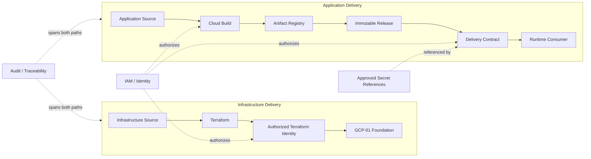
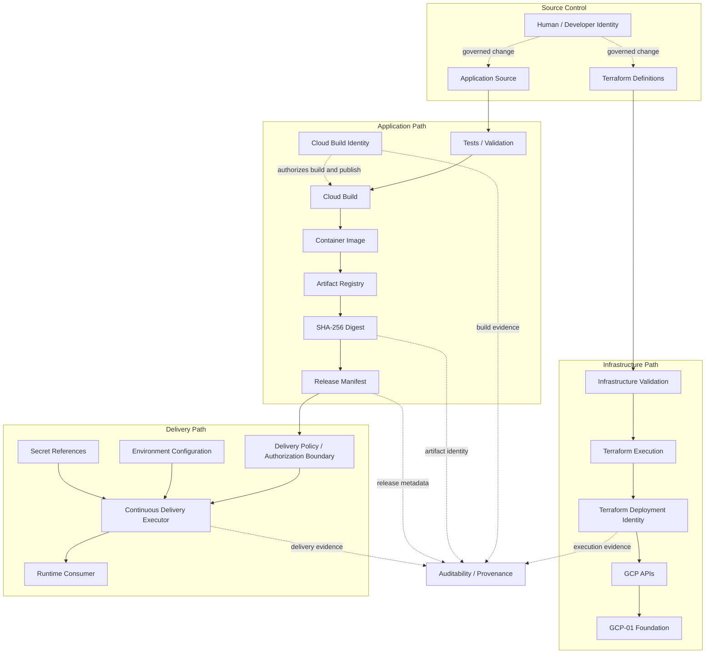
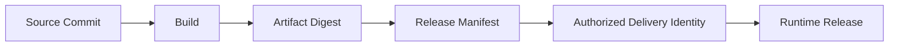

# GCP-02 — Build, Delivery & CI/CD Architecture

## Architecture Overview

GCP-02 defines how OEM infrastructure definitions and application source move through controlled automation to produce authorized, immutable and traceable deployment inputs. Infrastructure delivery and application delivery are separate paths with distinct identities, outputs and authorization boundaries.

GCP-02 consumes capabilities from [GCP-01](gcp-foundation-current.md) and supplies delivery contracts to D4 and D5A. It does not redefine either cloud foundation or OEM runtime responsibilities.

## Solution Architecture



Terraform provisions foundation resources. Cloud Build validates and builds application artifacts. Artifact Registry stores them, the digest identifies the exact deployable content, the Release Manifest describes it, and a separately authorized delivery identity delivers it to a runtime consumer.

## Delivery Flow

| Step | Infrastructure path | Application path |
|---|---|---|
| Define | Version infrastructure definitions | Version application source |
| Validate | Check definitions and policy | Run application validation and tests |
| Build / Provision | Execute Terraform through its authorized identity | Build the container image through Cloud Build |
| Store | Preserve controlled infrastructure state and records | Store the image in Artifact Registry |
| Identify | Attribute the applied definition and execution | Resolve the immutable SHA-256 digest |
| Describe | Record infrastructure change context | Create the governed Release Manifest |
| Authorize | Approve foundation change permissions | Approve artifact, metadata, policy and delivery identity |
| Deliver | Invoke GCP APIs for foundation resources | Deliver the approved release to a runtime consumer |
| Validate | Verify the infrastructure outcome | Validate release and runtime behavior |
| Promote / Roll Back | Apply a controlled corrective change | Promote the same digest or select a previous approved release |

## Engineering Architecture



The engineering view separates source governance, infrastructure provisioning, application build, artifact identity and runtime delivery. It introduces no deployment controller; the Continuous Delivery Executor represents the authorized actor and contract boundary.

## Infrastructure Delivery Model

The infrastructure path is **source-controlled definitions → validation → Terraform → authorized Terraform identity → GCP APIs → GCP-01 foundation**. Terraform can create or update foundation resources through approved permissions. It does not build application images, store application artifacts, authorize application releases or execute OEM business logic.

## Application Build Model

The application path is **application source → validation/tests → Cloud Build → container image → Artifact Registry**. Cloud Build produces and publishes the approved build output through its own identity. Its responsibility ends at the build and artifact boundary unless a separate delivery contract explicitly grants further responsibility; Cloud Build is not production deployment.

## Artifact Identity

The immutable deployment identity is the resolved image digest:

```text
REGION-docker.pkg.dev/PROJECT/REPOSITORY/SERVICE@sha256:DIGEST
```

Tags can provide human-readable metadata, but `latest`, branch names, environment names and build numbers are not deployment identities. Only the digest identifies the exact artifact content.

## Release Manifest

The Release Manifest is governed release metadata. It records the source commit, build identity, artifact digest, health contract, dependencies, configuration references, logical secret references and other release metadata required by the delivery contract.

It contains no secret payloads, static credentials or private keys, and it does not execute deployment. **Release Manifest ≠ Deployment Controller.**

## Release Traceability



This chain makes the source, build, artifact, release metadata, delivery actor and consumed runtime release reviewable as one provenance path.

## Identity Model

| Identity | Trust boundary |
|---|---|
| Human / Developer | Proposes and reviews governed source changes; it is not an automation credential. |
| Terraform Deployment | Provisions approved foundation resources through GCP APIs. |
| Cloud Build | Executes validation/build and publishes artifacts within approved permissions. |
| Continuous Delivery Executor | Delivers an approved release under applicable policy. |
| Runtime Workload | Accesses runtime resources after deployment under workload-specific permissions. |

Each identity is purpose-specific, independently authorized and least-privileged. They must not be collapsed into one service account or shared credential.

## Secret Boundary

Secret payloads remain in an approved secret-management system. Source, Terraform definitions, container images, Release Manifests, Wiki pages and committed environment files contain no secret values. Delivery artifacts carry logical references only; runtime secret resolution and injection belong to the runtime/security integration.

## Deployment Authorization

An artifact existing in Artifact Registry is not authorization to deploy it. Delivery requires:

- an approved immutable artifact digest;
- approved Release Manifest metadata;
- an authorized Continuous Delivery Executor identity; and
- applicable environment and delivery policy.

Artifact availability and deployment authorization are separate decisions.

## Promotion Model

The delivery architecture follows **build once, promote the same immutable artifact**. A single approved digest can be evaluated by QA and later selected for production without rebuilding application code. Environment differences come from governed configuration, logical secret references and environment policy. This contract does not claim that promotion is automated.

## QA / Production Consumption

D4 consumes an approved immutable release for QA runtime validation without transferring its GKE or OEM runtime responsibilities into GCP-02. D5A consumes the approved production release contract while retaining production availability, scaling, recovery and runtime controls.

```text
GCP-02 Delivery Architecture + D5A Production Runtime = D5B Production + CI/CD
```

## Rollback Model

Rollback selects a previous approved immutable release, validates compatibility and performs a newly authorized delivery. It considers application version, configuration compatibility, database schema compatibility and stateful-service compatibility. Selecting an earlier digest does not make rollback automatically safe.

## Database Migration Boundary

PostgreSQL remains the Operational Source of Truth. Database migrations require explicit sequencing and classification as forward-compatible, backward-compatible or restore-dependent. Application rollback and database rollback are not automatically equivalent, and GCP-02 does not select a migration engine.

## Stateful Upgrade Boundary

Kafka, PostgreSQL and OpenSearch are not ordinary stateless image replacements. Their upgrades require service-specific compatibility, backup, recovery, integrity and availability strategies. Runtime architectures and operational runbooks own the implementation details.

## Supply Chain Security

GCP-02 requires immutable artifact identity, source-to-artifact provenance, separate identities, least privilege, controlled secret references, traceability and validation gates. SBOMs, artifact signing, attestations and provenance verification are extended controls that require separate adoption evidence; this architecture does not represent them as implemented.

## Auditability

The architecture supports answering: who changed source, which commit was used, which build ran, which artifact digest resulted, which Release Manifest described it, which identity delivered it and which runtime release consumed it. GCP-02 does not prescribe a specific audit backend.

## Architectural Principles

| Principle | Architectural consequence |
|---|---|
| Infrastructure / Application Separation | Terraform and Cloud Build remain distinct automation paths. |
| Build Once | Environments consume the same immutable artifact rather than rebuilding code. |
| Immutable Artifact Identity | A SHA-256 digest, not a mutable tag, identifies deployable content. |
| Identity Separation | Human, Terraform, build, delivery and runtime identities remain distinct. |
| Least Privilege | Each actor receives only the permissions required for its responsibility. |
| Secret Externalization | Artifacts and manifests carry references, never secret payloads. |
| Release Traceability | Commit, build, digest, manifest, delivery actor and runtime release remain attributable. |
| Environment Promotion | Configuration, secret references and policy vary by environment; application content does not. |
| Controlled Authorization | Artifact existence never implies permission to deploy. |
| Rollback Awareness | A previous digest requires compatibility validation and fresh authorization. |
| Stateful Upgrade Awareness | Stateful services use service-specific upgrade and recovery strategies. |
| Foundation / Delivery / Runtime Separation | GCP-01, GCP-02 and D4/D5A retain independent responsibilities. |

## Delivery Boundary

GCP-02 defines infrastructure automation, application build, artifact management, release metadata, delivery authorization, promotion and rollback contracts. It does not define OEM event-processing behavior, GKE runtime topology, production HA/DR or AI/AIOps architecture.

## Relationship to GCP-01

[GCP-01](gcp-foundation-current.md) provides IAM, Secret Manager, Artifact Registry and other foundation capabilities consumed by GCP-02. GCP-01 establishes those capabilities; GCP-02 defines how governed infrastructure and application delivery use them. Foundation is not delivery.

## Relationship to D4

[D4](d4-qa-gke-minimum-target.md) consumes an approved release for QA validation. GCP-02 neither defines nor operates the QA GKE runtime. Delivery is not QA runtime.

## Relationship to D5A / D5B

[D5A](d5a-prod-gke-runtime-target.md) defines the production runtime. GCP-02 defines delivery inputs and authorization contracts. [D5B](d5b-prod-gke-cicd-target.md) composes those two architectures without changing their responsibilities.

## Related Architectures

- [GCP-01 — OEM GCP Foundation Architecture](gcp-foundation-current.md)
- [D4 — QA GKE Minimum Deployment Architecture](d4-qa-gke-minimum-target.md)
- [D5A — PROD GKE Runtime Architecture](d5a-prod-gke-runtime-target.md)
- [D5B — PROD GKE + CI/CD Architecture](d5b-prod-gke-cicd-target.md)
- [GCP architecture evolution history](evolution/gcp-architecture-history.md)
- [Architecture Evolution Register](evolution/index.md)
