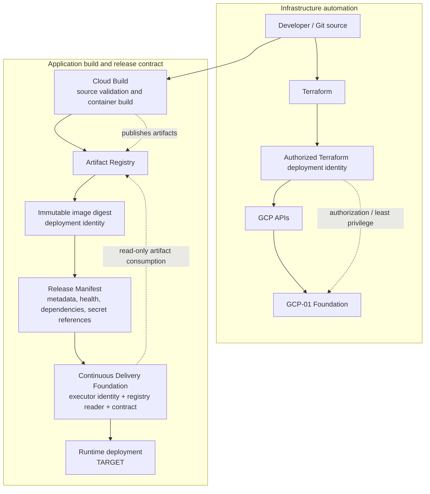

# GCP-02 — OEM GCP Build, Delivery & CI/CD Architecture

| Architecture lifecycle | Evidence status | Scope |
|---|---|---|
| `CURRENT` | `CURRENTLY DOCUMENTED` build/delivery foundation | Automation and contracts, not runtime deployment |

GCP-02 answers how OEM infrastructure and deployable artifacts are built,
governed, identified and prepared for delivery. It extends
[GCP-01 Foundation](gcp-foundation-current.md); neither page defines a
production runtime architecture.

## Infrastructure and artifact lifecycle



## Responsibility boundaries

- **Terraform:** defines and provisions infrastructure through authorized
  identity and GCP APIs; it is not application image build tooling.
- **Cloud Build:** validates/builds supported container artifacts; it is not an
  infrastructure runtime.
- **Artifact Registry:** stores artifact repository capability and immutable
  images; it is not deployment.
- **Release Manifest:** identifies an immutable release with provenance, health
  contract, dependencies and logical secret references; it is not deployment
  instructions and contains no secret payloads.
- **Continuous Delivery Foundation:** creates a dedicated execution identity,
  Artifact Registry read access and runtime-independent contract. It does not
  create GKE, workloads, container deployment, runtime health execution or
  automatic rollback.
- **Runtime deployment:** remains `TARGET` and must consume the contract later.

## Identity and credential flow

Human/developer identity is distinct from the Terraform deployment identity,
Cloud Build identity, Continuous Delivery executor and future runtime workload
identity. The intended direction is authorization by IAM and references by
Secret Manager, never shared static credentials embedded in source, manifests
or Wiki artifacts.

## Release contract

The release contract uses immutable image identity:

```text
REGION-docker.pkg.dev/PROJECT/REPOSITORY/SERVICE@sha256:DIGEST
```

Tags such as `latest`, environment labels, branches and Build IDs are metadata,
not deployment identities. The manifest records artifact provenance, health
semantics, dependencies and logical secret references; the runtime resolves
those references with its approved mechanism.

## Relationship to D4 and D5

D4 is the QA minimum runtime target and does not include CI/CD in its primary
architecture. D5A will compose GCP-01 with a production GKE runtime. D5B will
compose D5A with GCP-02, adding the build/delivery contract. This is
architectural composition, not evidence that deployment automation is active.

## Exclusions

AI-01 and Multi-Surface Interaction remain separate future product
architectures. GCP-02 does not deploy AIOps, AI, GKE, application workloads or
production infrastructure.
