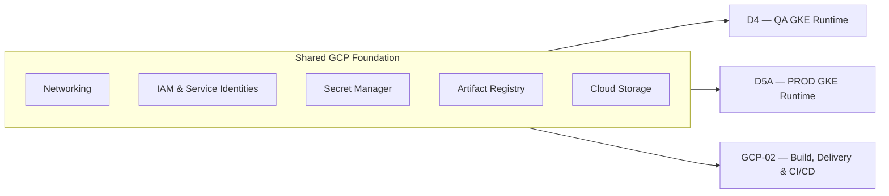
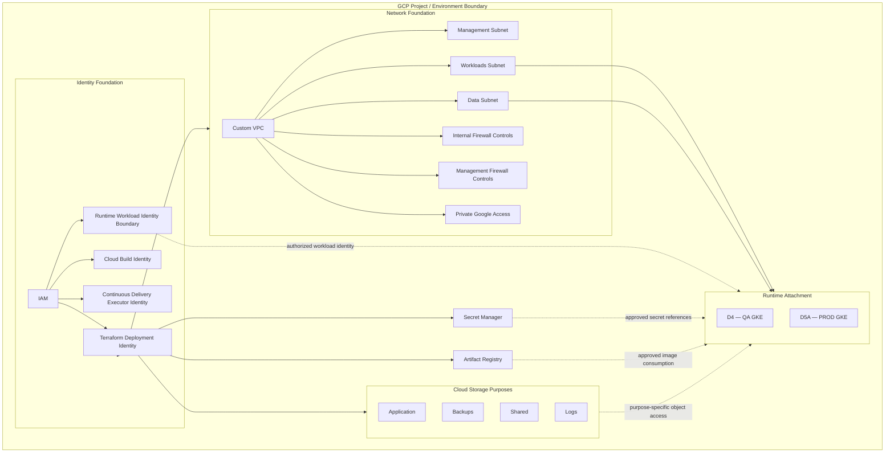

# GCP-01 — OEM GCP Foundation Architecture

## Architecture Overview

GCP-01 defines the shared Google Cloud foundation consumed by OEM runtime and delivery architectures. It establishes network, identity, secret, artifact and object-storage capabilities without turning those capabilities into an OEM runtime, a build pipeline or evidence that cloud resources are deployed.

The environment model uses separate `event-management-dev`, `event-management-qa` and `event-management-prod` project boundaries. Each environment applies the same foundation responsibilities through its own authorized identities and environment-specific configuration.

## Solution Architecture

The foundation is a shared architectural dependency, not a shared runtime. D4 and D5A attach their environment-specific GKE runtimes to foundation capabilities. GCP-02 consumes identities and artifact storage to define delivery contracts. None of those consumers transfers its responsibilities into GCP-01.

## Foundation Consumers

| Consumer | Foundation capabilities consumed | Responsibility retained by consumer |
|---|---|---|
| D4 QA GKE | QA network attachment, approved identities and secret references, image and object-storage capabilities | Minimum QA GKE topology and OEM workload runtime |
| D5A PROD GKE | Production network attachment and production-scoped foundation capabilities | Production runtime, availability, scaling, recovery and workload controls |
| GCP-02 | Terraform, Cloud Build and Continuous Delivery identity boundaries plus Artifact Registry | Build, immutable artifact, promotion and delivery contracts |

## Engineering Architecture

This view expresses containment and authorized attachment. It does not imply an event flow, a deployed GKE cluster or a particular application deployment.

## GCP Environment Boundary

Each project/environment is an isolation boundary for its network, identities, secrets, artifacts and object storage. The documented project model is `event-management-dev`, `event-management-qa` and `event-management-prod`. Promotion across environments must preserve this separation; a shared architectural pattern does not imply shared credentials, secrets or runtime state.

## Network Foundation

The network foundation contains a custom VPC with regional management, workloads and data subnets. Internal and management firewall controls separate traffic purposes, while Private Google Access supports private access to eligible Google APIs and services.

The management subnet supports administrative and platform traffic, the workloads subnet supports runtime and application workloads, and the data subnet provides the boundary for stateful and data-oriented connectivity. Operational CIDRs remain infrastructure configuration rather than architecture-page policy.

Cloud Router, Cloud NAT, Private Service Access, private DNS, VPC peering, VPN/Interconnect, load balancers, public ingress and runtime NetworkPolicy are not defined by this foundation view. They require an explicit environment or runtime decision.

## Identity and Access Model

Identity is purpose-specific and least-privileged:

- the Terraform deployment identity provisions the documented foundation;
- the Cloud Build identity supports the GCP-02 build boundary;
- the Continuous Delivery executor identity supports the GCP-02 delivery boundary; and
- the runtime workload identity boundary is consumed and completed by D4 or D5A.

Human administration, automation and workloads must not collapse into a single identity. Runtime RBAC, workload-to-service mapping and secret injection remain runtime responsibilities.

## Terraform Provisioning Boundary

Terraform is the infrastructure-as-code mechanism for provisioning the documented GCP foundation through its authorized deployment identity. It does not build application images, operate the runtime, authorize application deployments or own secret payloads. Terraform definitions describe intended infrastructure; they are not cloud-inventory evidence.

`Terraform → authorized deployment identity → GCP APIs → foundation resources`

## Secret Management

Secret Manager is the secure storage and reference boundary. Consumers use approved references or injected values through their own authorized identities. Credentials, service-account keys and secret payloads must not be committed to Git, Terraform variables, container images, release manifests or architecture documentation.

Secret producers or administrators manage values through approved controls; authorized runtime and automation integrations consume only the references or injected values they require.

## Artifact Foundation

Artifact Registry provides repository storage for approved container artifacts. It does not build images, select deployable versions, promote releases, execute deployments, authorize a runtime or serve as source control. Those lifecycle contracts belong to GCP-02 and its consumers.

## Object Storage Foundation

Cloud Storage supplies purpose-specific object-storage capabilities for application, backups, shared and logs use cases. Access is environment-scoped and identity-controlled; retention, lifecycle and recovery requirements must be defined by the consuming service or environment.

## Storage Responsibility Model

| Storage capability | Responsibility | Not represented as |
|---|---|---|
| Artifact Registry | Container artifact repository | Build controller, deployment controller or runtime |
| Application bucket | Application-owned objects | PostgreSQL or Kubernetes Persistent Volume |
| Backups bucket | Approved backup objects | A complete backup/recovery architecture |
| Shared bucket | Governed shared objects | Shared database or event bus |
| Logs bucket | Log objects where explicitly used | OpenSearch analytics projection or observability platform |

Cloud Storage does not replace PostgreSQL, Kafka, OpenSearch or Kubernetes Persistent Volumes. Those data responsibilities remain with the runtime and the owning OEM service.

## Security Principles

| Principle | Foundation rule |
|---|---|
| Least Privilege | Grant only the permissions required for each responsibility. |
| Identity Separation | Keep Terraform, build, delivery, runtime and human administration identities distinct. |
| No Static Credentials | Use approved identity integration; do not embed credentials in workloads or automation. |
| Secret Externalization | Keep secret payloads in Secret Manager and outside source, images, manifests and plain configuration. |
| Controlled Network Boundaries | Separate management, workloads and data traffic through explicit network and firewall boundaries. |
| Private/Internal Service Access | Use Private Google Access where defined; other private connectivity requires a separate decision. |
| Auditability | Make identity use and foundation changes attributable through controlled execution. |
| Environment Separation | Isolate dev, QA and production through distinct project/environment boundaries. |

## Architectural Principles

| Principle | Architectural consequence |
|---|---|
| Foundation / Runtime Separation | GCP capabilities support but do not define OEM workloads. |
| Infrastructure as Code | Foundation resources are expressed and provisioned through controlled Terraform execution. |
| Identity Purpose Separation | Terraform, build, delivery and runtime use distinct authorization boundaries. |
| Secret Externalization | Secret Manager holds payloads; consumers receive approved references or injected values. |
| Artifact Immutability Readiness | Artifact Registry supplies repository capability for the governed lifecycle defined by GCP-02. |
| Network Segmentation | Management, workloads and data connectivity remain distinct responsibilities. |
| Storage Responsibility Separation | Object and artifact storage do not replace runtime persistence. |
| Environment Isolation | Each environment retains its own project-scoped capabilities and access. |
| Reusable Cloud Foundation | D4, D5A and GCP-02 consume the same foundation contract without duplicating it. |
| Least Privilege | Every consumer receives only the access required for its role. |

The foundation consumption flow is: **Define** infrastructure as code;
**Authorize** the dedicated deployment identity; **Provision** through GCP APIs;
**Establish** the network, identity, secret, artifact and storage foundations;
then **Consume** them from the separate runtime and delivery architectures.

## Foundation Boundary

GCP-01 stops before OEM application behavior, GKE workload topology, ingress, load balancing, runtime storage, event processing, observability, production HA/DR, CI/CD workflow and AI/AIOps. These are separate architecture domains. The page also makes no claim that a GCP project or any depicted resource is deployed; the diagrams define architectural capabilities and boundaries.

## Relationship to D4

[D4](d4-qa-gke-minimum-target.md) consumes the QA-scoped foundation and defines the minimum QA GKE runtime. GCP-01 does not absorb the cluster, Kubernetes or OEM workload responsibilities represented by D4.

## Relationship to D5A

[D5A](d5a-prod-gke-runtime-target.md) composes the production-scoped foundation with production GKE runtime requirements. Availability, scaling, recovery and runtime controls remain D5A concerns.

## Relationship to GCP-02

[GCP-02](gcp-cicd-current.md) consumes foundation identities and Artifact Registry while defining infrastructure delivery, application build, promotion and runtime-delivery contracts. GCP-01 provides capabilities; GCP-02 defines how delivery uses them.

## Related Architectures

- [D4 — QA GKE Minimum Deployment Architecture](d4-qa-gke-minimum-target.md)
- [D5A — PROD GKE Runtime Architecture](d5a-prod-gke-runtime-target.md)
- [GCP-02 — OEM GCP Build, Delivery & CI/CD](gcp-cicd-current.md)
- [GCP architecture evolution history](evolution/gcp-architecture-history.md)
- [Architecture Evolution Register](evolution/index.md)
