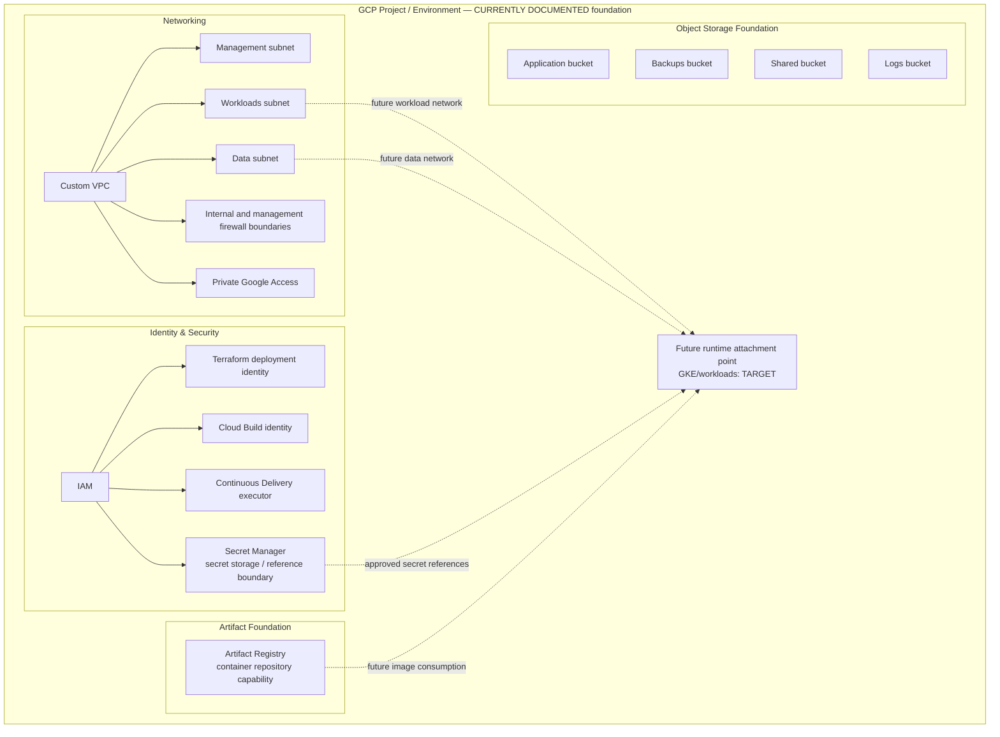

# GCP-01 — OEM GCP Foundation Architecture

| Architecture lifecycle | Evidence status | Scope |
|---|---|---|
| `CURRENT` | `CURRENTLY DOCUMENTED` infrastructure definition | GCP foundation, not runtime |

GCP-01 answers where OEM cloud infrastructure capabilities are defined. It does
not assert that Terraform definitions prove cloud resources currently exist, nor
that QA, production, GKE workloads, HA or DR are running.

**Predecessor:** preserved [combined GCP material](evolution/gcp-architecture-history.md).  
**Successor/extension:** [GCP-02 Build, Delivery & CI/CD](gcp-cicd-current.md).  
**Runtime relationship:** [D4 QA GKE](d4-qa-gke-minimum-target.md) remains a
separate target runtime architecture.

## Foundation containment

## Networking

The repository documents a custom VPC, regional management/workloads/data
subnets, Private Google Access, internal ingress firewall and management-to-SSH
firewall boundaries. It explicitly does not include Cloud Router, NAT, Private
Service Access, private DNS, VPC peering, VPN/Interconnect, load balancers or
public ingress rules in the initial module. Those are `PLANNED` or `UNKNOWN`
until an environment decision and evidence exist.

## Identity and secrets

Identity is represented by purpose: Terraform deployment, Cloud Build and
Continuous Delivery execution identities. Secret Manager is the secure storage
and integration boundary; applications should consume approved references or
injected values. Credentials, service-account keys and secret payloads do not
belong in Git, committed Terraform variables, release manifests or diagrams.

Runtime workload identity and secret injection are future runtime decisions.

## Artifact and storage foundations

Artifact Registry is a foundation capability that stores container artifacts.
Its build, immutable-digest and promotion lifecycle belongs to GCP-02. Cloud
Storage supports documented application, backups, shared and logs purposes; it
is object storage and must not be confused with Kubernetes Persistent Volumes
or application database storage.

## Runtime attachment boundary

GCP-01 deliberately stops before a runtime. D4 defines the QA GKE target;
D5A will compose GCP-01 with a production GKE runtime. Kafka, PostgreSQL,
OpenSearch and OEM workloads are not represented as deployed GCP resources in
this view.

## Evidence and gaps

The current repository supplies Terraform definitions and documentation, not a
cloud inventory. GKE topology, workload identity, ingress/load balancing,
runtime storage, HA/DR, backup/recovery and observability remain pending.
