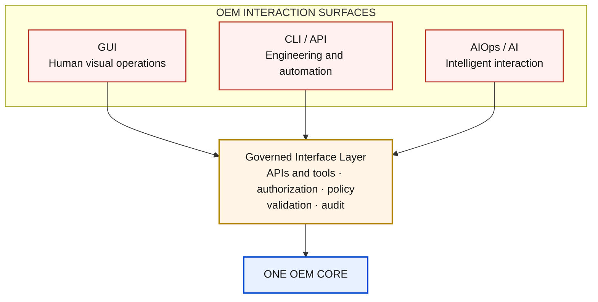
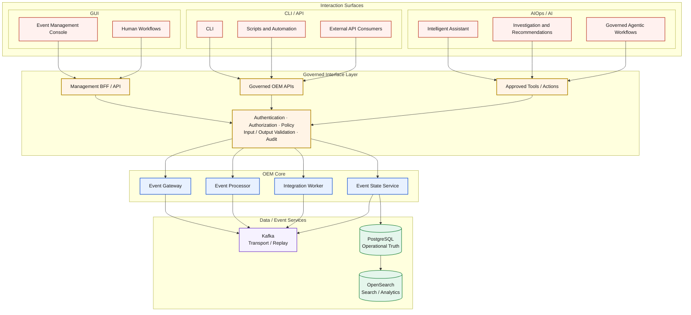
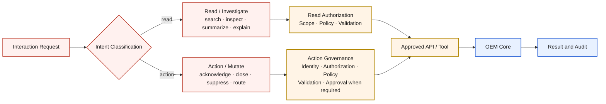
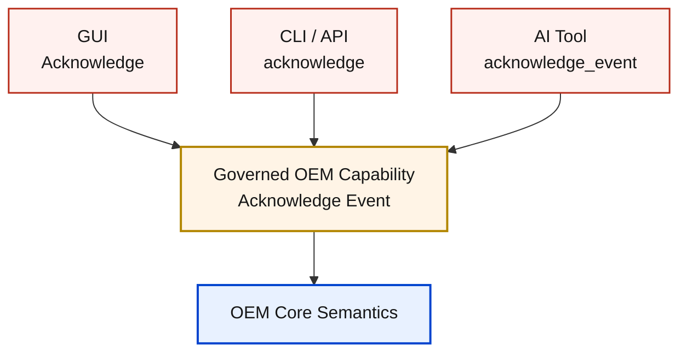

# Multi-Surface Interaction Architecture

## Architecture Overview

Open Event Management exposes one governed OEM Core through multiple interaction surfaces. GUI, CLI / API and AIOps / AI are alternative and complementary ways to consume the same product capabilities; they are not separate OEM products and none becomes an authority over operational state.

A deployment may expose one, several or all compatible surfaces according to policy and environment requirements. The interaction model can vary without changing OEM service ownership, event contracts, data authority or deployment architecture.

## Solution Architecture



The diagram expresses three interaction surfaces, one mandatory governance boundary and one OEM Core. No surface owns operational state or bypasses approved OEM APIs and tools.

## Interaction Surfaces

| Surface | Primary consumers | Interaction purpose |
|---|---|---|
| GUI | Operators and human users | Visual event operations, search, configuration and guided workflows |
| CLI / API | Operators, engineers, scripts, automation systems and external platforms | Programmatic operations, engineering automation and machine integration |
| AIOps / AI | Assistants, investigation workflows and governed agents | Investigation, summarization, recommendations and policy-controlled automation |

Surfaces can provide different experiences while converging on equivalent governed OEM capabilities.

## Engineering Architecture



The Governed Interface Layer mediates interaction with OEM Core contracts. Surfaces do not directly mutate Kafka, PostgreSQL, OpenSearch or runtime infrastructure.

## Governed Interface Layer

The Governed Interface Layer is a logical architecture boundary, not an assertion of a new microservice. It comprises the applicable Management BFF / API, governed OEM APIs, approved tool contracts and their controls.

Its responsibilities are:

- establish the authentication boundary for identifiable principals;
- authorize requested capabilities and scopes;
- enforce policy and action governance;
- preserve API and tool contracts;
- validate inputs and outputs;
- attribute and audit governed operations; and
- apply rate or usage controls where required.

The architecture defines these responsibilities without claiming that one uniform IAM, RBAC or audit implementation already spans every component.

## GUI Surface

The GUI provides human visual interaction with OEM:

```text
Operator
  → Event Management Console
  → Management BFF / API
  → Governed OEM APIs
  → OEM Core
```

According to governed API capabilities, the GUI may provide event visualization, search, operational actions, configuration interfaces and workflow interaction. It does not directly access Kafka, PostgreSQL, OpenSearch or runtime nodes.

## CLI / API Surface

CLI and API consumers provide programmatic and engineering interaction:

```text
CLI / API Consumer
  → Governed OEM API
  → OEM Core
```

Operators, engineers, scripts, automation systems and external platforms use the same authorization, validation and audit principles as the GUI. Automation does not receive a privileged bypass API merely because its caller is non-human.

## AIOps / AI Surface

AIOps / AI is an optional intelligent interaction surface. It can support investigation, event summarization, context retrieval, recommendations, guided remediation and governed agentic workflows through approved APIs, tools and retrieval interfaces.

AI receives no unrestricted authority over PostgreSQL, Kafka, OpenSearch or runtime infrastructure. Detailed model, retrieval, orchestration and AI governance design belongs to [AI-01](ai-01-aiops-ai-architecture.md).

## Read vs Action Boundary



Reads can search events, retrieve context, inspect lifecycle, summarize or correlate information and explain state. Actions can acknowledge, close, suppress, route, create or update a ticket, trigger automation or change configuration. Every action requires explicit governance; an AI request does not imply action authority.

## Action Governance

A state-changing operation preserves this chain:

```text
Identity → Authorization → Policy → Validation
         → Approved Tool / API → OEM Core → Result → Audit
```

Sensitive or high-impact actions can include approval gates. Approval requirements are policy-driven according to action risk and environment; the architecture does not impose universal human approval on every operation.

## Identity Model

Every surface acts through an identifiable principal, such as a human identity, automation or service identity, AI or agent identity, or tool-execution identity. Anonymous authority is not part of this architecture.

The identity contract supports least privilege, attribution, auditability and separation of duties without selecting a concrete IAM implementation.

## Authorization Model

Authorization is based on the requested capability and its scope:

```text
Identity
  + Requested Capability
  + Resource / Scope
  + Policy
  = Authorization Decision
```

The availability of a surface does not grant unrestricted OEM access. This model does not select a particular RBAC or policy engine.

## Audit Model

Governed operations are attributable by identity, surface, API or tool, action, target, timestamp, result and correlation or request identifier. AI-driven actions additionally preserve the agent or workflow identity, invoked tool, policy decision and approval evidence when applicable.

Multi-Surface defines the audit interaction contract but does not select a physical audit store.

## Tool Model

Approved tools expose bounded capabilities to AI and automation:

```text
AI / Automation
  → Tool Contract
  → Authorization / Policy
  → OEM API / Integration
  → Result
```

A tool contract defines its input and output schemas, permissions, side effects, error behavior and audit context. AI-01 owns detailed agent and tool orchestration.

## Data Access Model

| Service | Invariant role | Surface access rule |
|---|---|---|
| PostgreSQL | Operational Source of Truth | Consumed through governed OEM capabilities; never a surface authority |
| OpenSearch | Search / Analytics Projection | Search, analytics and retrieval context are exposed through governed interfaces |
| Kafka | Transport / Replay Boundary | Supports asynchronous product workflows; it is not a user-facing API |

Callers depend on product contracts rather than physical store topology. OpenSearch can support retrieval and context, but **OpenSearch is not AI** and does not become authoritative.

## Event-Driven Interaction

OEM can support request/response interactions, event-driven workflows, notifications, callbacks and asynchronous automation. Kafka remains the internal event transport and replay boundary; interaction surfaces consume designed interfaces rather than Kafka as a direct user API.

## Surface Equivalence



Equivalent business capabilities converge on the same governed OEM operation regardless of surface. User experiences and invocation syntax can differ; core business semantics do not.

## Surface Independence

OEM Core remains operable without requiring every surface. A policy-approved deployment can expose GUI only, API / CLI only, GUI plus API, GUI plus API plus AIOps, or another compatible combination.

AI is not mandatory, and GUI is not mandatory for machine-oriented use cases. A required Management Plane capability is distinct from the availability of a particular interaction surface.

## Product Modularity

```text
OEM Core
  + Selected Interaction Surfaces
  + Environment Profile
  = Environment-Specific Product Deployment
```

This is an architecture-modularity model. It does not define commercial SKUs, entitlements or licensing policy.

## Deployment Relationship

Multi-Surface is a cross-cutting product architecture that can apply to compatible D1, D3, D2, D4, D5A and D5B deployments. The selected environment architecture determines runtime implementation; Multi-Surface determines interaction governance.

It is not a deployment environment and does not belong inside the D1-to-D5 specialization path.

## Relationship to D0

[D0](d0-logical-current.md) defines the invariant OEM Core, its component responsibilities, event flow and data authority. Multi-Surface sits above that core and defines how interaction models consume its governed contracts; it does not duplicate or redefine D0 internals.

## Relationship to D6

[D6](d6-environment-evolution.md) is the OEM architecture navigation and environment-composition map. It identifies Multi-Surface as cross-cutting across compatible deployment profiles. Multi-Surface does not redefine D6 environment topology.

## Relationship to AI-01

Multi-Surface answers **which interaction surfaces can consume OEM** and defines AIOps / AI as one optional surface. [AI-01](ai-01-aiops-ai-architecture.md) answers **how the intelligent surface is implemented and governed**, including model, retrieval, orchestration and tool concerns.

## Solution Flow

1. **Select Surface:** use a policy-approved GUI, CLI / API or AIOps / AI interaction.
2. **Authenticate:** establish an identifiable principal.
3. **Request Capability:** submit the intended read or action.
4. **Authorize:** evaluate capability, resource, scope and policy.
5. **Validate:** enforce the applicable API or tool contract.
6. **Execute Read / Action:** invoke the approved governed interface.
7. **Process in OEM Core:** preserve canonical component responsibilities and semantics.
8. **Return Result:** provide a contract-defined outcome to the surface.
9. **Audit:** attribute the operation, policy decision and result.
10. **Continue Workflow:** allow the surface to present, automate or govern the next step.

## Architectural Principles

| Principle | Architectural consequence |
|---|---|
| One OEM Core | Every surface consumes the same product responsibilities and authority model. |
| Multiple Interaction Surfaces | Human, programmatic and intelligent interaction models coexist. |
| API-First | Surfaces consume explicit OEM APIs and tool contracts. |
| Governed Access | Every path crosses authorization, policy and validation boundaries. |
| Capability Equivalence | Equivalent operations preserve the same core semantics across surfaces. |
| Least Privilege | Identities receive only capabilities and scopes required for their role. |
| Identity Attribution | Human, automation, AI and tool execution remain attributable. |
| Policy-Controlled Actions | Mutations execute only through approved policy-governed operations. |
| Auditability | Governed requests, decisions, tools and outcomes can be traced. |
| Store Encapsulation | Surfaces do not depend on or directly mutate internal stores. |
| Surface Independence | OEM operates with any policy-approved compatible surface combination. |
| AI Optionality | AI is an optional interaction model, not an OEM dependency. |
| Deployment Independence | Interaction governance is separate from runtime topology. |
| Vendor-Neutral Interfaces | Product interaction contracts do not depend on one provider or client. |

## Architecture Boundary

Multi-Surface defines interaction surfaces, governed access, action governance, surface equivalence and the identity/audit interaction contract.

It does not define OEM event-processing internals, deployment topology, AI model architecture, retrieval-augmented generation, agent orchestration or GCP infrastructure. Those concerns remain owned by D0, D6, AI-01 and the applicable deployment and foundation architectures.

## Related Architectures

- [D0 — OEM Logical Architecture](d0-logical-current.md)
- [D6 — Environment Evolution & Deployment Model](d6-environment-evolution.md)
- [AI-01 — OEM AIOps / AI Architecture](ai-01-aiops-ai-architecture.md)
- [Data Authority & Replay Boundary](data-authority-replay.md)
- [Architecture Evolution Register](evolution/index.md)
- [Future Architecture Register](evolution/future-architecture-register.md)
