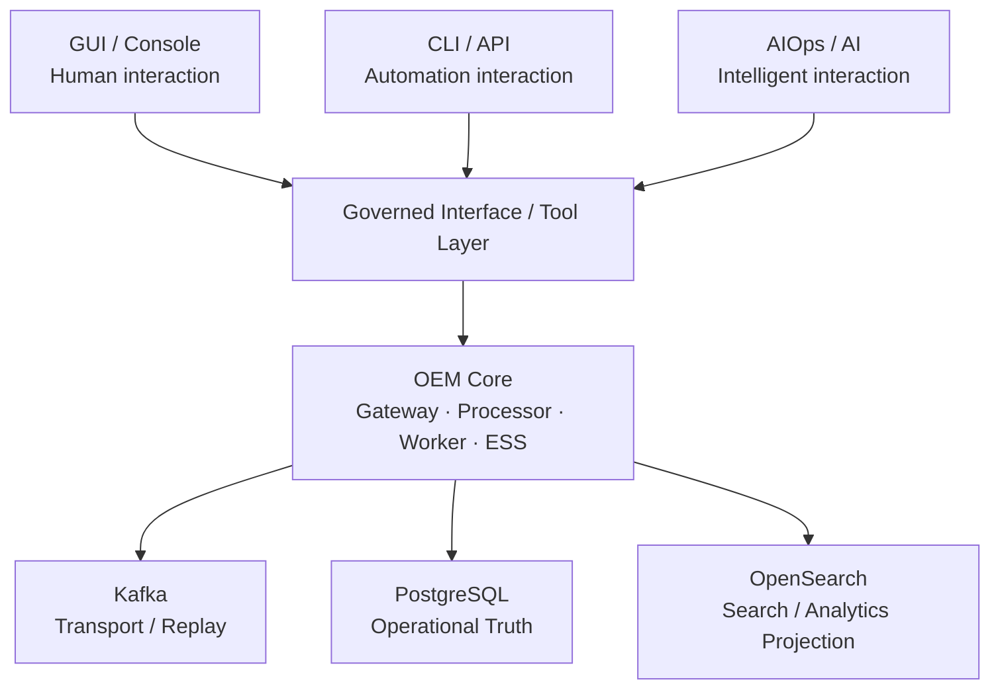

# OEM Multi-Surface Interaction Architecture

| Architecture lifecycle | Documentation status |
|---|---|
| `PLANNED` | `DOCUMENTED FUTURE ARCHITECTURE` |

## One OEM Core — Multiple Ways to Operate It

Open Event Management is interaction-surface independent. Customers can operate one governed OEM Core through a human GUI, programmatic CLI/API, future AIOps/AI, or a combination of these models. These are not separate OEM products and none owns a private path into OEM state.

The Governed Interface / Tool Layer is an architectural boundary, not a newly asserted microservice. It represents OEM and management APIs, approved CLI operations, future AI tools/functions, authorization, policy enforcement, audit and action validation. It prevents direct GUI, CLI or AI access to PostgreSQL, Kafka and OpenSearch.

### Interaction choices

- **GUI / Console:** operator → Event Management Console → Management BFF/API → governed OEM APIs → OEM Core.
- **CLI / API:** operator, script, automation client or integration → governed OEM APIs → OEM Core. Existing CLI capabilities remain limited to their documented scope.
- **AIOps / AI:** assistant or workflow → governed tools/APIs → OEM Core. AI is optional and does not gain operational authority through model inference.

This view is compatible with [D0 logical architecture](d0-logical-current.md), [D1 local deployment](d1-local-current.md), [D6 environment evolution](d6-environment-evolution.md) and the planned [AI-01 architecture](ai-01-aiops-ai-architecture.md).
