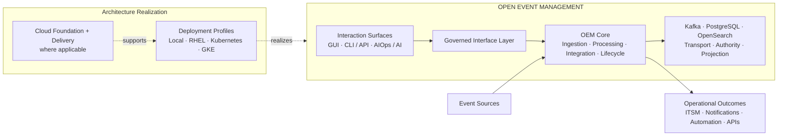
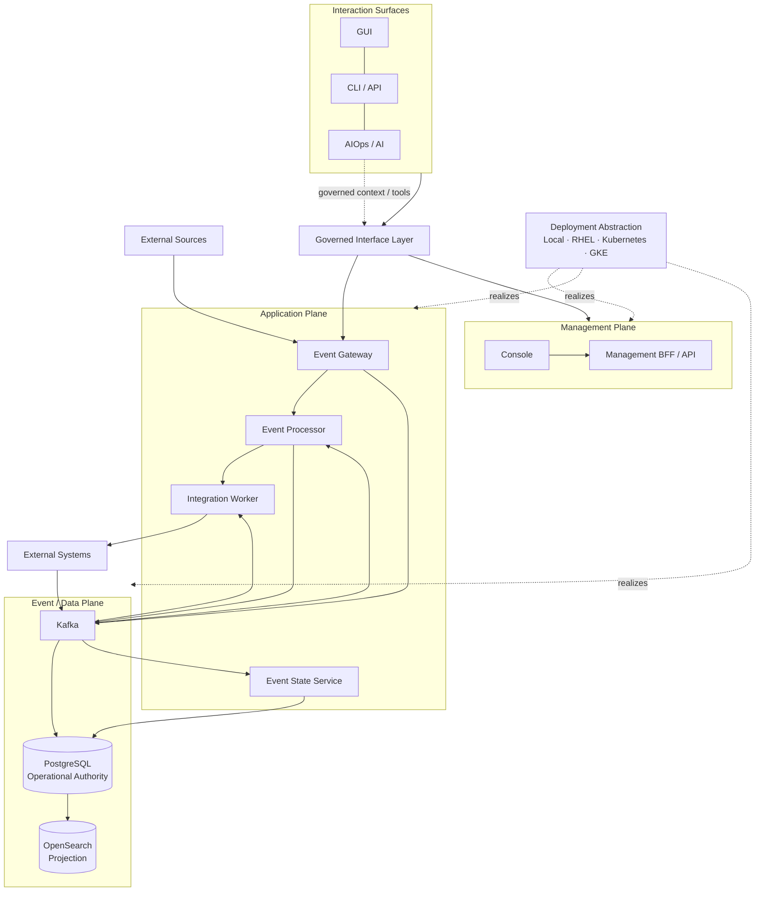

# Open Event Management — Architecture Definition

| Architecture role | Source set | Scope |
|---|---|---|
| Canonical master definition | Approved OEM Golden Architecture Set | Product-wide synthesis |

This page explains the complete Open Event Management (OEM) architecture once.
The linked Golden architectures remain authoritative for domain depth; this
Master composes them and does not supersede them.

## 1. Product Definition

### 1.1 Purpose

OEM is an event-driven platform for receiving, processing, integrating,
consolidating and operating enterprise events. It converts event streams into
governed operational outcomes while preserving explicit service ownership and
data authority. See [D0](d0-logical-current.md).

### 1.2 Problem Domain

Enterprise events arrive from heterogeneous sources, require policy and context,
and may trigger ITSM, notification, automation or API actions. OEM decouples
those concerns so that ingestion, decisions, execution and lifecycle state can
evolve independently behind stable contracts.

### 1.3 Architectural Scope

The architecture covers the logical product, event flow, management and
interaction surfaces, data authority, optional AI attachment, deployment
profiles, GCP foundation, delivery, security, operability and evolution.

### 1.4 Product Boundaries

OEM owns its Core services, governed interfaces and operational state. Event
sources and action systems remain external. Cloud platforms, orchestrators,
model providers and integration products realize or attach to OEM without
becoming OEM business logic.

### 1.5 Architectural Principles

- Event-driven, API-first and governed by explicit contracts.
- Gateway receives, Processor decides, Worker executes, and ESS consolidates.
- PostgreSQL owns operational truth; Kafka transports; OpenSearch projects.
- One vendor-neutral logical core supports multiple deployment profiles.
- Identity, secrets, policy, audit and controlled exposure cross all domains.
- Open interfaces, replaceable adapters, portable deployment, provider-neutral
  models, modular integrations and versionable architecture support extension.

## 2. Architecture at a Glance

### 2.1 Master Solution Architecture



### 2.2 Architecture Domains

| Domain | Canonical responsibility | Detailed architecture |
|---|---|---|
| Logical Core | Product planes, services and contracts | [D0](d0-logical-current.md) |
| Interaction | Alternative governed surfaces | [Multi-Surface](multi-surface-interaction.md) |
| Data | Transport, authority, projection and recovery | [Data Authority & Replay](data-authority-replay.md) |
| AI / AIOps | Optional governed intelligent attachment | [AI-01](ai-01-aiops-ai-architecture.md) |
| Deployment | Environment-specific realization | [D6](d6-environment-evolution.md) |
| Cloud Foundation | GCP infrastructure capabilities | [GCP-01](gcp-foundation-current.md) |
| Build / Delivery | Immutable release lifecycle | [GCP-02](gcp-cicd-current.md) |

The organizational taxonomy is:

```text
OEM Architecture
├── Product Architecture — D0
├── Data Architecture — Data Authority & Replay
├── Interaction Architecture — Multi-Surface
├── AI Architecture — AI-01
├── Deployment Architecture — D1, D3, D2, D4, D5A, D5B
├── Cloud Architecture — GCP-01, GCP-02
└── Environment Architecture — D6
```

This taxonomy organizes the approved set; it introduces no new architecture
semantics or lifecycle sequence.

### 2.3 Canonical Event Flow

`Event Source → Event Gateway → Kafka → Event Processor → Integration Worker
→ External System → integration.results → Event State Service → PostgreSQL
→ OpenSearch`

Management follows a separate governed path through Console, BFF and OEM APIs.

The canonical synthesis invariants are:

| Invariant | Canonical statement |
|---|---|
| Logical core | One OEM Logical Core |
| Operational authority | PostgreSQL = Operational Source of Truth |
| Event backbone | Kafka = Decoupled Event Transport + Replay Boundary |
| Search and analytics | OpenSearch = Search / Analytics Projection |
| Interaction | GUI / CLI-API / AIOps = Governed Interaction Surfaces |
| AI | Optional cross-cutting capability |
| Cloud boundary | GCP Foundation != OEM Runtime |
| Delivery boundary | Delivery != Runtime |
| Provisioning boundary | Terraform != Application Deployment |
| Authorization boundary | Artifact Availability != Deployment Authorization |
| Recovery boundary | Replay != Backup / Restore |
| Data boundary | Projection != Operational Authority |
| Portability | Environment changes != Product semantic changes |

## 3. Logical Architecture

### 3.1 Management Plane

The Event Management Console and Management BFF/API expose governed operations.
They do not directly mutate datastores, the event backbone or runtime hosts.

### 3.2 Application Plane

Event Gateway owns admission and normalization; Event Processor owns policy and
decisions; Integration Worker owns adapter execution; Event State Service owns
lifecycle, history and state consolidation.

### 3.3 Event / Data Plane

Kafka decouples asynchronous services. PostgreSQL persists authoritative state.
OpenSearch materializes search and analytics projections.

### 3.4 External Integration Boundary

Adapters isolate OEM from ITSM, notification, automation, webhook and external
API providers. External outcomes return through governed result contracts.

### 3.5 Component Responsibilities

| Component | Responsibility |
|---|---|
| Event Gateway | Validate, normalize and admit events |
| Event Processor | Enrich, correlate, suppress, apply policy and route |
| Integration Worker | Execute approved integration commands |
| Event State Service | Consolidate lifecycle, results, history and state |
| Management BFF / API | Mediate governed management operations |

The integrated engineering composition is:



## 4. Event Processing Architecture

### 4.1 Ingestion

Event Gateway validates, normalizes and admits source events through controlled
interfaces.

### 4.2 Transport

Kafka carries explicit event and integration contracts and separates producer
and consumer lifecycles.

### 4.3 Processing

Event Processor applies policy, enrichment, correlation, suppression and routing
without taking ownership of integration execution.

### 4.4 Integration Execution

Integration Worker executes approved commands through provider adapters and
returns explicit results.

### 4.5 Lifecycle Consolidation

Event State Service consolidates results and lifecycle transitions without
re-evaluating Processor decisions.

### 4.6 Persistence

Service-owned PostgreSQL persistence records authoritative operational state,
history and audit according to the owning contract.

### 4.7 Search / Analytics Projection

OpenSearch receives derived projections for search, analytics and approved
retrieval context. Full flow depth remains in [D0](d0-logical-current.md).

## 5. Data Authority & Replay

### 5.1 Authority Model

| Capability | Architectural Role | Authority |
|---|---|---|
| Kafka | Decoupled Event Transport + Replay Boundary | Non-authoritative transport state |
| PostgreSQL | Operational Source of Truth | Authoritative |
| OpenSearch | Search / Analytics Projection | Derived / rebuildable |

### 5.2 Kafka

Kafka provides asynchronous transport, buffering, finite retention and bounded
replay; retained events do not become operational truth.

### 5.3 PostgreSQL

PostgreSQL is the source used to decide canonical OEM operational state.

### 5.4 OpenSearch

OpenSearch provides rebuildable search and analytics views and never replaces
PostgreSQL authority.

### 5.5 Replay

Replay is controlled reintroduction of eligible retained events. Retention,
compatibility, determinism, idempotency and external side effects constrain it.

### 5.6 Recovery Semantics

| Capability | Recovery pattern |
|---|---|
| Kafka | Retention / controlled replay |
| PostgreSQL | Backup / restore / integrity recovery |
| OpenSearch | Rebuild / reconcile / reindex |

**Replay != Backup / Restore != Projection Rebuild.**

### 5.7 Consistency Boundary

OEM does not claim distributed ACID or exactly-once semantics across transport,
authority and projection. Projection consistency is asynchronous. A general
reconciliation service and transactional outbox remain separate decisions. See
[Data Authority & Replay](data-authority-replay.md).

## 6. Interaction Architecture

### 6.1 Multi-Surface Model

GUI, CLI / API and AIOps / AI are alternative surfaces over one OEM Core.

### 6.2 GUI

The GUI provides a task-oriented human experience through the Management BFF.

### 6.3 CLI / API

CLI and API clients use stable, authorized OEM contracts for equivalent
capabilities where exposed.

### 6.4 AIOps / AI Surface

The optional AI surface interprets intent and context but receives no privileged
path around OEM governance.

### 6.5 Governed Interface Layer

All surfaces traverse identity, authorization, policy, validation and audit
controls defined by [Multi-Surface](multi-surface-interaction.md).

### 6.6 Read vs Action Governance

Reads preserve authority and provenance. State-changing actions require stronger
authorization, validation, policy and audit and execute through owning services.

## 7. AI / AIOps Architecture

### 7.1 AI Position in OEM

AI-01 is optional and subordinate to OEM Core; OEM remains operable without it.

### 7.2 Orchestration

AI orchestration coordinates context, models, workflows and tools without owning
OEM business state.

### 7.3 Retrieval and Context

Context retains provenance and authority class. OpenSearch can supply retrieval
context; authoritative context is obtained through governed OEM APIs.

### 7.4 Model Abstraction

Provider-neutral model interfaces isolate OEM from any LLM or OLLM vendor.

### 7.5 Agent / Workflow Model

Workflows constrain goals, steps and state; agents receive bounded identity and
permissions.

### 7.6 Tool Model

Read and action tools are explicit governed interfaces, not datastore backdoors.

### 7.7 AI Governance

Prompt/instruction, model, agent and tool governance preserve authorization,
approval, provenance, output validation and audit.

### 7.8 AI Observability and Evaluation

AI behavior is designed for traceability, measurement and regression evaluation;
specific stacks and thresholds remain separately selected.

### 7.9 Failure / Graceful Degradation

Model, retrieval, workflow or tool failure is contained in AI orchestration.
OEM Core and non-AI surfaces continue according to their deployment contracts.

### 7.10 Implementation Evidence Boundary

AI-01 remains `PLANNED (DOCUMENTED)`. Certified evidence is limited to persistent
AIOps configuration and revisions, REST CRUD, immutable configuration-change
audit and HTTP assessment against an internal mock provider. It does not certify
LLM/OLLM, RAG, vector retrieval, a model gateway, production agents or tools,
durable AI memory, or complete production AI governance, observability or
evaluation. See [AI-01](ai-01-aiops-ai-architecture.md).

## 8. Deployment Architecture

### 8.1 Deployment Model

Deployment profiles realize the same D0 Core through different containment,
orchestration, infrastructure and operating-quality choices.

### 8.2 Local — D1

Linux → Docker Engine → Docker Compose provides self-contained local execution.

### 8.3 On-Premises RHEL — D3

Enterprise virtualization and RHEL VMs distribute Database, Core, Gateway and
GUI roles with controlled exposure and lifecycle contracts.

### 8.4 Portable Kubernetes — D2

KVM → Linux VMs → Kubernetes provides a provider-neutral orchestration model.

### 8.5 QA GKE — D4

GCP Foundation → GKE realizes the portable workload contract for QA validation.

### 8.6 Production GKE — D5A

D5A adds production availability, resilience, security, capacity, recovery and
operability as platform capabilities, not new OEM business services.

### 8.7 Production GKE + CI/CD — D5B

D5B composes GCP-01 foundation, GCP-02 delivery and D5A runtime.

| Profile | Infrastructure | Orchestration | Application deployment | Production qualities | Delivery automation |
|---|---|---|---|---|---|
| D1 Local | Linux host | Docker Compose | Local composition | Local scope | External |
| D3 RHEL | Enterprise VMs | Role/service lifecycle | Enterprise/offline package | Profile-specific | External |
| D2 Kubernetes | KVM + Linux VMs | Kubernetes | Kubernetes package | Portable capability contract | External |
| D4 QA GKE | GCP foundation | GKE | Kubernetes package | QA validation | External |
| D5A PROD GKE | GCP foundation | Production GKE | Authorized runtime release | Required | Separate GCP-02 |
| D5B PROD GKE + CI/CD | GCP-01 | D5A runtime | Governed immutable release | Required through D5A | Composed GCP-02 |

## 9. Cloud Foundation Architecture

### 9.1 GCP Foundation

[GCP-01](gcp-foundation-current.md) supplies reusable, environment-isolated
infrastructure capabilities; it does not define OEM business behavior.

### 9.2 Networking

VPC and management, workload and data subnet responsibilities establish
controlled connectivity boundaries.

### 9.3 Identity

Human, Terraform, build, delivery and runtime identities remain purpose-specific
and least-privileged.

### 9.4 Secret Management

Secret Manager provides approved storage/reference boundaries; payloads remain
outside source, images, manifests and architecture documentation.

### 9.5 Artifact Foundation

Artifact Registry stores approved artifacts but does not build, authorize or
deploy them.

### 9.6 Object Storage

Purpose-specific object storage supports application, backup, shared and log
uses without replacing runtime state services.

## 10. Build & Delivery Architecture

### 10.1 Infrastructure Delivery

Validated Terraform definitions use an authorized identity to provision GCP-01.

### 10.2 Application Build

Validated source is built into container artifacts and published by a distinct
build identity.

### 10.3 Immutable Artifact Identity

A resolved image digest identifies deployable content; mutable tags do not.

### 10.4 Release Manifest

The manifest records source, build, digest, health, dependency, configuration and
logical secret-reference metadata; it is not a deployment controller.

### 10.5 Deployment Authorization

Artifact availability does not authorize deployment. Approved metadata, actor
identity and environment policy govern delivery.

### 10.6 Promotion

Build once and promote the same approved digest; environment configuration,
secret references and policy vary independently.

### 10.7 Rollback

Rollback is a newly authorized, compatibility-checked delivery of a prior
approved release, not a tag switch.

### 10.8 Release Traceability

Source commit → build → digest → manifest → delivery identity → runtime release
forms one attributable chain. See [GCP-02](gcp-cicd-current.md).

## 11. Environment Architecture

### 11.1 Environment Architecture Map

[D6](d6-environment-evolution.md) is the detailed map from the D0 invariant to
Local, RHEL, portable Kubernetes, QA GKE and production GKE profiles.

### 11.2 Environment Invariants

Service responsibilities, event contracts, authority, external integration and
governed management remain stable across profiles.

### 11.3 Environment-Specific Concerns

Containment, networking, storage integration, identity, secrets, availability,
recovery, capacity and delivery automation vary by environment.

### 11.4 Deployment Mechanisms

Profiles delegate to Docker Compose, enterprise packages, Kubernetes packages,
Terraform and authorized delivery as applicable.

### 11.5 Installer vs Terraform vs Kubernetes vs CI/CD

Installer/package tooling deploys OEM; Terraform provisions infrastructure;
Kubernetes orchestrates workloads; CI/CD moves validated immutable releases.
None replaces the others or owns OEM business logic.

## 12. Security & Governance

### 12.1 Identity

Purpose-specific human, automation, delivery and workload identities preserve
responsibility boundaries.

### 12.2 Least Privilege

Every actor, workload, workflow and tool receives only required permissions.

### 12.3 Secret Externalization

Secret payloads stay outside source, artifacts, release metadata and plain
configuration.

### 12.4 Controlled Exposure

Only approved ingestion and management interfaces cross runtime boundaries;
NetworkPolicy is a Kubernetes enforcement capability where selected.

### 12.5 Policy

Processing, deployment and action policy are explicit, versionable and applied
at their owning boundaries.

### 12.6 Auditability

Management, delivery and governed action decisions remain attributable.

### 12.7 AI Governance

AI cannot bypass authorization, approval, validation or tool policy.

### 12.8 Supply Chain Security

Immutable identity, provenance, separate actors, validation gates and traceable
authorization protect delivery. Specific signing, SBOM and attestation controls
remain separately governed.

## 13. Operability & Resilience

### 13.1 Health / Readiness

Services and stateful capabilities expose distinct health and readiness signals.

### 13.2 Observability

Logs, metrics, health and traces where applicable support diagnosis and release
feedback without selecting one telemetry vendor.

### 13.3 Availability

Production platforms provide redundancy, scheduling and failure isolation while
services retain their logical ownership.

### 13.4 HA vs DR

HA maintains service within a failure domain; DR restores service after broader
loss. One does not imply the other.

### 13.5 Backup / Restore

Authoritative PostgreSQL recovery uses backup, restore and integrity controls;
specific schedules, RPO and RTO remain environment decisions.

### 13.6 Projection Recovery

OpenSearch is rebuilt, reconciled or reindexed from authoritative state and/or
eligible events without becoming authority.

### 13.7 Capacity

Compute, storage, retention and throughput are planned per profile and service.

### 13.8 Controlled Change

Validated releases, compatibility-aware stateful upgrades, diagnostics and
authorized rollback constrain operational change.

## 14. Deployment and Portability Principles

### 14.1 One Logical Core

D0 responsibilities remain invariant in every compatible realization.

### 14.2 Multiple Deployment Profiles

Profiles are operating choices, not separate OEM products or a mandatory
migration sequence.

### 14.3 Environment Configuration

Externalized configuration combines product settings, profile inputs, secret
references and runtime policy.

### 14.4 Externalized Secrets

Secret authorities and injection vary by environment while payloads remain
outside immutable application content.

### 14.5 Build Once / Promote

Environments consume the same approved artifact identity where GCP-02 applies.

### 14.6 Vendor Neutrality

OEM Core is conceptually independent of one cloud, model provider, ITSM,
notification platform, automation platform or Kubernetes distribution. GCP
architectures are implementations of this vendor-neutral model.

## 15. Architecture Boundaries

### 15.1 What OEM Defines

OEM defines product planes, component ownership, governed interfaces, event
contracts, authority semantics, integration boundaries and portability rules.

### 15.2 What Environment Architectures Define

Environment views define containment, platform capabilities, infrastructure
integration and operating qualities without redefining OEM Core.

### 15.3 What Remains ADR-Controlled

Helm/Kustomize packaging, Kubernetes distribution/topology, stateful operators,
specific ingress, PKI/TLS, storage classes, telemetry stack, model/provider
selection, DR topology and general reconciliation/outbox design remain separate
decisions.

### 15.4 What Remains Outside Certified Implementation Evidence

Architecture approval is not runtime certification. Deployment evidence,
provider behavior and production operating qualities remain separately governed.
The AI evidence limit is stated in 7.10; no Master statement expands it.

The principal responsibility boundaries are:

| Capability | Owns / provides | Does not own / replace |
|---|---|---|
| OEM Core | Event-management business behavior | Cloud or provider control planes |
| Interaction Surface | Human, programmatic or intelligent experience | OEM Core or direct datastore mutation |
| Governed Interface Layer | Identity, authorization, policy, validation and audit boundary | Owning service business responsibility |
| Kafka | Decoupled transport and replay boundary | Operational authority or backup |
| PostgreSQL | Authoritative operational state | Event transport or search projection |
| OpenSearch | Search, analytics and approved retrieval projection | Operational authority or AI engine |
| AI-01 | Optional orchestration, retrieval, model, workflow and tool boundaries | OEM authority or governance bypass |
| Kubernetes | Portable workload orchestration | OEM business logic |
| GCP Foundation | Network, identity, secret, artifact and object-storage capabilities | OEM Runtime or delivery authorization |
| Terraform | Authorized infrastructure provisioning | Application deployment or artifact build |
| Cloud Build | Validated application build and artifact publication | Production deployment authorization |
| Artifact Registry | Approved artifact storage | Build, promotion or runtime control |
| Release Manifest | Governed release metadata | Deployment execution or secret payloads |
| CD Executor | Authorized release delivery | Foundation ownership or runtime business logic |

## 16. Architecture Catalog

### 16.1 Golden Architecture Matrix

| ID | Architecture | Domain | Master coverage | Purpose | Lifecycle | Detailed page |
|---|---|---|---|---|---|---|
| D0-golden-01 | OEM Logical Architecture | Product | PRIMARY | Logical Core and contracts | CURRENT (DOCUMENTED) | [D0](d0-logical-current.md) |
| D1-golden-01 | Local Deployment | Deployment | SUPPORTING | Local Compose realization | CURRENT (DOCUMENTED) | [D1](d1-local-current.md) |
| D3-golden-01 | On-Premises RHEL | Deployment | SUPPORTING | Distributed enterprise roles | CURRENT (DOCUMENTED) | [D3](d3-rhel-current.md) |
| D2-golden-01 | KVM + Kubernetes | Deployment | SUPPORTING | Portable orchestration | TARGET (DOCUMENTED) | [D2](d2-kvm-kubernetes-target.md) |
| D4-golden-01 | QA GKE Minimum | Deployment | SUPPORTING | Managed-Kubernetes QA | TARGET (DOCUMENTED) | [D4](d4-qa-gke-minimum-target.md) |
| GCP-01-golden-01 | GCP Foundation | Cloud | SUPPORTING | Shared infrastructure capabilities | CURRENT (DOCUMENTED) | [GCP-01](gcp-foundation-current.md) |
| GCP-02-golden-01 | Build, Delivery & CI/CD | Delivery | SUPPORTING | Governed immutable delivery | CURRENT (DOCUMENTED) | [GCP-02](gcp-cicd-current.md) |
| D5A-golden-01 | Production GKE Runtime | Deployment | SUPPORTING | Production runtime qualities | TARGET (DOCUMENTED) | [D5A](d5a-prod-gke-runtime-target.md) |
| D5B-golden-01 | Production GKE + CI/CD | Composition | SUPPORTING | Foundation + delivery + runtime | TARGET (DOCUMENTED) | [D5B](d5b-prod-gke-cicd-target.md) |
| D6-golden-01 | Environment Evolution | Navigation | PRIMARY | Environment/deployment map | CURRENT (DOCUMENTATION VIEW) | [D6](d6-environment-evolution.md) |
| MULTI-SURFACE-golden-01 | Multi-Surface Interaction | Interaction | CROSS-CUTTING | Governed alternative surfaces | PLANNED (DOCUMENTED) | [Multi-Surface](multi-surface-interaction.md) |
| AI-01-golden-01 | AIOps / AI | AI | CROSS-CUTTING | Optional intelligent attachment | PLANNED (DOCUMENTED) | [AI-01](ai-01-aiops-ai-architecture.md) |
| DATA-AUTHORITY-golden-01 | Data Authority & Replay | Data | CROSS-CUTTING | Authority, replay and recovery | CURRENT (DOCUMENTED) | [Data Authority](data-authority-replay.md) |

### 16.2 Cross-References

| Master domain | Primary Golden source | Supporting Golden sources | Contract reused |
|---|---|---|---|
| Product / Logical Core | D0-golden-01 | Multi-Surface, Data Authority | Product planes, ownership and contracts |
| Event Processing | D0-golden-01 | DATA-AUTHORITY-golden-01 | Canonical event flow and persistence roles |
| Data Authority & Replay | DATA-AUTHORITY-golden-01 | D0 | Transport, authority, projection and recovery |
| Interaction | MULTI-SURFACE-golden-01 | D0, AI-01 | Governed surfaces and read/action boundary |
| AI / AIOps | AI-01-golden-01 | Multi-Surface, Data Authority | Optional governed intelligent attachment |
| Local Deployment | D1-golden-01 | D0 | Linux / Docker Compose realization |
| RHEL Deployment | D3-golden-01 | D0 | Distributed enterprise roles |
| Portable Kubernetes | D2-golden-01 | D0, D3 | Portable orchestration contract |
| QA GKE | D4-golden-01 | D2, GCP-01 | QA managed-Kubernetes realization |
| Production GKE | D5A-golden-01 | D4, GCP-01, Data Authority | Production runtime qualities |
| Production Composition | D5B-golden-01 | GCP-01, GCP-02, D5A | Foundation + delivery + runtime |
| Cloud Foundation | GCP-01-golden-01 | D4, D5A | GCP support capabilities |
| Build / Delivery | GCP-02-golden-01 | GCP-01, D5B | Immutable authorized delivery |
| Environment Architecture | D6-golden-01 | D0 through D5B | Profiles, invariants and mechanisms |
| Security / Governance | D0 and cross-cutting Golden contracts | D2, D4, GCP-01, GCP-02, D5A | Existing identity, policy, secret and audit boundaries |
| Operability / Resilience | D5A-golden-01 | Data Authority and deployment Golden contracts | Health, availability, recovery and controlled change |

This traceability matrix maps every major Master domain to approved sources. D0
remains the logical authority and D6 remains environment navigation; the Master
replaces neither.

### 16.3 Architecture Evolution

The [Architecture Evolution Register](evolution/index.md) preserves lifecycle,
predecessor, successor and change rationale independently from this synthesis.

### 16.4 Future Architecture

The [Future Architecture Register](evolution/future-architecture-register.md)
keeps AI-02, packaging, DR where separately required, general
reconciliation/outbox and other BAU decisions outside this assembly. Helm or
Kustomize packaging, GitOps controller selection, stateful operator selection,
and business recovery objectives remain separately governed decisions rather
than defects in the Master.
