# Open Event Management — Architecture Definition

**Vendor-Neutral Event Management, Automation and AIOps Platform**

## Document Control

| Field | Value |
|---|---|
| Document | Open Event Management — Architecture Definition |
| Architecture | OEM Master Architecture |
| Classification | Architecture Definition |
| Language | English |
| Version | 1.0 |
| Source | MASTER-ARCH-01 |
| Architecture baseline | 13 approved Golden Architectures |
| Status | Approved Architecture Definition |

This publication is a curated projection of the canonical [OEM Master Architecture](../oem-architecture-definition.md). The Master and approved Golden architectures remain the semantic sources; this document does not redesign them.

## Executive Overview

Open Event Management (OEM) is an event-driven platform for receiving, processing, integrating, consolidating and operating enterprise events. It separates responsibilities that are commonly entangled in operations platforms: source admission, event decisions, external action, lifecycle state, search and human or automated interaction. Each responsibility can therefore evolve behind explicit contracts without silently changing another.

Events enter through the Event Gateway, which validates, normalizes and admits them. Kafka provides decoupled transport and a bounded replay boundary. The Event Processor applies policy, enrichment, correlation, suppression and routing decisions. The Integration Worker executes approved commands through adapters for IT service management (ITSM), notification, automation and external APIs. Results return through explicit contracts to the Event State Service, which consolidates lifecycle and history in PostgreSQL. PostgreSQL is the Operational Source of Truth; OpenSearch is a derived, rebuildable search and analytics projection. Transport is not authority, replay is not backup and projection is not operational truth.

OEM exposes one governed Core through GUI, CLI/API and AIOps/AI surfaces. Every surface crosses the same identity, authorization, policy, validation and audit boundary. Read and state-changing action paths are distinct, with stronger controls for actions. AI is optional and subordinate to the Core: models and agents cannot bypass authorization or write internal stores.

The logical product is vendor-neutral. Monitoring sources, ITSM products, notification systems, automation engines, cloud providers, Kubernetes distributions and AI model providers attach through replaceable boundaries. The same product can be realized with local Docker Compose, on-premises RHEL, portable Kubernetes, QA GKE or production GKE with governed delivery. GCP is a deployment implementation, not a product dependency.

Across profiles, service ownership and data authority remain stable. Secrets are externalized, identities separated by purpose, releases authorized and identified by immutable digest, and recovery follows authority. OEM is therefore portable and extensible without asserting unsupported topology, provider commitments, maturity or service levels.

## 1. Product Architecture

### 1.1 Purpose

OEM converts heterogeneous event streams into governed operational outcomes while preserving explicit service ownership and data authority.

### 1.2 Problem Domain

Enterprise events carry inconsistent context and may require policy or action in external systems. OEM decouples admission, decisions, execution, lifecycle authority and search.

### 1.3 Architectural Scope

Scope includes the logical Core, event flow, interaction, data authority, optional AI, deployment profiles, cloud foundation, delivery, production qualities, security and governance. Customer topology is outside this definition.

### 1.4 Architecture Principles

| Principle | Intent |
|---|---|
| Event-Driven; API-First | Explicit contracts and governed interfaces |
| Single Operational Authority | PostgreSQL holds authoritative operational state |
| Separation of Concerns | Gateway admits; Processor decides; Worker executes; ESS consolidates |
| Vendor Neutrality; Deployment Portability | Replaceable providers and one logical Core |
| Governed Interaction; Least Privilege | Identity, policy, validation and audit at every surface |
| Externalized Secrets; Immutable Delivery | References remain external; digest identifies content |
| Observable Operations | Health, telemetry, audit and outcomes support operation |
| Authority-Aware Recovery | Restore, replay and rebuild remain distinct |
| AI Optionality; Extensibility | Core is AI-independent and adapters remain modular |

### 1.5 Master Solution Architecture

**Figure D-01 — OEM Master Solution Architecture.** Shows the product boundary, governed interaction, outcomes and portable realization.

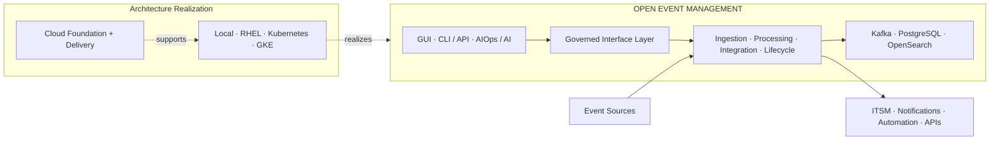

Cloud and delivery support a profile; they never become OEM business services.

## 2. Logical Architecture

### 2.1 OEM Logical Core

The Core contains stable management, application and event/data planes.

**Figure D-02 — OEM Master Engineering Architecture.** Integrates surfaces, services, transport, authority and deployment abstraction.

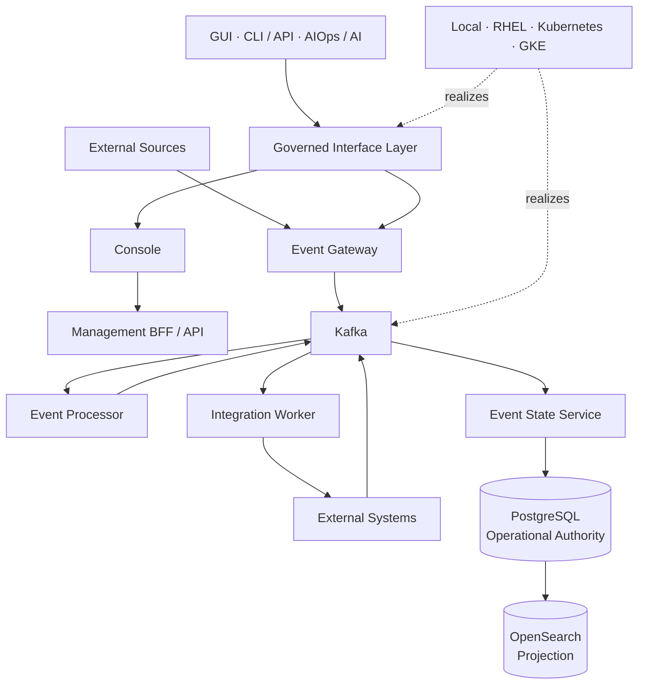

### 2.2 Management Plane

Console and Management BFF/API expose governed operations; they do not directly mutate stores or hosts.

### 2.3 Application Plane

Gateway owns admission, Processor owns policy decisions, Worker owns adapter execution and Event State Service (ESS) owns lifecycle consolidation.

### 2.4 Event / Data Plane

Kafka transports, PostgreSQL persists authority and OpenSearch projects search and analytics.

### 2.5 Component Responsibilities

| Component | Responsibility | Primary interaction |
|---|---|---|
| Event Gateway | Validate, normalize and admit | Sources, Kafka |
| Event Processor | Enrich, correlate, suppress, apply policy and route | Kafka, state contracts |
| Integration Worker | Execute approved commands | Kafka, external systems |
| Event State Service | Consolidate lifecycle, results and history | Kafka, PostgreSQL, projection path |
| Event Management Console | Human visual operations | Management BFF/API |
| Management BFF/API | Mediate management operations | Console, OEM APIs |
| Kafka | Transport and replay boundary | Producers, consumers |
| PostgreSQL | Operational Source of Truth | Owning services |
| OpenSearch | Search/analytics projection | Query and approved retrieval |

### 2.6 Canonical Event Flow

**Figure D-03 — Canonical Event Flow.** Preserves admission, decisions, execution, results and authoritative consolidation.

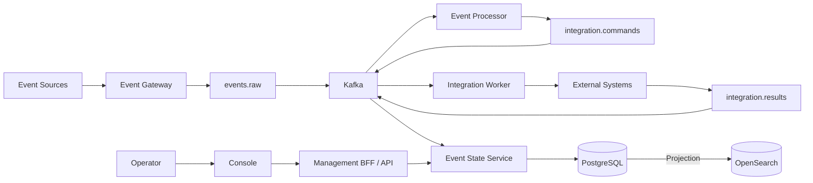

Results re-enter through contracts before state becomes authoritative.

## 3. Data Architecture

### 3.1 Data Authority Model

**Figure D-04 — Data Authority and Replay.** Separates transport, authority and projection.

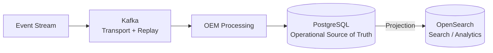

| Technology | Role | Authority |
|---|---|---|
| Kafka | Decoupled Event Transport + Replay Boundary | Non-authoritative transport state |
| PostgreSQL | Operational Source of Truth | Authoritative |
| OpenSearch | Search / Analytics Projection | Derived and rebuildable |

**Replay != Backup/Restore != Projection Rebuild.**

### 3.2 Kafka

Kafka decouples services, buffers contracts and supports bounded replay. Offsets express consumption progress, not business authority.

### 3.3 PostgreSQL

PostgreSQL owns canonical operational state through service contracts. Integrity, compatibility and backup/restore are therefore architectural concerns.

### 3.4 OpenSearch

OpenSearch supports search, analytics and approved retrieval context. It never decides authoritative state.

### 3.5 Replay and Recovery

Replay requires scope, authorization, idempotency analysis, external-side-effect controls and validation. PostgreSQL restore protects authority; OpenSearch rebuild recreates a projection.

### 3.6 Consistency Model

OEM is asynchronous across services and external systems. It claims no universal exactly-once or distributed ACID guarantee, no general reconciliation service, transactional outbox or universal replay controller.

## 4. Interaction Architecture

### 4.1 Multi-Surface Model

**Figure D-05 — Multi-Surface Solution Architecture.** Three alternative surfaces converge on one mandatory governance boundary.

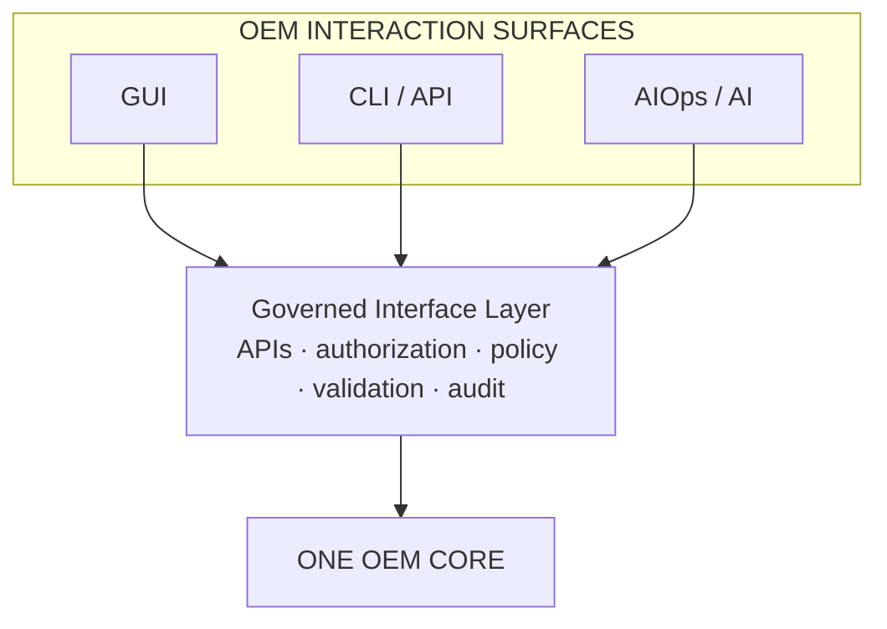

### 4.2 GUI

The GUI supports visual event operations, search, configuration and guided human workflows.

### 4.3 CLI / API

CLI/API supports engineering automation, scripts and machine integration through governed interfaces.

### 4.4 AIOps / AI

AI supports investigation, explanation, recommendation and policy-controlled workflows without independent authority.

### 4.5 Governed Interface Layer

Authentication establishes identity; authorization and policy determine scope; validation protects inputs and outputs; audit records decisions and outcomes.

### 4.6 Read vs Action Governance

Read tools retrieve authorized context. State-changing tools require stronger policy, approval where required, idempotency and outcome capture.

## 5. AI / AIOps Architecture

### 5.1 AI Position in OEM

AI-01 is optional. The authoritative Core operates when AI is absent, unavailable or denied.

### 5.2 AI Solution Architecture

**Figure D-06 — AI-01 Solution Architecture.** Models can request governed capabilities but never control OEM directly.

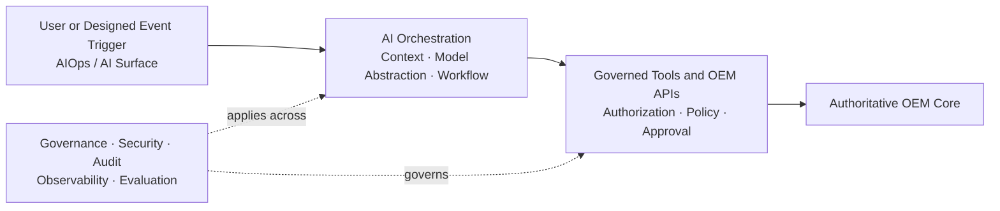

### 5.3 Orchestration

Orchestration coordinates context, instructions, models, workflows and tool selection; it owns neither business rules nor state.

### 5.4 Retrieval and Context

Context comes from governed APIs, projections and approved knowledge. Scope follows identity and purpose; retrieved content remains untrusted input.

### 5.5 Model Abstraction

A provider-neutral boundary can support commercial, open, self-hosted, enterprise or specialized models without selecting a family.

### 5.6 Agents and Workflows

Deterministic workflows and bounded agents may investigate, plan, recommend or request tools. Autonomy never implies authorization.

### 5.7 Governed Tools

Narrow read and action tools validate identity, arguments, policy and outcome. Models and agents have no direct store access.

### 5.8 AI Governance

Governance covers model, prompt, retrieval, agent, workflow and tool versions, human approval, data handling and output validation.

### 5.9 AI Security

Untrusted input cannot confer authority. AI identities receive no unrestricted runtime credentials; sensitive context is minimized and isolated.

### 5.10 Observability and Evaluation

Implementations should observe errors, latency, retrieval quality, policy decisions, tool calls and outcomes and evaluate safety and regressions.

### 5.11 Implementation Evidence Boundary

> **Architecture Definition vs Implementation Evidence**
> AI-01 is **PLANNED (DOCUMENTED)**. Certified evidence covers persistent AIOps configuration, REST CRUD, immutable configuration-change audit and HTTP assessment against an internal mock provider. LLM/OLLM, RAG, vector retrieval, production agents, model gateway, production tool execution, durable AI memory, complete governance, production observability and production evaluation are not claimed as implemented.

## 6. Deployment Architecture

### 6.1 Environment Architecture Map

**Figure D-07 — D6 Environment Architecture Map.** Maps one Core to alternative profiles and composable cloud/delivery domains.

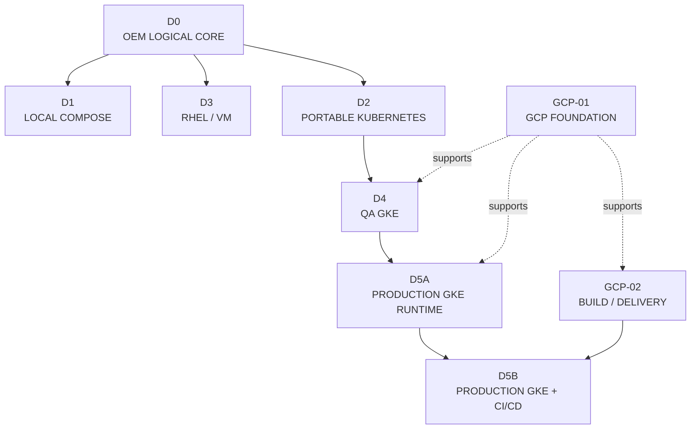

### 6.2 Deployment Profiles

| Profile | Infrastructure | Orchestration | Deployment mechanism | Purpose |
|---|---|---|---|---|
| Local | Linux host | Docker Compose | Compose | Development/functional validation |
| RHEL | Enterprise VMs | Host/service lifecycle | Enterprise/offline package | Distributed on-premises operation |
| Kubernetes | KVM/Linux VMs | Kubernetes | Kubernetes package | Provider-neutral orchestration |
| QA GKE | GCP | GKE | Kubernetes package | Managed-Kubernetes validation |
| Production GKE | GCP | Production GKE | Authorized runtime mechanism | Production operation/recovery |
| Production GKE + CI/CD | GCP-01 | D5A plus delivery | GCP-02 release input | Traceable production delivery |

### 6.3 Local — Docker Compose

D1 realizes the Core on a Linux host without changing ownership.

### 6.4 On-Premises — RHEL

D3 distributes database, Core, gateway and GUI roles across enterprise RHEL VMs.

### 6.5 Portable Kubernetes — KVM

D2 realizes workloads and stateful contracts on Kubernetes over KVM/Linux VMs.

### 6.6 QA — GKE

D4 validates the portable workload on managed GKE; it is not a production topology.

### 6.7 Production — GKE

D5A adds availability, resilience, security, recovery, observability, capacity and controlled change.

### 6.8 Production — GKE + CI/CD

D5B composes GCP-01, GCP-02 and D5A without merging their ownership.

**Figure D-08 — Environment-Aware Deployment Model.** Profile selection delegates to the appropriate mechanism.

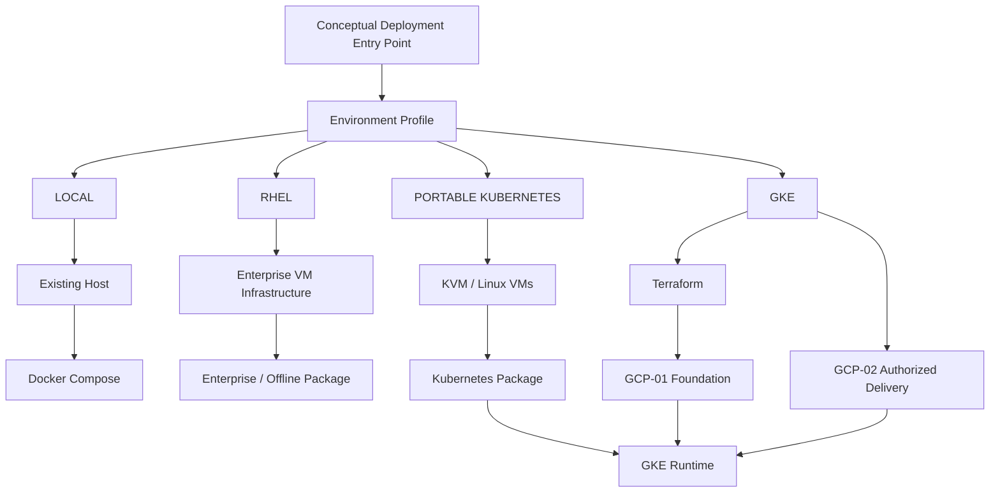

The entry point is conceptual; no universal installer is claimed.

## 7. Cloud Foundation Architecture

### 7.1 GCP Foundation

**Figure D-09 — GCP Foundation Solution Architecture.** Foundation capabilities support consumers without becoming their runtime.

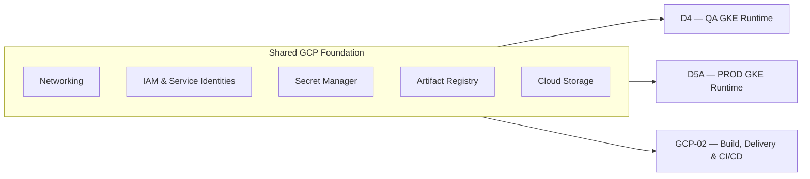

### 7.2 Networking

Environment-scoped networking provides workload/data attachment and controlled management exposure without prescribing CIDRs.

### 7.3 Identity and Access

Terraform, build, delivery and runtime identities remain separate, least-privileged and environment-scoped.

### 7.4 Secret Management

Automation and runtimes consume approved references; values never enter source, images or manifests.

### 7.5 Artifact Foundation

Artifact Registry stores artifacts; availability does not authorize deployment.

### 7.6 Object Storage

Object storage supports approved application, backup, shared or log purposes without determining data authority.

## 8. Build & Delivery Architecture

### 8.1 Infrastructure Delivery

Terraform provisions foundation resources through its authorized identity. **Terraform != Build**.

### 8.2 Application Build

Cloud Build validates and creates artifacts. **Cloud Build != Deployment**.

### 8.3 Immutable Artifact Identity

The SHA-256 digest identifies exact deployable content; mutable tags do not.

### 8.4 Release Manifest

The manifest binds digest, source and metadata. **Release Manifest != Deployment Controller**.

### 8.5 Deployment Authorization

Policy evaluates manifest, environment and delivery identity. **Artifact Registry != Authorization**.

### 8.6 Promotion

Build once; promote the same digest with external environment configuration.

### 8.7 Rollback

Rollback selects a previously approved release after compatibility and state checks; it is not a tag switch.

### 8.8 Release Traceability

Source, validation, build identity, digest, manifest, authorization, delivery and outcome form the evidence chain.

**Figure D-10 — GCP Build / Delivery Solution Architecture.** Separates provisioning from application delivery.

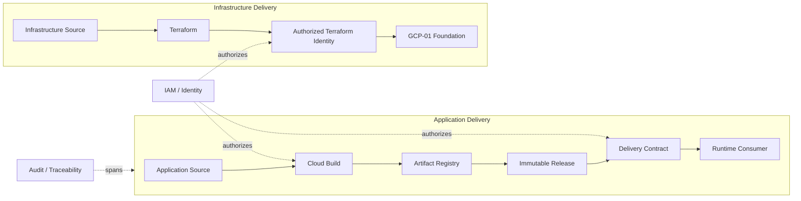

## 9. Production Architecture

### 9.1 Production Runtime

**Figure D-11 — Production GKE Solution Architecture.** Production qualities surround, but do not redefine, OEM.

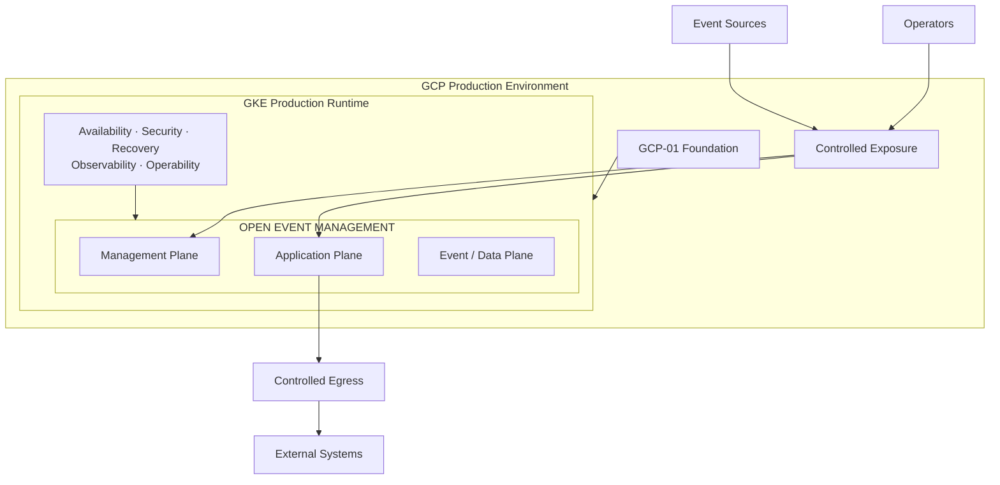

### 9.2 Availability

Health-aware scheduling, replacement and controlled disruption support service-specific continuity.

### 9.3 HA vs DR

HA maintains service through localized failure; DR restores after broader loss. HA does not replace backup. No RPO, RTO, SLO or SLA is invented.

### 9.4 Stateful Services

Kafka, PostgreSQL and OpenSearch retain distinct continuity and recovery semantics.

### 9.5 Recovery

Plans identify authority, compatible schema, source, side effects and validation.

### 9.6 Observability

Health, metrics, logs, traces where applicable, audit, capacity and release outcomes provide evidence, not authority.

### 9.7 Capacity

Compute, storage, throughput, retention and concurrency are planned per workload; values remain environment-specific.

### 9.8 Controlled Change

Change validates compatibility, authorizes immutable input, controls rollout and records acceptance or rollback.

**Figure D-12 — Production Composition Architecture.** Foundation, Delivery and Runtime stay independently governed.

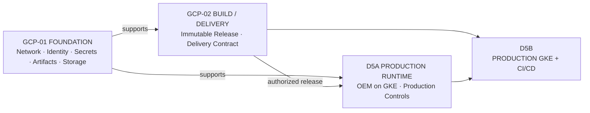

## 10. Security & Governance

### 10.1 Security Model

Identity, authorization, secrets, exposure, audit and supply-chain controls cross every domain; this synthesis invents no separate security architecture.

### 10.2 Identity Separation

| Identity | Purpose | Must not become |
|---|---|---|
| Human/developer | Governed source and approval | Runtime identity |
| Terraform | Foundation provisioning | Build/runtime identity |
| Build | Validate, build, publish | Deployment authorization |
| Delivery executor | Deliver approved manifest | Foundation administrator |
| Runtime workload | Runtime dependencies | General delivery identity |
| AI/agent | Request scoped tools | Direct store/infrastructure identity |

### 10.3 Least Privilege

Permissions are scoped by environment, service, operation and resource.

### 10.4 Secret Externalization

Only approved references cross build, manifest and runtime boundaries.

### 10.5 Controlled Exposure

Ingress, management and egress paths are explicit; internal stores are not public by default.

### 10.6 Policy and Authorization

Identity says who acts; policy says which capability, target and scope are permitted. Reachability never grants authority.

### 10.7 Auditability

Audit connects identity, request, decision, artifact/tool, target and outcome.

### 10.8 AI Governance

AI actions add data-scope, prompt, model, agent, workflow, tool and approval controls.

### 10.9 Supply Chain Security

Versioned source, validation, isolated identities, digest, manifest, authorization and runtime verification form the chain.

## 11. Portability & Environment Model

### 11.1 One OEM Logical Core

D0 defines one product contract; profiles realize rather than fork it.

### 11.2 Environment Invariants

Service ownership, event contracts, governed interfaces, data authority and provider boundaries remain stable.

### 11.3 Environment-Specific Concerns

Containment, orchestration, network, storage, secrets, availability, recovery and deployment mechanism vary.

### 11.4 Installer vs Terraform vs Kubernetes vs CI/CD

| Mechanism | Responsibility |
|---|---|
| Installer/package | Prepare a selected local/RHEL profile |
| Terraform | Provision cloud foundation |
| Kubernetes | Orchestrate declared workloads |
| CI/CD | Build, identify, authorize and deliver releases |

### 11.5 Build Once / Promote

The same digest moves through compatible environments; configuration and secret references stay external.

### 11.6 Vendor Neutrality

OEM is independent of monitoring, ITSM, notification, automation, cloud, Kubernetes and model vendors. Open interfaces, replaceable adapters, portable deployment, versioned architecture and modular components enable community extensibility without claiming unadopted governance.

## 12. Architecture Boundaries

### 12.1 OEM Responsibilities

OEM owns services, contracts, governed interfaces, lifecycle and data authority.

### 12.2 Deployment Responsibilities

Profiles own realization concerns without changing product semantics.

### 12.3 Cloud Responsibilities

GCP-01 owns foundation capabilities, not runtime or delivery semantics.

### 12.4 Delivery Responsibilities

GCP-02 owns build, identity, manifest, authorization, promotion and traceability, not runtime availability.

### 12.5 AI Responsibilities

AI-01 defines optional orchestration, retrieval, model, workflow, tool and assurance boundaries; OEM retains authority.

### 12.6 ADR-Controlled Decisions

Architecture Decision Records control concrete providers, topology, products and values left open here.

### 12.7 Implementation Evidence Boundary

Architecture defines intended responsibilities. Evidence proves only named behavior and scope; a diagram never proves deployment, adoption or production readiness.

## 13. Architecture Catalog

### 13.1 Golden Architecture Matrix

| Golden | Role | Publication section |
|---|---|---|
| [D0](../d0-logical-current.md) | Logical Core | 1–3 |
| [D1](../d1-local-current.md) | Local | 6.3 |
| [D3](../d3-rhel-current.md) | RHEL | 6.4 |
| [D2](../d2-kvm-kubernetes-target.md) | Kubernetes | 6.5 |
| [D4](../d4-qa-gke-minimum-target.md) | QA GKE | 6.6 |
| [GCP-01](../gcp-foundation-current.md) | GCP foundation | 7 |
| [GCP-02](../gcp-cicd-current.md) | Build/delivery | 8 |
| [D5A](../d5a-prod-gke-runtime-target.md) | Production runtime | 9 |
| [D5B](../d5b-prod-gke-cicd-target.md) | Production composition | 6.8, 9 |
| [D6](../d6-environment-evolution.md) | Environment map | 6, 11 |
| [Multi-Surface](../multi-surface-interaction.md) | Interaction | 4 |
| [AI-01](../ai-01-aiops-ai-architecture.md) | AI/AIOps | 5 |
| [Data Authority & Replay](../data-authority-replay.md) | Authority/recovery | 3 |

### 13.2 Architecture Traceability

| Publication area | Sources | Preserved invariant |
|---|---|---|
| Product/logical | D0, Master | One Core; explicit ownership |
| Data | D0, Data Authority | Transport != authority != projection |
| Interaction/AI | Multi-Surface, AI-01 | Governance mandatory; AI optional |
| Deployment | D1/D3/D2/D4/D5A/D5B/D6 | Environment != product semantics |
| Cloud/delivery | GCP-01/GCP-02 | Foundation != runtime; build != deployment |
| Production | D5A/D5B | HA != DR; authority-aware recovery |

### 13.3 Future Architecture

The [Future Architecture Register](../evolution/future-architecture-register.md) records possible needs; an entry authorizes neither design nor implementation.

### 13.4 Detailed Architecture References

The [Architecture Evolution Index](../evolution/index.md) links the governed catalog and Golden detail. Links add depth; this publication contains the core semantics required to understand OEM.
