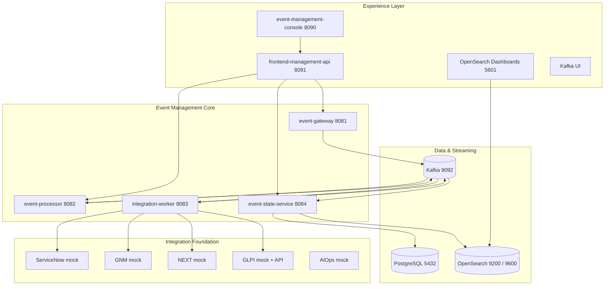

# Topología del runtime local

Vista alineada con los servicios declarados en el `docker-compose.yml` entregado.

Además del core, el árbol `services/` revisado contiene `console-catalog-api`, `e2e-tool-api`, `enrichment-engine`, `frontend-management-api`, `glpi-ticketing-api`, `itsm-ticketing-dashboard`, `mock-secrets`, `oem-dashboards`, `oem-dashboards-api` y `product-observability`.

La presencia de un servicio o mock en el código no implica promoción productiva.
