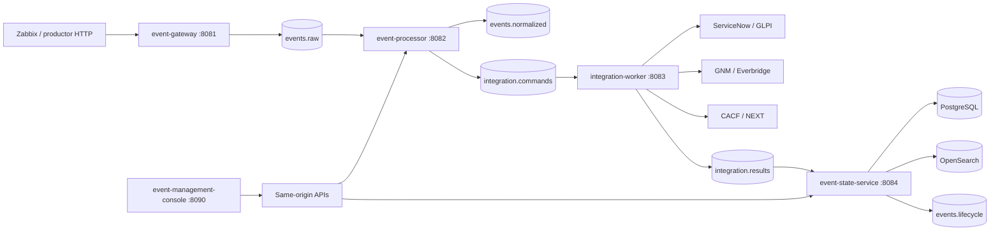
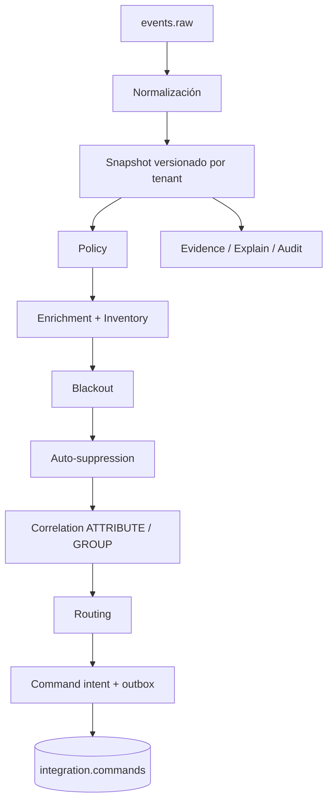
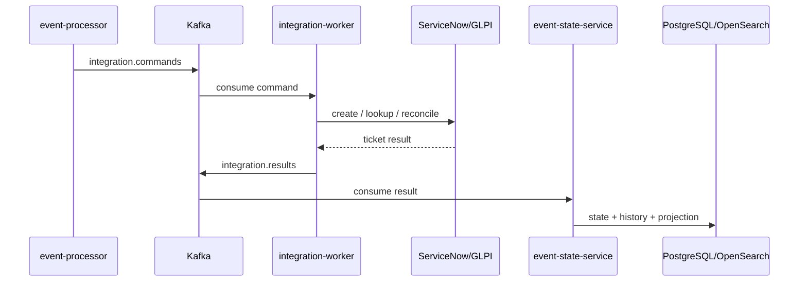
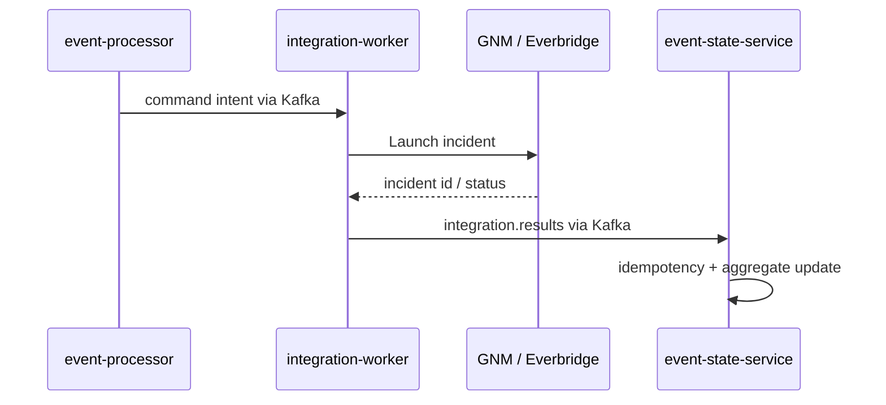
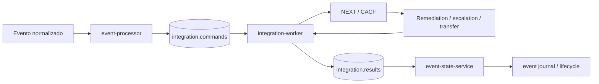
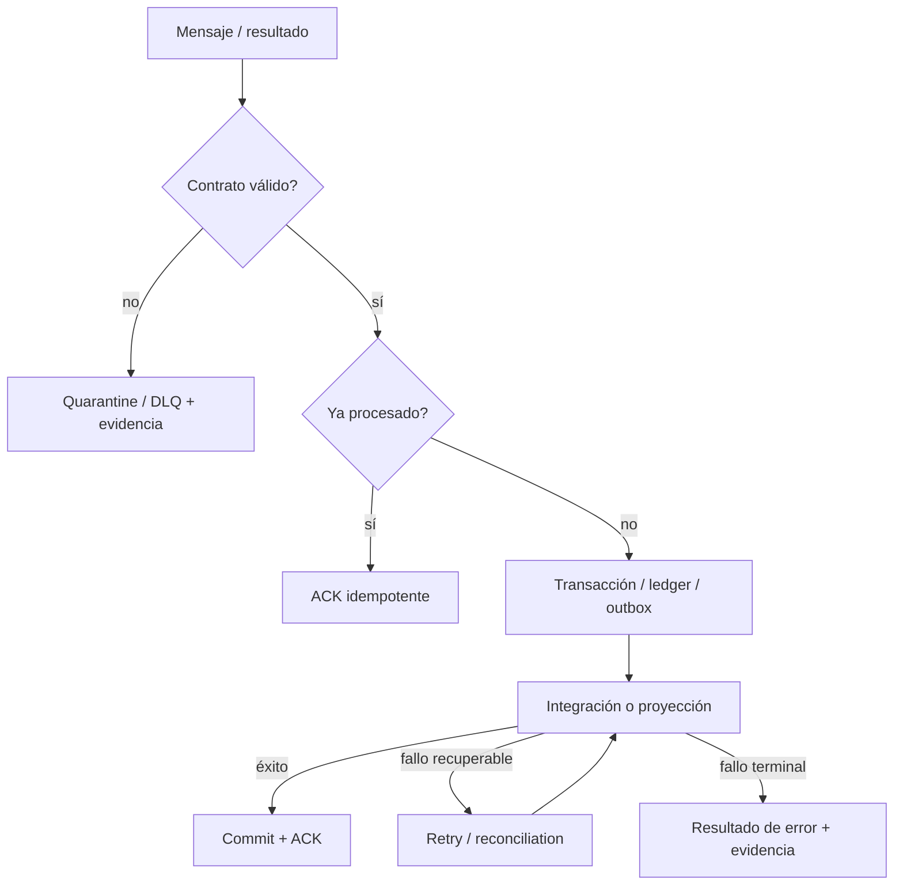

# Flujos de solución ejecutados

Esta página extiende la arquitectura existente con flujos representados en el código y procedimientos de certificación del repositorio de plataforma. No convierte mocks ni pruebas locales en certificación productiva.

## Happy path end-to-end

Las certificaciones ESS documentan trazabilidad de `sourceEventId`, `commandId`, `resultId` y `eventKey`.

## Decisión dentro de Event Processor

## Ticketing

## Notification Router — GNM / Everbridge

El compose revisado incluye `gnm-mock`; un PASS contra mock no certifica conectividad real con Everbridge.

## Automation Router — CACF / NEXT

## Fallo y recuperación

