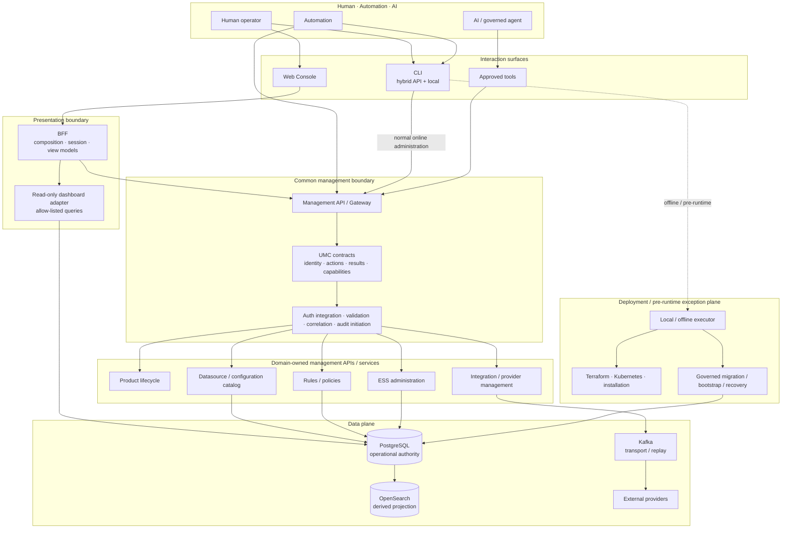
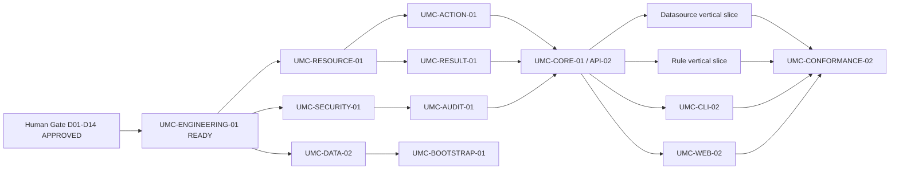

# UMC Master Conformance — UMC-CONFORMANCE-01

**Status:** APPROVED

**Inputs:** UMC-01, UMC-CLI-01, UMC-API-01, UMC-WEB-01, UMC-DATA-01 and Engineering Event Management

**Boundary:** architecture consolidation only; no product, API, CLI, BFF, PostgreSQL or runtime implementation

## Executive decision input

The evidence supports **APPROVE_WITH_EXCEPTIONS** for the normal OEM management path:

```text
CLI → Management API / Gateway → UMC contracts → Domain APIs / Services
Web → BFF → Management API / Gateway → UMC contracts → Domain APIs / Services
Automation / AI → governed API or tool boundary → UMC contracts → Domain APIs / Services
```

The exceptions are explicit rather than alternative normal paths:

- installation, offline validation, infrastructure provisioning, migration,
  bootstrap and recovery may require a pre-runtime execution plane;
- governed PostgreSQL scripting remains a limited deployment/operations
  surface, never arbitrary caller SQL or a peer for ordinary administration;
- the dashboard PostgreSQL mode remains a read-only, allow-listed BFF adapter;
- provider runtime execution, event processing, ESS lifecycle and Kafka flows
  remain data-plane/domain behavior rather than management-resource mutation.

The recommended Management API topology is **hybrid common management gateway
and federated domain APIs**. The common layer owns cross-cutting contract and
governance concerns; domain services retain business logic, persistence and
lifecycle ownership. These decisions were **APPROVED** by the
UMC-CONFORMANCE-01 Human Gate.

## Input baselines

| Surface | Current model | UMC assessment | Principal gaps |
| --- | --- | --- | --- |
| CLI | Fragmented subsystem operational, installer and deployment commands | FRAGMENTED / PARTIAL | No common resource grammar, security boundary, result envelope or audit contract |
| API | Federated management, domain, BFF and operational APIs | **YES_WITH_GAPS** | No common entry contract, identity, capability registry, result/error or audit semantics |
| Web | Console and dashboards through same-origin BFF/domain paths | **YES_WITH_GAPS** | Fragmented action paths, local-only controls, uneven authorization and result semantics |
| Data | Service-owned PostgreSQL plus controlled scripts and read adapters | **LIMITED_GOVERNED_SURFACE** | No common script runner, migration ledger, operator identity or uniform audit/result contract |
| Normal bypass | CLI/Web direct store mutation | **SPECIAL_CASES_ONLY** | Exceptions require explicit classification, authorization, provenance and evidence |

No baseline status is changed by this consolidation.

## Master resource/action matrix

Legend: `E` existing; `P` partial/domain-specific; `M` missing; `N/A` not an
appropriate surface. Entries summarize the approved inventories rather than
repeating their endpoint-level evidence.

| Resource | Actions | CLI | API | Web | Data | Semantic parity | Domain owner | Target normal path | Principal gap |
| --- | --- | --- | --- | --- | --- | --- | --- | --- | --- |
| Product/service | get, list, status, start, stop, restart, install, configure | P | P | P | N/A | CLI_API_WEB | Deployment/Operations plus service owners | CLI/Web → gateway → lifecycle adapter | Local/runtime lifecycle is not a versioned product resource |
| Datasource | create, get, list, update, test, validate, enable, disable, delete, import/export | P | P | P | P | CLI_API_WEB | Console Catalog / datasource domain | gateway → datasource domain API | Identity, lifecycle, provider capability and auth differ |
| Rule | create, get, list, update, validate, simulate, enable, disable, retire, import/export | P | E/P | P | P | CLI_API_WEB | Processor or Gateway by rule type | gateway → owning rule API | Multiple contracts and no shared envelope |
| Policy | create, get, list, update, simulate, validate, enable, disable, retire | M | M/P | P | P | WEB_API | Processor/catalog policy owners | gateway → owning policy API | No common policy identity or lifecycle |
| Integration/provider | register, get, list, configure, test, enable, disable, retire | P | P | P | P | CLI_API_WEB | Integration configuration/catalog | gateway → integration management API → provider adapter | Registration, profiles, secrets and capabilities fragmented |
| Script | register, validate, execute, inspect, retire | M | M | M | P | DATA_ONLY | Deployment/Operations or owning domain | governed script runner for approved cases only | No script identity, authorization, checksum or result contract |
| Configuration | get, list, update, validate, configure, import/export | P | P | P | P | ALL | Owning domain; common contract for envelope | gateway → owning configuration API | Scope, revisions and conflict handling vary |
| Environment/bootstrap | inspect, validate, install, bootstrap, configure, migrate, recover | P | P | P | P | ALL | Deployment/Operations/IaC | hybrid online orchestration + pre-runtime executor | API may not exist; no universal ledger or retry model |
| ESS administration | list, get, history, quarantine summary | E | E | E | service-owned | CLI_API_WEB | ESS | gateway/adapter → ESS read API | Writes are intentionally not a UMC management capability |
| Dashboard query | list, filter, inspect | P | E | E | E read-only | API_WEB | Dashboard BFF/read domain | Web → BFF → read adapter | Must remain separate from mutation semantics |

### Action consolidation

| Action family | Current coverage | Common target semantics | Domain-specific qualification |
| --- | --- | --- | --- |
| install / bootstrap | CLI/scripts/data; partial API/Web orchestration | versioned manifest, target environment, preflight, dry-run where possible, durable result | Terraform, Kubernetes, database and offline installers retain ownership |
| create / update / configure | strongest in domain APIs/Web; fragmented CLI/data | identity, validation, authorization, version precondition, idempotency and audit | owning domain validates business rules and persists |
| get / list | broadly available but differently shaped | stable identity, scope, pagination/filter contract and authorization | optimized read models may return surface-specific views |
| delete / retire | sparse and intentionally restricted | explicit capability, dependency check, conflict result and audit | lifecycle policy may forbid deletion |
| test / validate | present across several domains with different meanings | non-mutating intent declared; structured findings and target version | provider tests may have external side effects and need explicit classification |
| enable / disable | rules/providers/configuration, fragmented | revision-aware transition with policy, reason and audit | domain controls transition invariants |
| import / export | mostly missing | schema/version/provenance, secret exclusion and conflict policy | not every resource must support portability |

## Semantic parity findings

| Classification | Evidenced examples | Convergence implication |
| --- | --- | --- |
| CLI_ONLY | Kafka preparation/inspection; broad local Compose lifecycle | Retain as domain/offline tooling or adapt behind an explicit contract |
| API_ONLY | selected gateway/processor administrative capabilities | Add clients only after common semantics exist; do not duplicate logic |
| WEB_ONLY | selected local service-control and provider/demo flows | Move normal mutations downward; isolate local/demo behavior |
| DATA_ONLY | migrations, role grants, recovery and direct deployment scripts | Keep limited and governed; never promote to normal CRUD |
| CLI_API | ESS reads, processor/gateway administration utilities | Strong reuse candidate for thin CLI adaptation |
| WEB_API | catalog, dashboards, processor screens and ESS proxy | Preserve API ownership; normalize BFF and common contracts |
| CLI_WEB | local service lifecycle through different paths | Converge on lifecycle adapter and shared result/audit semantics |
| CLI_API_WEB | datasource/rule/configuration fragments | Candidate resources once identity/security/result contracts exist |
| ALL | configuration/bootstrap mechanisms in incompatible forms | Presence on all surfaces does not yet mean semantic parity |
| NONE | universal UMC resource grammar and common conformance envelope | Foundation work, not an endpoint inventory problem |

Fragmentation is primarily caused by missing common identity, action, result,
security, audit, capability and version contracts—not by absence of every
domain implementation.

## Proposed target architecture



This diagram is engineering evidence, not the final OEM Solution Diagram.

## Normal management path and roles

### Recommendation

**APPROVE_WITH_EXCEPTIONS.** API-first normal administration provides one
governed entry and reusable semantics while federated domain APIs preserve
service ownership and operational independence.

### Management API role

The common Management API/Gateway should provide:

- external resource/action contract exposure and capability discovery;
- authentication boundary and authorization-context propagation/integration;
- common request validation, contract/version negotiation and correlation;
- common result/error envelope and audit initiation;
- domain routing and stable external compatibility.

It must not own domain business rules, domain persistence, provider execution,
ESS lifecycle transitions or infrastructure implementation. Domain services
remain responsible for semantic validation, invariants, transactions,
concurrency, persistence and domain audit detail.

### Management API topology

**Recommendation: C — hybrid common management gateway + federated domain
APIs.** A monolith would centralize business logic and persistence; direct
domain APIs alone would retain cross-surface fragmentation. The hybrid topology
keeps the common boundary deliberately thin.

### CLI target role

**RECOMMENDED_CLI_PATTERN: HYBRID_API_PLUS_LOCAL.**

- Online normal administration: thin Management API client.
- Offline/pre-runtime: local dispatcher over versioned domain installers,
  validators and recovery tools.
- Infrastructure: Terraform/Kubernetes tooling remains domain-owned and may be
  orchestrated by `oem bootstrap apply` without being absorbed into UMC.
- Security: online identity follows the common boundary; offline actions need
  explicit operator identity, target environment, authorization/gate and audit
  evidence.

### Web and BFF target role

**RECOMMENDED_WEB_PATTERN: APPROVE_WITH_EXCEPTIONS.** Normal mutations follow
`Web → BFF → Management API → UMC → Domain`. The BFF retains UI composition,
aggregation, view-model shaping, session/user context, frontend orchestration
and bounded read optimization. It must not become domain authority, own
resource business rules, resolve provider secrets in the browser, or define
independent mutation semantics.

### PostgreSQL management role

**RECOMMENDED_DATA_MANAGEMENT_PATTERN: LIMITED_GOVERNED_SURFACE.** Allowed
classes are versioned migration, initialization/bootstrap, recovery/restore,
deployment-owned schema change, approved environment-bound bulk initialization
and evidence-supported controlled administration. Each requires approved
artifact identity/checksum, actor, environment/tenant scope, compatibility
preflight, transaction/retry classification, structured result, audit and
rollback/recovery guidance. Arbitrary SQL and ordinary Web/CLI CRUD remain
prohibited; normal bypass is **SPECIAL_CASES_ONLY**.

### Dashboard PostgreSQL mode

**RECOMMENDED_DASHBOARD_DATA_PATTERN: READ_OPTIMIZATION / ALTERNATIVE_READ_MODEL.**
The existing browser → BFF → read-only PostgreSQL adapter → allow-listed view
path remains outside the Management API write path. It is not browser SQL, an
interoperability switch or evidence for resource mutation. Deprecation is not
proposed without further evidence.

## Control, data and deployment planes

| Plane | Includes | Excludes |
| --- | --- | --- |
| Control | resource/configuration management, provider registration, rule/policy administration, governed operational actions | event processing and provider runtime execution |
| Data | ingress, processing, Kafka transport, ESS runtime state, integration execution, projections and event queries | normal management resource mutation |
| Deployment / pre-runtime | Terraform, Kubernetes, installation, migration, bootstrap, recovery, offline validation | general online resource CRUD |

**Deployment classification: HYBRID / PRE_RUNTIME_PLANE_REQUIRED.** A runtime
Management API cannot be the sole bootstrap dependency because the environment,
database or API may not exist. `oem bootstrap apply` should be a declarative
orchestrator that selects approved adapters, records identity and provenance,
and converges to the online Management API when available.

| Offline capability | Mode |
| --- | --- |
| installation, environment render/preflight, Terraform/IaC | OFFLINE |
| migration, restore, bootstrap and recovery | OFFLINE with explicit gate; optionally ONLINE-orchestrated later |
| diagnostics and health collection | BOTH |
| ordinary resource CRUD and provider configuration | ONLINE |
| validation/test | BOTH when side effects and authority are explicit |

## Domain ownership model

| Domain | Ownership retained | UMC relationship |
| --- | --- | --- |
| Terraform/IaC | infrastructure state and provisioning | deployment adapter/capability, not common business logic |
| Kafka | topics, broker operations, transport/replay | operational domain outside normal resource mutation |
| ESS | event state/history/quarantine and lifecycle invariants | governed read/admin adapter; no direct state bypass |
| Datasources/configuration | catalog identity, profiles, revisions and persistence | candidate resource adapter behind common contracts |
| Rules/policies | validation, simulation, activation, revisions and persistence | domain adapters expose common action semantics |
| Integrations/providers | registration/profile configuration and runtime adapters | management resource specialization separate from execution |
| Product lifecycle | service inventory and controlled lifecycle | lifecycle adapter; local and deployed environments may differ |
| Bootstrap/deployment | installation, migration, recovery and evidence | explicit exception plane using common identity/result/audit where possible |
| Dashboard/read models | query optimization and presentation projections | BFF/read path; no mutation authority |

UMC owns common semantics; domains own implementation.

## Common UMC core candidate

| Capability | Classification | Rationale |
| --- | --- | --- |
| Resource and action identity | COMMON_CONTRACT | Required for parity across all surfaces |
| Capability registry | COMMON_SERVICE + COMMON_CONTRACT | Clients need environment/resource/action discovery |
| Contract validation and version negotiation | COMMON_LIBRARY / COMMON_CONTRACT | Shared rules with deployable topology left open |
| Result envelope and error classification | COMMON_CONTRACT | Required for CLI/API/Web compatibility |
| Request/correlation identity | COMMON_CONTRACT | Cross-domain trace and reconciliation |
| Identity, tenant and environment context | COMMON_CONTRACT | Propagated consistently; provider remains external |
| Authorization integration | COMMON_SERVICE boundary + DOMAIN_RESPONSIBILITY | Common policy context plus domain enforcement |
| Secret-reference contract | COMMON_CONTRACT | Values stay server-side/domain-owned |
| Audit-event semantics | COMMON_CONTRACT | Physical storage remains undecided/domain-aware |
| Version/provenance and idempotency metadata | COMMON_CONTRACT | Needed for concurrency and safe retry |
| Business validation and persistence | DOMAIN_RESPONSIBILITY | Must remain with owning service |

These classifications do not require one UMC runtime service.

## Convergence requirements

### UMC-RESOURCE-01

- Define stable `resourceType`, `resourceId`, tenant, environment, name,
  schema/version, status, metadata and provenance semantics.
- Define provider specialization without making provider-native runtime objects
  OEM management resources.
- Define ownership, canonical references and compatibility for product,
  datasource, rule, policy, integration, script, configuration and bootstrap.

### UMC-ACTION-01

- Define capability-scoped action identity, preconditions, validation-only and
  dry-run behavior, synchronous/asynchronous classification and side effects.
- Preserve domain actions where the common vocabulary is insufficient; do not
  force every action onto every resource.
- Require reason/intent, target version and policy context for risky mutations.

### UMC-RESULT-01

- Define status, resource/action identity, result, validation findings, common
  error class, request/correlation ID, optional execution ID, async status,
  version/provenance and audit reference.
- Required error taxonomy: VALIDATION, AUTHENTICATION, AUTHORIZATION,
  NOT_FOUND, CONFLICT, UNAVAILABLE, TIMEOUT, PROVIDER_ERROR, INTERNAL and
  UNCERTAIN. Serialization remains future design.

### UMC-SECURITY-01

- Authenticate at the common boundary where available and authorize at both
  common and domain boundaries: common capability/scope policy plus domain
  invariant enforcement.
- Carry human, automation, service and AI/tool principal identity; tenant and
  environment scope; action/resource context; and approval evidence when
  policy requires it.
- Preserve least privilege and prevent an identity header from becoming an
  authorization claim.

### Secret-reference requirements

- CLI/API/Web exchange references and metadata, not raw provider secrets.
- Server-side/domain components resolve values through approved secret stores.
- Browser, normal CLI output, audit, logs and result envelopes never return raw
  secret values.
- Bootstrap may receive a protected local secret reference/file, but must not
  convert it into a command-line or Git artifact.

### UMC-AUDIT-01

The semantic audit contract requires event ID, timestamp, principal, source
surface, tenant/environment, resource identity, action, request/correlation and
execution identity, policy/authorization outcome, result/error, applicable
before/after or revision references, version/provenance and domain owner.
Physical storage and schema are intentionally undecided.

### Versioning and concurrency

- Version UMC contract, resource schema, provider contract, API compatibility,
  result envelope and audit semantics independently where their lifecycles differ.
- Carry resource/configuration revisions and support optimistic conflict
  detection for mutable resources.
- Domain services retain locking/transaction choices; the common layer maps
  conflict semantics without replacing them.
- CLI compatibility and capability negotiation must reject unsafe mismatches.

### Idempotency and async management

Create/update/register/bootstrap/import and external-effect actions require an
idempotency decision; retries of provider, deployment and recovery operations
require execution identity and reconciliation. Read/list need request identity
but normally not mutation idempotency. Revision-sensitive changes require
optimistic concurrency.

Async-capable actions use a common semantic progression where applicable:
`ACCEPTED → RUNNING → SUCCEEDED | FAILED | UNCERTAIN`. They expose request and
execution identities, status lookup, terminal result/audit, retry eligibility
and reconciliation. Domain-equivalent states may be mapped; these statuses are
not imposed on immediate reads or validations.

### Observability

Measure availability, request/action rate, latency, validation and authorization
failures, mutation outcomes, async status, dependency/domain failures and audit
delivery health. Dimensions include resource/action, domain, source surface,
environment and outcome without leaking tenant secrets or high-cardinality raw data.

## Provider and integration alignment

The common relationship is:

```text
UMC integration resource
  → provider specialization (Custom API, GLPI, ServiceNow, CACF, GNM/Everbridge)
  → domain-owned management adapter
  → separately governed provider runtime execution
```

Registration/configuration, references, capabilities, test and lifecycle are
management concerns. Ticket creation, notification, automation callbacks and
other external effects remain runtime/provider contracts. Provider-native IDs
remain externally authoritative; OEM owns its configuration, command identity
and execution evidence.

## Minimum viable UMC candidate

The first usable slice includes:

- common resource/action identity and capability discovery;
- hybrid Management API/Gateway entry with identity, authorization integration,
  validation, correlation, result/error and audit semantics;
- one thin online CLI path and one Web/BFF path using the same operation;
- version/concurrency and idempotency behavior for the selected mutations;
- representative adapters for **Datasource** first and **Rule** second.

Datasource is the preferred first vertical slice because API, Web and Data
evidence already covers catalog identity, configuration, revisions, secret
references and tests while exposing the gaps UMC must solve. Rule is second
because processor/gateway APIs already demonstrate validation, simulation,
activation, revision and audit patterns. ESS reads are useful conformance tests
but insufficient as the first mutation slice; bootstrap has excessive
pre-runtime complexity for MVP.

Excluded from MVP: universal coverage, provider runtime execution, arbitrary
SQL, complete deployment/recovery orchestration, all policy domains, final AI
tooling and legacy retirement.

## Master conformance scorecard

| Dimension | CLI | API | Web | Data | Target readiness |
| --- | --- | --- | --- | --- | --- |
| Resource identity | WEAK | PARTIAL | PARTIAL | PARTIAL | MISSING |
| Action semantics | PARTIAL | PARTIAL | PARTIAL | WEAK | MISSING |
| Validation | PARTIAL | PARTIAL | PARTIAL | PARTIAL | PARTIAL |
| Authorization | WEAK | PARTIAL | PARTIAL | WEAK | MISSING |
| Secrets | PARTIAL | PARTIAL | PARTIAL | PARTIAL | PARTIAL |
| Result model | WEAK | PARTIAL | PARTIAL | WEAK | MISSING |
| Audit | WEAK | PARTIAL | PARTIAL | PARTIAL | MISSING |
| Versioning | WEAK | PARTIAL | PARTIAL | PARTIAL | MISSING |
| Idempotency | PARTIAL | PARTIAL | PARTIAL | PARTIAL | PARTIAL |
| Observability | PARTIAL | PARTIAL | PARTIAL | PARTIAL | PARTIAL |
| Domain ownership | PARTIAL | STRONG | PARTIAL | STRONG | STRONG |
| Management API reuse | PARTIAL | NOT_APPLICABLE | PARTIAL | NOT_APPLICABLE | MISSING |

## Current → target comparison

| Concern | Current | Target candidate | Gap | Workstream |
| --- | --- | --- | --- | --- |
| CLI | subsystem/local commands | hybrid thin API client + offline dispatcher | grammar, identity, results | UMC-CLI-02 |
| API | federated inconsistent APIs | thin common gateway + domain APIs | common contracts/routing | UMC-API-02 / UMC-CORE-01 |
| Web/BFF | same-origin fragmented paths | presentation BFF over common gateway; bounded reads | business/action convergence | UMC-WEB-02 |
| Data | service SQL + scripts | service ownership + limited governed scripts | runner, ledger, audit | UMC-DATA-02 / UMC-BOOTSTRAP-01 |
| Security | local/subsystem controls | shared context + common and domain enforcement | policy and principal model | UMC-SECURITY-01 |
| Audit | multiple stores/logs | common semantic event with domain evidence | contract/correlation | UMC-AUDIT-01 |
| Resource/action/result | surface-specific | versioned common contracts | foundational definitions | UMC-RESOURCE/ACTION/RESULT-01 |
| Providers | configuration and execution mixed | common integration resource + provider specialization | lifecycle/capabilities | domain integration work |
| Bootstrap | scripts before runtime | explicit pre-runtime plane + online orchestration | manifest/ledger/retry | UMC-BOOTSTRAP-01 |
| Observability | subsystem-specific | common operation semantics and domain telemetry | dimensions/outcomes | UMC-CORE-01 |
| Conformance | narrative inventories | executable cross-surface profile | tests/profile missing | UMC-CONFORMANCE-02 |

## Approved decision register

All entries are **APPROVED** architecture directions. They establish the target
management direction without starting product implementation or replacing the
domain-specific design work that follows.

| ID | Status | Approved decision | Evidence | Alternatives considered | Consequence |
| --- | --- | --- | --- | --- | --- |
| UMC-CONF-D01 | APPROVED | Normal CLI management uses Management API | API reuse already exists; direct patterns fragment | local dispatcher only | thin client plus explicit offline exceptions |
| UMC-CONF-D02 | APPROVED | Normal Web mutation uses BFF → Management API | BFF/domain paths exist; parity missing | direct domain calls everywhere | consistent governance while retaining UI composition |
| UMC-CONF-D03 | APPROVED | Hybrid gateway + federated domain APIs | strong domain ownership and fragmented common concerns | monolith; direct domain only | common boundary without centralizing logic |
| UMC-CONF-D04 | APPROVED | BFF owns presentation, not domain authority | approved Web baseline | business logic in BFF | domain rules converge downward |
| UMC-CONF-D05 | APPROVED | PostgreSQL is a limited governed surface | Data baseline | peer normal management surface | migrations/bootstrap/recovery only by approved class |
| UMC-CONF-D06 | APPROVED | Dashboard PostgreSQL remains read optimization/alternative read model | fixed read-only adapter | removal; general interoperability | outside write path; retain bounded mode |
| UMC-CONF-D07 | APPROVED | Domains own implementation and persistence | D0, Engineering Foundation, Data Authority | centralized UMC ownership | adapters conform to common contracts |
| UMC-CONF-D08 | APPROVED | Minimum UMC core is contract/governance scope | repeated cross-surface gaps | giant UMC service | deployment topology stays minimal/flexible |
| UMC-CONF-D09 | APPROVED | Deployment/bootstrap is hybrid with a pre-runtime plane | API may not exist during installation | API-only bootstrap | explicit offline executor and transition to online control |
| UMC-CONF-D10 | APPROVED | Authorization is enforced at common and domain boundaries | uneven current controls; domain invariants | gateway-only; domain-only | consistent policy plus defense of domain semantics |
| UMC-CONF-D11 | APPROVED | Define one semantic audit contract, not one mandatory store | fragmented subsystem audit | centralized schema now | correlation without premature storage decision |
| UMC-CONF-D12 | APPROVED | CLI supports explicit ONLINE/OFFLINE/BOTH capabilities | installation/recovery evidence | online-only; local-only | capability discovery and separate security model required |
| UMC-CONF-D13 | APPROVED | Capability registry is REQUIRED | actions vary by resource/environment | hard-coded clients | clients negotiate supported resources/actions/versions |
| UMC-CONF-D14 | APPROVED | Adapt/wrap before migration; no blanket deprecation | mature domain APIs and local tools | rewrite all surfaces | incremental transition with conformance profiles |

No evidence requires an amendment to the approved UMC-01 semantics; the
approved direction refines topology and exception boundaries without changing
the UMC-01 semantics.

## Master gap register and roadmap

| ID | Priority/class | Capability | Surfaces | Dependency | Ownership | Target workstream | Status |
| --- | --- | --- | --- | --- | --- | --- | --- |
| UMC-G01 | P0 BLOCKER | principal, tenant/environment and authorization model | all | Approved D10 | common + domains | UMC-SECURITY-01 | REGISTERED |
| UMC-G02 | P0 FOUNDATION | resource identity/schema | all | Approved D07/D08 | common contract | UMC-RESOURCE-01 | REGISTERED |
| UMC-G03 | P0 FOUNDATION | action/capability semantics | all | G02 | common + domains | UMC-ACTION-01 | REGISTERED |
| UMC-G04 | P0 FOUNDATION | result/error/async envelope | CLI/API/Web | G02/G03 | common contract | UMC-RESULT-01 | REGISTERED |
| UMC-G05 | P0 BLOCKER | semantic audit and correlation | all | G01–G04 | common + domains | UMC-AUDIT-01 | REGISTERED |
| UMC-G06 | P1 FOUNDATION | gateway topology, routing and capability registry | CLI/API/Web | Approved D03/D13, G01–G05 | common layer | UMC-CORE-01 / UMC-API-02 | REGISTERED |
| UMC-G07 | P1 DEPENDENT | thin CLI + offline split | CLI | G01–G06, approved D12 | CLI + deployment | UMC-CLI-02 | REGISTERED |
| UMC-G08 | P1 DEPENDENT | BFF mutation convergence | Web/API | G01–G06 | Web/BFF + domains | UMC-WEB-02 | REGISTERED |
| UMC-G09 | P1 PARALLELIZABLE | governed scripting/ledger/bootstrap | Data/CLI | G01/G04/G05, approved D09 | Deployment/Operations | UMC-DATA-02 / UMC-BOOTSTRAP-01 | REGISTERED |
| UMC-G10 | P1 PARALLELIZABLE | provider lifecycle specialization | API/Web/Data | G02–G06 | Integration domain | domain conformance | REGISTERED |
| UMC-G11 | P1 PARALLELIZABLE | datasource and rule adapters | API/Web/Data | G02–G06 | owning domains | vertical slices | REGISTERED |
| UMC-G12 | P2 DEPENDENT | executable conformance profile/tests | all | first slices | quality/common | UMC-CONFORMANCE-02 | REGISTERED |
| UMC-G13 | P2 LATER | legacy/demo transition and deprecation evidence | CLI/Web/Data | G07–G12 | owning domains | follow-up | REGISTERED |

Recommended order: approved Human Gate → separately authorized Engineering architecture → Resource + Security
→ Action + Result + Audit (parallel with contract coordination) → Core/API
gateway → Datasource first slice → Rule second slice → CLI/Web adapters →
Bootstrap/Data exception plane → automated conformance → transition cleanup.

| Workstream | Readiness | Dependencies |
| --- | --- | --- |
| UMC-ENGINEERING-01 | READY | PRECONDITION SATISFIED: D01–D14 approved |
| UMC-RESOURCE-01 | READY_AFTER_DECISION | D07/D08 and engineering contract boundaries |
| UMC-ACTION-01 | BLOCKED_BY_OTHER_WORKSTREAM | resource identity/capability model |
| UMC-RESULT-01 | BLOCKED_BY_OTHER_WORKSTREAM | resource/action identities and async policy |
| UMC-SECURITY-01 | READY_AFTER_DECISION | D10; may proceed parallel with resource model |
| UMC-AUDIT-01 | BLOCKED_BY_OTHER_WORKSTREAM | identity, resource, action and result semantics |
| UMC-CORE-01 | BLOCKED_BY_FOUNDATION | resource/action/result/security/audit contracts |
| UMC-CLI-02 | BLOCKED_BY_OTHER_WORKSTREAM | core/API and offline boundary |
| UMC-API-02 | BLOCKED_BY_FOUNDATION | common contracts and topology approval |
| UMC-WEB-02 | BLOCKED_BY_OTHER_WORKSTREAM | core/API and BFF decision |
| UMC-DATA-02 | READY_AFTER_DECISION | D05/D09/D11; coordinate security/audit |
| UMC-BOOTSTRAP-01 | BLOCKED_BY_OTHER_WORKSTREAM | Data contract, offline identity and result/audit |
| UMC-CONFORMANCE-02 | LATER | implemented vertical slices and profiles |

Parallel domain work can prepare adapters and capability mappings in Terraform,
Kafka operations, ESS, Datasources, Rules, Policies and Integrations while
common contract work proceeds. Collision points are the shared resource/action
schemas, result/error taxonomy, capability registry, security/audit context,
gateway routing and generated clients. Domain changes stay domain-owned; shared
contracts remain minimal and versioned; adapters declare conformance; registry
integration is explicit. This does not define a new GitFlow.

## Transition guidance, risks and anti-patterns

| Existing surface | Guidance |
| --- | --- |
| Mature domain API | ADAPT_BEHIND_UMC |
| CLI already consuming an API | MIGRATE to common client/envelope incrementally |
| Offline installer/recovery utility | WRAP with explicit offline contract |
| Read-only dashboard PostgreSQL adapter | KEEP_AS_IS then conform read metadata |
| Local demos/mocks | KEEP_AS_IS / isolate; DEPRECATION_CANDIDATE only after evidence |
| Direct normal table mutation | MIGRATE; prohibit as normal path |

| Risk | Evidence/impact | Mitigation direction | Owner |
| --- | --- | --- | --- |
| common gateway bottleneck | cross-surface dependency could centralize runtime | thin gateway, federated APIs, operational independence | UMC-CORE/API |
| monolithic UMC business layer | domains already own invariants and persistence | contracts/adapters, not central logic | Architecture/domains |
| BFF business-logic growth | current local actions and catalog writes vary | presentation-only responsibility and domain APIs | Web/API |
| SQL bypass | scripts and migrations exist | limited classes, runner, identity/audit/ledger | Data/Bootstrap |
| inconsistent authorization | local and subsystem modes differ | common context plus domain enforcement | Security |
| secret leakage | multiple surfaces/providers | references only; server-side resolution | Security/domains |
| result/audit fragmentation | varied JSON/text/log/store outputs | common semantic envelopes and correlation | Result/Audit |
| offline runtime dependency | API may not exist during install/recovery | explicit pre-runtime plane | Deployment |
| migration/version drift | no global migration ledger | checksums, compatibility and applied-version record | Data/Bootstrap |
| shared contract contention | all adapters depend on common files | versioned contracts, ownership and generated artifacts | Engineering |

Explicit anti-patterns are browser → arbitrary PostgreSQL; normal CLI table
mutation; one CLI owning every domain; a giant UMC service containing domain
logic; BFF as persistence/domain authority; surface-specific resource or audit
semantics; raw secret arguments/results; and Management API ownership of domain
persistence.

## Target conformance model

Future UMC conformance evidence must prove, for each declared capability:

1. stable resource and action identities across CLI/API/Web;
2. compatible input validation and authorization expectations;
3. compatible result/error/async semantics;
4. audit emission and correlation to the domain outcome;
5. secret-reference handling and tenant/environment isolation;
6. version compatibility, conflict behavior and idempotency where required;
7. observability and capability discovery;
8. preservation of domain ownership and data authority.

Tests are deferred to UMC-CONFORMANCE-02.

## UMC-ENGINEERING-01 Handoff

**Approved input baselines:** UMC-01 and CLI/API/Web/Data inventories listed at
the top of this document. Their findings remain authoritative.

**Approved decisions:** UMC-CONF-D01 through D14. They are the architecture
constraints for the future engineering design; that workstream is not started
by this release.

**Common-core candidate:** versioned resource/action/result/capability/security/
audit contracts, thin gateway responsibilities and shared validation/client
libraries where justified. No giant UMC domain service.

**Domain ownership:** product lifecycle, catalog/datasource, rules/policies,
integrations/providers, ESS, IaC/deployment and dashboard reads remain with
their owning services and adapters.

**Normal paths:** CLI → gateway and Web → BFF → gateway. Automation/AI uses the
same governed API/tool boundary. **Exceptions:** pre-runtime/offline adapters,
limited governed scripting and read-only dashboard data access.

**Required contracts:** security, audit, resource, action, result, version,
idempotency, async, secret-reference, capability and observability requirements
defined above.

**Dependency graph:**



**Open engineering decisions:** physical gateway/library topology, IAM/policy
technology, audit storage, contract serialization, exact capability schema and
transition milestones. D01–D14 are approved and are no longer open.

**Readiness:** UMC-ENGINEERING-01 PRECONDITION = SATISFIED. It is ready for a
separately authorized workstream, but is not executed by this release. When
authorized, it must not repeat the four inventories; it should transform the
approved decisions and requirements into versioned architecture contracts and
adapter boundaries.

## Architecture relationships

This consolidation preserves [D0](../d0-logical-current.md),
[Multi-Surface Interaction](../multi-surface-interaction.md),
[Data Authority & Replay](../data-authority-replay.md),
[AI-01](../ai-01-aiops-ai-architecture.md), Engineering Event Management,
Integration Architecture and deployment profiles. AI/AIOps uses governed UMC
tools and cannot bypass authorization, validation, policy or audit; UMC does
not depend on AI.

## Human Gate

**UMC-CONFORMANCE-01 = APPROVED.** Decisions UMC-CONF-D01 through D14 are
**APPROVED** and establish the target management direction. No product code,
API, CLI, BFF, PostgreSQL, runtime, deployment or specialized follow-up
workstream is changed or started. UMC-ENGINEERING-01 is ready but remains
unexecuted.
