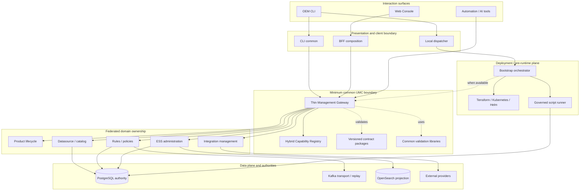
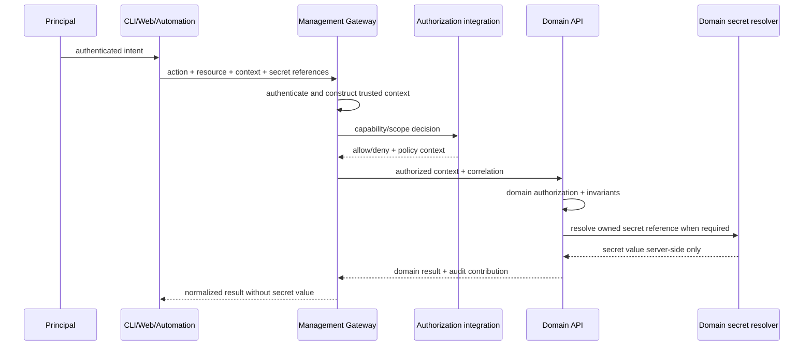
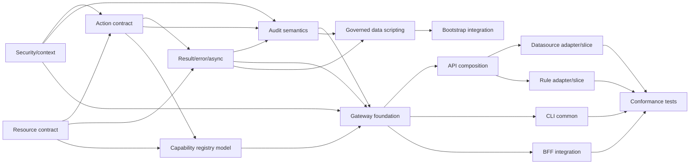

# UMC Implementable Engineering Architecture — UMC-ENGINEERING-01

**Status:** APPROVED / DOCUMENTED

**Implementation:** NOT STARTED

**Baseline:** documentation `fe79f38ed7ddb6e277165a48650e0252d399c470`

**Authority:** UMC-01, UMC-CLI-01, UMC-API-01, UMC-WEB-01, UMC-DATA-01,
UMC-CONFORMANCE-01 and approved decisions UMC-CONF-D01 through D14.

**Boundary:** implementable architecture only. This design creates no runtime
component, API, CLI, BFF route, database object, migration, directory or test.

## Solution Architecture

**APPROVED VISUAL ASSET:** PENDING INTEGRATION

No approved raster visual is physically available in this workspace. The
approved engineering diagram in the Logical component model remains the
canonical solution view for this release; no replacement or alternative
architecture is inferred.

## Engineering answer

OEM requires a small versioned contract family, a thin management gateway, a
hybrid capability registry, explicit domain adapters, thin surface clients and
separate deployment/data-script executors. A logical component is not
automatically a microservice. Domain APIs continue to own business validation,
persistence and lifecycle.

The approved normal paths are:

```text
CLI → Management Gateway → UMC contracts → Domain API/Service
Web → BFF → Management Gateway → UMC contracts → Domain API/Service
Automation/AI → governed API/tool boundary → Management Gateway → Domain API/Service
```

Approved exceptions are explicit: offline/pre-runtime dispatch, limited
governed scripting and the read-only dashboard data adapter.

## Logical component model

| Component | Classification | Runtime? | Responsibility | Must not own |
| --- | --- | --- | --- | --- |
| UMC contract family | CONTRACT PACKAGE | No | Cross-surface resource/action/result/context semantics | Domain models or persistence |
| Contract validators | LIBRARY | In callers | Validate common envelopes and compatibility | Domain business rules |
| Management Gateway | GATEWAY | Yes | Entry security, negotiation, routing and normalization | Domain logic or resource stores |
| Capability Registry | REGISTRY | Hybrid | Resolve supported resource/action/version/availability | Resource state |
| Domain management adapter | ADAPTER | Domain-local or gateway client | Translate UMC operation to an existing domain API | A second domain implementation |
| Domain API/service | DOMAIN COMPONENT | Existing/evolving | Invariants, authorization, transactions and persistence | Surface-specific semantics |
| CLI common | CLI COMPONENT | Client | Grammar, context, API client, rendering and exit mapping | Domain implementation |
| CLI local dispatcher | CLI COMPONENT | Client/offline | Select approved pre-runtime/domain tool adapters | Universal online business logic |
| BFF management adapter | BFF COMPONENT | Existing BFF | UI composition and Management API invocation | Domain authority |
| Dashboard read adapter | DATA ACCESS COMPONENT | Existing BFF | Allow-listed read model queries | Resource mutation |
| Governed script runner | DEPLOYMENT COMPONENT | Pre-runtime/operations | Execute approved manifests/scripts with controls | Arbitrary caller SQL |
| Deployment orchestrator | DEPLOYMENT COMPONENT | Pre-runtime | Preflight and coordinate IaC/bootstrap/recovery | Terraform/Kubernetes internals |
| Execution status capability | SERVICE or DOMAIN COMPONENT | Only when async actions require it | Status, reconciliation and retry evidence | Domain resource state |
| Audit semantic producer | LIBRARY/ADAPTER | At gateway and domains | Correlated semantic audit contributions | Mandatory centralized storage |
| Conformance profiles | CONTRACT PACKAGE / TEST ASSET | No production runtime | Verify equivalent surface behavior | Product behavior |



## Three-plane boundaries

| Plane | Owns | Interacts through | Explicit exclusions |
| --- | --- | --- | --- |
| Control | Management requests, configuration, lifecycle and governance | Gateway and federated domain APIs | Event processing and provider execution |
| Data | Ingress, processing, Kafka, ESS state, integration execution and projections | Existing domain contracts | General resource administration |
| Deployment/pre-runtime | Install, render, migrate, bootstrap, recovery and offline diagnostics | Approved local adapters/manifests; Management API when available | Normal online CRUD and domain business logic |

The planes may share infrastructure but not authority. A deployment action may
create an environment needed by the control plane; it does not become a normal
UMC resource mutation solely because a CLI initiated it.

## Versioned contract package model

Logical packages are independently versioned where compatibility lifecycles
differ. Field-level schemas remain deferred.

| Package | Contents | Owner | Consumers |
| --- | --- | --- | --- |
| `resource-contract` | Resource identity, scope, revision and provenance concepts | UMC architecture/core | All surfaces and domain adapters |
| `action-contract` | Action identity, capability, intent, preconditions and execution class | UMC core + domains | Gateway, clients and domains |
| `result-contract` | Synchronous, validation, accepted, failure and uncertain semantics | UMC core | Gateway, CLI, BFF and domains |
| `error-contract` | Common error classification and domain-detail extension point | UMC core + domains | All clients/adapters |
| `capability-contract` | Resource/action/version/availability declaration | UMC core | Registry and discovery clients |
| `context-contract` | Principal, tenant, environment, request and correlation context | Security + UMC core | Gateway and domains |
| `authorization-contract` | Required permission/policy context and decision contribution | Security + domains | Gateway and domains |
| `secret-reference-contract` | Opaque reference and permitted metadata semantics | Security | Surfaces, gateway and domain resolvers |
| `audit-contract` | Semantic event and correlated contribution model | Audit + UMC core | Gateway, domains, scripts and async actions |
| `version-contract` | Contract/resource/provider compatibility metadata | UMC core + domains | Registry, gateway and clients |
| `idempotency-contract` | Operation identity, retry classification and replay relationship | Result/core + domains | Mutation clients and domains |

Contracts should be transport-neutral source artifacts with generated
language/OpenAPI bindings only where justified. Generated artifacts are outputs,
not independent authorities.

## Thin Management Gateway

### Belongs in the gateway

- Public management entry and protocol termination.
- Authentication integration and trusted identity-context construction.
- Tenant/environment scope validation.
- Management API and UMC contract-version negotiation.
- Common-envelope validation and request/correlation identity.
- Capability lookup, resource/action routing and domain dispatch.
- Coarse capability authorization plus propagation of policy context.
- Result/error normalization without erasing domain detail.
- Audit initiation and gateway outcome contribution.
- Health/readiness for its own dependencies.

### Does not belong in the gateway

- Resource business validation, domain invariants or persistence.
- Provider execution or provider-secret ownership.
- Terraform/Kubernetes implementation.
- ESS lifecycle transitions, rules engine or policy engine.
- Datasource storage, migration execution or dashboard SQL.
- A universal async workflow engine.

Gateway availability must not redefine domain correctness. Domains should
remain independently testable and operational through their owned interfaces.

## Participating domain API contract

Every conforming domain exposes or adapts:

1. stable mapping between common and domain resource identity;
2. declared supported actions and execution class;
3. common input validation plus domain semantic validation;
4. authorization enforcement and invariant checks in the domain;
5. persistence and transaction ownership;
6. common result/error mapping with domain detail;
7. correlated audit contribution;
8. explicit idempotency/retry behavior for mutations;
9. revision/version conflict behavior;
10. capability declaration and health suitable for routing.

Conformance does not require identical frameworks, databases or internal
models. Existing subsystem APIs should be adapted before replacement.

## Capability Registry

**Recommendation: HYBRID.** Static, version-controlled declarations define
resource types, owners, route/adapters, contract compatibility, permissions and
offline eligibility. Runtime status overlays deployment availability,
environment constraints, feature enablement and health.

The registry is not a resource database. Runtime self-registration may update
availability but cannot silently redefine approved contract semantics.

| Registry datum | Authority |
| --- | --- |
| Resource/action ownership | Version-controlled declaration |
| Contract/API compatibility | Version-controlled declaration plus startup check |
| Domain endpoint/adapter | Environment deployment configuration |
| Online/offline and sync/async class | Version-controlled declaration |
| Permissions/policy requirement | Security-owned declaration |
| Provider specialization | Domain-owned declaration |
| Current availability/health | Runtime observation |
| Feature/environment enablement | Governed rollout configuration |

Routing is:

```text
request → validate resourceType/action/version → capability lookup
→ reject unsupported/offline-only/version mismatch OR resolve owner
→ authorize common capability → dispatch domain adapter
→ domain authorize/validate/execute → normalize result → audit contribution
```

Provider specialization selects a domain adapter under an integration resource;
it never routes provider runtime calls through the common gateway by default.

## CLI engineering model

```text
oem executable
├── parser and common resource/action grammar
├── context: endpoint, tenant, environment, principal/session
├── capability/help discovery
├── online Management API client
├── local dispatcher
│   └── explicit registered offline/domain adapters
├── result renderer: human, JSON and automation-safe output
└── exit-code mapper
```

The local dispatcher uses a small explicit registration interface: adapter ID,
owned action capabilities, execution mode, input manifest type, required local
privileges, result mapper and health/preflight hook. This is not a dynamic
third-party plugin framework. Terraform, Kafka, ESS diagnostics and bootstrap
remain domain-owned tools wrapped only when a common invocation adds value.

CLI credentials stay in platform-approved stores/files or delegated sessions;
secrets are references. Help is registry-driven for online capabilities and
bundled declaration-driven for offline capabilities.

## Management API and OpenAPI model

The API engineering composition is public gateway entry, common middleware,
contract validation, capability endpoint, routing, domain clients/adapters and
gateway health/readiness.

**OpenAPI recommendation:** gateway OpenAPI plus domain-owned OpenAPIs, with a
generated documentation aggregation. The gateway specification owns common
entry/context/result/discovery behavior; each domain owns resource operations.
Aggregation is generated and checked for route/schema/version conflicts. A
single manually maintained mega-spec is rejected.

Compatibility boundaries remain separate:

| Version | Protects |
| --- | --- |
| UMC contract | Cross-surface semantics |
| Management API | External route/protocol compatibility |
| Domain API | Domain adapter and service compatibility |
| Provider contract | External provider specialization |
| Resource schema/revision | Resource representation and concurrency |

No arbitrary version numbers are assigned by this design.

## Web/BFF model

Management mutations converge on `Web → BFF → Management Gateway`. The BFF
translates UI intent and view models but passes common action, context and
idempotency semantics without inventing alternatives.

Initially unchanged paths may include dashboard queries, local preferences,
ESS read proxying and current domain reads where they already preserve approved
authority. Direct same-origin domain mutations can remain during transition
behind compatibility adapters, then migrate resource by resource.

| BFF path | Target treatment |
| --- | --- |
| Management mutation | Management Gateway client |
| Management read | Gateway or existing domain read during transition |
| UI aggregation | Remains BFF-owned |
| Session/context | Remains BFF-owned; converted to trusted gateway context |
| Dashboard query | Internal API or bounded read-only adapter |
| Local browser preference | Remains client-local, outside UMC |

### Dashboard read model boundary

The PostgreSQL mode requires a read-only role, allow-listed views/relations,
bound parameters, explicit tenant scope, timeouts, no mutation capability, no
secret return and suitable telemetry. It remains outside normal management
mutations and is not a second UMC implementation.

## Governed data scripting and deployment

The governed runner accepts only an approved script/manifest identity. Its
logical components are manifest resolver, checksum verifier, compatibility
preflight, environment guard, authorization/approval gate, secret-reference
resolver, transaction policy, executor adapter, structured result mapper,
audit contributor and rollback/recovery metadata handler.

It rejects raw caller SQL. Domain migrations stay version-controlled with their
owners. PostgreSQL remains authoritative; no duplicate UMC resource store is
created.

Deployment behavior is state-aware:

| Runtime state | Path |
| --- | --- |
| Absent | CLI local dispatcher → bootstrap orchestrator → IaC/migration adapters |
| Available | CLI may ask Management API to validate/coordinate supported deployment actions |
| Offline | Local approved bundle/declarations; durable local evidence for later reconciliation |

Terraform, Kubernetes/Helm, configuration rendering, database migration,
preflight and recovery retain domain/deployment ownership. The orchestrator
coordinates them; it does not absorb their implementation.

## Security boundaries



Gateway authorization is coarse capability/scope enforcement; domain
authorization protects domain invariants. Authentication or authorization
dependency failure is fail-closed for protected operations. Identity headers
from untrusted surfaces are never treated as authorization evidence.

Domain-side secret resolution is preferred because the domain knows provider
use and minimum scope. Gateway resolution is permitted only for gateway-owned
infrastructure secrets. Normal surfaces never receive secret values.

## Result, async and audit model

Synchronous, validation-only, accepted asynchronous, failed and uncertain
results share semantics but not a finalized JSON shape. The gateway owns common
normalization; domains own outcome truth.

For long-running actions, the owning domain should normally own execution and
status persistence. A shared execution-status capability is justified only for
cross-domain orchestration and must store operation metadata, not duplicate
resource state.

```text
ACCEPTED → RUNNING → SUCCEEDED | FAILED | UNCERTAIN
UNCERTAIN → status query/reconciliation → terminal or still uncertain
```

Kafka is used only when durable asynchronous domain execution or existing
transport/replay behavior requires it:

| Action class | Execution |
| --- | --- |
| Small reads/validations and bounded mutations | DIRECT_SYNC_API |
| Existing durable long-running domain command | ASYNC_EVENT_DRIVEN |
| Install/preflight/recovery without runtime | LOCAL_OFFLINE |
| Online orchestration invoking pre-runtime/domain executor | HYBRID |

Audit uses correlated contributions rather than duplicate full events: surface
telemetry records user intent locally when useful; gateway records admission,
policy and dispatch; domain records semantic outcome; scripts record artifact,
target and execution; async execution records state transitions. One request ID
and execution ID connect them. Physical storage may remain distributed.

## Cross-cutting persistence and projections

UMC may require durable execution status, idempotency records and audit
references. Placement follows ownership: domain operation records live with the
domain; gateway-local records are limited to gateway-owned orchestration.
Capability declarations are configuration plus runtime observations. UMC never
duplicates Datasource, Rule, Policy, ESS or provider resource stores.

OpenSearch may index audit/management telemetry for search and dashboards. It
is a rebuildable projection and cannot be required to determine operation
correctness.

## Resource ownership map

| Resource | Domain owner | Management adapter | Persistence owner | CLI owner | Web/BFF owner |
| --- | --- | --- | --- | --- | --- |
| Product/service | Deployment/Operations + service owner | Lifecycle adapter | Runtime/deployment owner | CLI common + lifecycle adapter | Frontend management BFF |
| Datasource | Console Catalog datasource domain | Datasource API adapter | Catalog domain/PostgreSQL | CLI common | Catalog BFF/UI |
| Rule | Processor or Gateway by rule type | Owning rule API adapter | Owning rule domain/PostgreSQL | CLI common | Rule UI/BFF |
| Policy | Processor/catalog policy owner | Policy API adapter | Owning policy domain | CLI common | Policy UI/BFF |
| Integration/provider | Integration configuration/catalog | Integration management adapter | Catalog/configuration domain; external provider owns external object | CLI common | Catalog/integration BFF |
| Script | Deployment/Operations or domain | Governed runner adapter | Artifact registry/ledger owner | Local dispatcher | No normal Web mutation initially |
| Configuration | Owning domain | Configuration adapter | Owning domain | CLI common | Owning BFF/UI |
| Environment/bootstrap | Deployment/Operations/IaC | Pre-runtime orchestrator | IaC state and owned migration ledgers | Local dispatcher | Status/coordination only when available |
| ESS administration | ESS | ESS read/admin adapter | ESS/PostgreSQL | CLI common | ESS proxy/UI |
| Dashboard query | Dashboard read domain | Read adapter | Source domains; views are derived | Optional query client | Dashboard BFF |

## Module ownership and proposed source tree

The following is a design for the product repository; no directories are
created by this workstream.

```text
config/contracts/umc/                    # transport-neutral common contracts
docs/api/umc/                            # generated/composed API documentation
services/management-gateway/             # thin gateway only
  adapters/<domain>/                     # clients, not domain implementations
scripts/oem                              # future executable entry
scripts/umc-cli/                         # parser, API client, context, renderer
scripts/umc-cli/adapters/                # explicit offline adapter registrations
services/console-catalog-api/            # datasource/config domain ownership
services/event-processor/                # rule/policy domain ownership
services/event-gateway/                  # gateway-rule domain ownership
services/event-state-service/            # ESS ownership
services/integration-worker/             # provider runtime ownership
services/frontend-management-api/        # BFF integration, not UMC core
services/oem-dashboards-api/              # bounded read model
deploy/umc/                               # approved manifests/runner integration
testing/contracts/umc/                    # shared conformance fixtures/profiles
testing/services/management-gateway/      # gateway tests
testing/e2e/umc/                          # cross-surface parity tests
```

Ownership rules prevent a giant `/umc`: common contracts are architecture/core
owned; gateway code is gateway-owned; domain adapters are co-reviewed with the
domain; domain implementation stays in existing services; deployment scripts
stay under deployment ownership.

Shared collision points are contracts, capability declarations, gateway route
composition, CLI registration, OpenAPI aggregation and audit semantics.
Minimize contention through small versioned files per resource/domain,
generated indexes, explicit owners, compatibility checks and additive changes.

Terraform is the reference model: Terraform modules remain under
`infrastructure/**`; a UMC declaration advertises deployment capabilities; an
offline CLI adapter invokes approved tooling; results map to common semantics.
ESS, Kafka, Datasources, Rules, Policies, Integrations and Bootstrap follow the
same ownership rule without forcing the same implementation.

## First vertical slice: Datasource

The first slice proves both online paths over one catalog-owned Datasource
domain:

```text
CLI → Gateway → Datasource adapter → Console Catalog domain → PostgreSQL
Web → BFF → Gateway → same adapter/domain → PostgreSQL
```

Evidence supports an MVP of `create`, `get`, `list`, `update`, `validate`,
`test`, `enable` and `disable`. Delete is included only after the owning domain
confirms dependency and lifecycle semantics; import/export are later.

The slice must prove common identity/action/result semantics, CLI/API/Web
parity, common and domain authorization, server-side secret references,
revision conflicts, mutation idempotency, correlated audit, domain persistence
ownership and conformance tests. It must not prove universal UMC coverage.

## Second vertical slice: Rule

Rule follows Datasource to demonstrate a second owner, validation/simulation,
immutable revisions, enable/disable and separation between configuration
management and runtime deployment. Processor and Gateway rule types may share
UMC semantics while retaining distinct owners and adapters.

Integrations/providers follow only after common resource, security, result and
audit behavior is proven. The UMC integration resource specializes into
ServiceNow, GLPI, Custom API and other providers for configuration/lifecycle;
runtime ticketing, notification and callback execution remains provider/domain
runtime behavior.

## Transition and backward compatibility

Migration is incremental:

1. **OBSERVE** current calls and establish compatibility tests.
2. **WRAP** existing APIs/tools without changing clients.
3. **ADAPT** common contracts at domain boundaries.
4. **CONFORM** resource/action/result/security/audit behavior.
5. **MIGRATE CLIENTS** per resource and environment.
6. **DEPRECATE LEGACY** only with usage and replacement evidence.

Existing CLI scripts, Web routes, APIs, automation and operational procedures
remain functional initially. Compatibility adapters preserve inputs/results or
provide explicit translation; no silent semantic change is permitted.

Minimal rollout uses per-resource and per-environment enablement at the
capability registry, with dual-path support and shadow validation where
side-effect-free comparison is possible. One global big-bang flag is rejected.

## Conformance test architecture

Future test layers are contract serialization/compatibility, domain adapter,
gateway routing/middleware, CLI mapping/exit codes, BFF context/result mapping,
security and tenant isolation, audit correlation, idempotency/retry, async
reconciliation and cross-surface parity.

Shared fixtures represent resource/action identities, principals, tenants,
environments, versions, expected results/errors and async operations. Fixtures
define semantic expectations, not domain storage shapes. No tests are created
or executed by this design.

## Observability and health

Gateway telemetry covers admission, routing, authorization integration,
latency, result class and dependency status. Domains emit semantic outcome and
dependency telemetry. BFF/CLI record client experience without duplicating
authoritative audit. Async and data-script components emit state transitions
and reconciliation signals. Request, correlation and execution identities link
the signals without logging secrets.

| Dependency | Gateway readiness treatment |
| --- | --- |
| Contract/registry static configuration | Required; invalid configuration prevents readiness |
| Domain API | Capability-specific degradation, not global failure where isolation is possible |
| Authorization | Protected actions fail closed; readiness reflects dependency |
| Secret resolver | Capabilities requiring it are unavailable; no fallback secret leakage |
| Audit pipeline | Mutations follow approved fail/queue policy; never silently discard |
| Dashboard read adapter | Independent read capability health |

The gateway reports its ability to route; it does not aggregate every domain's
deep health into one binary platform health signal.

## Failure model

| Failure | Required behavior |
| --- | --- |
| Gateway unavailable | Online management unavailable; runtime domains continue; offline exceptions remain explicit |
| Domain unavailable | Return `UNAVAILABLE`; unaffected capabilities remain usable |
| PostgreSQL unavailable | Domain rejects/rolls back; no alternate authority |
| Authorization unavailable | Fail closed for protected operations |
| Secret resolver unavailable | Reject secret-dependent action; never request raw secret |
| Audit unavailable | Follow approved fail/queue policy by action risk; expose degraded state |
| Async outcome uncertain | Return `UNCERTAIN`, preserve execution identity and reconcile |
| Version mismatch | Reject before dispatch with compatibility information |
| Unsupported/offline-only action | Return capability error and supported mode |

## Engineering dependency graph



## Implementation waves

| Wave | Scope | Exit condition |
| --- | --- | --- |
| 0 — contracts | Resource and security/context first; action, result and audit coordinated | Reviewed compatible contract families |
| 1 — common foundation | Registry, thin gateway, OpenAPI composition and client bindings | Gateway can discover/route a non-mutating capability |
| 2 — Datasource | Domain adapter plus CLI/Web parity | Datasource acceptance and conformance evidence |
| 3 — Rule | Second owner and richer lifecycle | Rule validation/version/lifecycle parity |
| 4 — expansion | Providers and selected resources; data/bootstrap exception plane | Each capability independently conformed |
| 5 — convergence | Migrate clients and evidence-based legacy retirement | No ungoverned normal path remains |

No calendar dates or implementation authorization are implied.

## Workstream readiness

| Workstream | Readiness | Dependency |
| --- | --- | --- |
| UMC-RESOURCE-01 | READY_AFTER_UMC_ENGINEERING_APPROVAL | This Human Gate |
| UMC-SECURITY-01 | READY_IN_PARALLEL_AFTER_UMC_ENGINEERING_APPROVAL | This Human Gate |
| UMC-ACTION-01 | READY_AFTER_RESOURCE_AND_SECURITY_CONTEXT | Resource identity and trusted context |
| UMC-RESULT-01 | READY_AFTER_RESOURCE_AND_ACTION | Resource/action identity and async policy |
| UMC-AUDIT-01 | READY_AFTER_SECURITY_ACTION_AND_RESULT | Correlated semantic identities |
| UMC-CORE-01 | READY_AFTER_FOUNDATION_CONTRACTS | Resource/action/result/security/audit |
| UMC-API-02 | READY_IN_PARALLEL_WITH_CORE_AFTER_CONTRACTS | Gateway and OpenAPI boundaries |
| Datasource Vertical Slice | READY_AFTER_CORE_AND_API | Common foundation and owned adapter contract |
| Rule Vertical Slice | READY_AFTER_DATASOURCE_PROVES_CORE | First-slice lessons and rule adapter |
| UMC-CLI-02 | READY_AFTER_CORE_API_AND_CAPABILITIES | Online client and offline registration model |
| UMC-WEB-02 | READY_AFTER_CORE_API_AND_BFF_CONTRACT | Gateway and presentation mapping |
| UMC-DATA-02 | READY_AFTER_RESULT_SECURITY_AND_AUDIT | Governed script operation semantics |
| UMC-BOOTSTRAP-01 | READY_AFTER_DATA_AND_OFFLINE_CONTEXT | Governed runner and local dispatcher |
| UMC-CONFORMANCE-02 | READY_AFTER_FIRST_IMPLEMENTED_SLICE | Executable system under test |

Parallel work is safe only within these dependency boundaries. No listed
workstream is started by UMC-ENGINEERING-01.

## Risks

- The Management Gateway could accumulate domain behavior unless its thin
  boundary and adapter ownership are enforced.
- Common contracts and federated OpenAPI definitions could drift without
  generated compatibility checks and domain conformance profiles.
- Offline and governed-scripting exceptions could become bypass paths unless
  capability, authorization, audit and evidence requirements remain explicit.
- Premature legacy retirement could break existing CLI, Web, API or operations
  behavior before equivalent paths have acceptance evidence.
- Distributed audit contributions could lose traceability if request and
  execution identities are not propagated consistently.

## Open Decisions

The following are intentionally delegated to the named future contract or
implementation workstreams and do not block this architecture approval:

- final resource schemas and contract versions;
- authentication technology;
- physical audit persistence and audit-unavailable fail/queue policy;
- whether a shared execution-status capability is required;
- Datasource delete semantics; and
- final ownership split for Rule types.

## Approval

UMC-ENGINEERING-01 is approved as an implementable engineering architecture.
It preserves approved D01–D14 and domain ownership, defines
component/module/interface/dependency/flow/transition/sequencing boundaries,
and starts no product implementation or downstream workstream.
