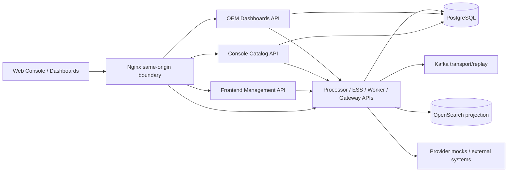

# UMC Web Conformance — UMC-WEB-01

**Discovery baseline:** `2ed0df350b2a9d2920636afd4cdb0b21b2945139`. This is a
read-only inventory of the current Web Console and BFF paths. No frontend, BFF,
API, database, or runtime code was changed.

## Assessment

**Web Console → BFF / Management API → UMC: YES_WITH_GAPS.** The console has
real BFF and same-origin service paths, but capabilities are split between
frontend-management, catalog, dashboard, processor, ESS, and isolated provider
surfaces. A common UMC API is therefore a convergence target, not the current
implementation.

**PostgreSQL interoperability: OPTIONAL_TARGET.** PostgreSQL-backed dashboard
and catalog adapters are evidenced, but no browser-to-PostgreSQL path is
evidenced and no user-facing switch is a complete UMC interoperability mode.

## Web applications and surfaces

| Surface | Implementation / route | Purpose | Backend dependency | Classification |
| --- | --- | --- | --- | --- |
| Management Console | `services/event-management-console` / `/administration`, `/ticketing/tickets`, `/criteria-filters`, `/customers`, `/blackouts`, `/correlation`, `/routing`, `/administration/ess` | Product administration, inventory, ticket views, configuration, ESS and processor workflows | Nginx to frontend-management, console-catalog, processor, ESS and isolated mocks | PRODUCT WEB CONSOLE |
| Operational dashboards | `services/oem-dashboards` / `/dashboards/*` | Read-only events, ticketing, GNM, CACF, delivery and data collection views | `oem-dashboards-api`; optional internal API or PostgreSQL source | DASHBOARD |
| ITSM dashboard | `services/itsm-ticketing-dashboard` | Local ticketing demonstration surface | Isolated mock/provider API | TEST/DEMO UI |
| Frontend Management API | `services/frontend-management-api` | Runtime inventory and local service control | Docker socket read-only plus allow-listed scripts | BFF |
| Console Catalog API | `services/console-catalog-api` | Catalogues, profiles, data sources, secrets and ESS proxy | PostgreSQL and fixed service adapters | BFF / domain API |
| Dashboard API | `services/oem-dashboards-api` | Dashboard read contracts and controlled collection actions | PostgreSQL or internal API | BFF |

## Current architecture



The target remains:

```text
Web Console → BFF / Management API → UMC → Domain Services
```

The approved alternative is a governed data-access boundary. Direct browser
SQL or direct browser PostgreSQL access was not found.

## Read/write and management paths

| Capability | Mode | Actual path | Status |
| --- | --- | --- | --- |
| Runtime inventory and health | READ / ADMINISTRATION | Browser → Nginx → frontend-management API → Docker/runtime checks | EXISTING |
| Start/stop/restart local services | ACTION / ADMINISTRATION | Browser → Nginx → frontend-management API → allow-listed shell script → SQLite operation record | PARTIAL |
| Catalogue customers and filters | READ / WRITE / CONFIGURATION | Browser → Nginx → console-catalog API → PostgreSQL | EXISTING |
| Data-source, secret and integration profiles | READ / WRITE / CONFIGURATION | Browser → Nginx → console-catalog API → PostgreSQL/adapters | PARTIAL |
| ESS event/history/quarantine | READ | Browser → Nginx → console-catalog ESS proxy → ESS | EXISTING |
| Rules, blackouts, dedup and AIOps | READ / WRITE / TEST | Browser → Nginx → processor API | PARTIAL |
| Dashboard domains | READ | Browser → Nginx → dashboard API → PostgreSQL or internal API | EXISTING |
| Data collection preview/send | TEST / ACTION | Browser → dashboard API → gateway preview/ingress | PARTIAL |
| Ticket query/close | READ / ACTION | Browser → Nginx → isolated GLPI or ServiceNow console mock | PARTIAL / LOCAL |
| GNM/CACF plugins | READ | Browser → dashboard API read-only routes | EXISTING |
| Provider execution from event routing | ACTION | Event Processor → Kafka command → Integration Worker/adapter | NOT_WEB_DIRECT |

## PostgreSQL path analysis

Evidence shows **Browser → BFF/API → PostgreSQL** for catalog and dashboard
PostgreSQL modes, and **Browser → BFF/API → domain service → PostgreSQL** for
service-owned state. Dashboard configuration supports `postgresql` and
`internal-api` sources, but this is a dashboard adapter setting, not a complete
UMC-wide switch. No Browser → direct PostgreSQL path was found.

## Security, secrets, and audit

- Console catalog routes use tenant parameters, authenticated principals and
  catalog permissions where the secured adapter is active; several local
  functional routes explicitly remain local-only or defer shared OIDC/RBAC.
- The frontend-management BFF has a constrained Docker read boundary but its
  documentation says multi-user authentication and authorization remain
  required before broader exposure.
- Provider/database credentials are not returned to the browser in the
  documented contracts. Secret routes expose references/metadata; raw secrets
  remain server-side. Local mock secrets are laboratory-only.
- State-changing requests use same-origin, `X-Console-Action`, content-type,
  origin and tenant checks where documented. These controls are not a universal
  RBAC/UMC security contract.
- Audit is mixed: catalog audit tables, operation SQLite records, service logs,
  provider ledgers and local browser state are separate. A central UMC audit
  event is not evidenced.

## Result and error model

Responses are JSON but vary by service. HTTP status, error codes, validation
messages, async operation IDs, provider results, and dashboard envelopes are
subsystem-specific. The frontend validates contracts and displays errors, but a
common UMC result/error envelope and correlation identity are not evidenced.

## Web resource/action matrix

| Resource | Action | UMC target | Current Web capability | Backend path | Status | Gap |
| --- | --- | --- | --- | --- | --- | --- |
| Product services | get/status | Existing | Inventory and health | Frontend Management API | EXISTING | Universal resource identity absent |
| Product services | start/stop/restart | Existing | Local allow-listed commands | Frontend Management API | PARTIAL | Local-only, not universal UMC |
| Datasources | get/list | Existing | Data-source catalogue/read models | Console Catalog API | EXISTING | Contract varies by adapter |
| Datasources | create/update/delete/test | Existing | Local configuration and provider checks | Console Catalog API/adapters | PARTIAL | Shared lifecycle and auth incomplete |
| Rules | get/list/create/update/validate/enable/disable | Existing | Correlation, blackouts, routing and rule screens | Processor APIs | PARTIAL | Multiple contracts and domains |
| Policies | get/list/update/simulate | Existing | Policy and filter screens | Processor/catalog APIs | PARTIAL | No common policy lifecycle |
| Integrations/providers | discover/configure/test/execute | Existing | Catalog profiles, ticketing and plugin views | Catalog, Worker, provider APIs | PARTIAL | Registration and execution are fragmented |
| Events/state | list/detail/history/quarantine | Existing | Dashboard and ESS administration | Dashboard API / ESS proxy | EXISTING | Mostly read-only Web surface |
| Automation | inspect/test | Existing | CACF/automation views and preview | Dashboard/processor APIs | PARTIAL | Provider actions are not general Web commands |

No `CONFLICTING` browser-to-database path was identified.

## Web ↔ API reuse matrix

| Capability | Reuse classification | Evidence |
| --- | --- | --- |
| Inventory and service control | USES_BFF_WRAPPER | Frontend Management API |
| Catalogues and profiles | USES_BFF_WRAPPER | Console Catalog API |
| ESS administration | USES_BFF_WRAPPER | `/api/ess/*` proxy to ESS |
| Rules, blackouts, AIOps | DIRECT_SERVICE_API through same-origin Nginx | Processor endpoints |
| Dashboard queries | USES_BFF_WRAPPER | OEM Dashboards API |
| Ticket demo/provider views | DIRECT_SERVICE_API / isolated adapter | GLPI and ServiceNow console paths |
| Sidebar, language and layout preferences | LOCAL_ONLY | Browser localStorage |

## Web ↔ CLI semantic comparison

| Resource/action family | Web | CLI | Relationship |
| --- | --- | --- | --- |
| ESS read/history/quarantine | BOTH | BOTH | Shared API semantics, separate surfaces |
| Dashboard source/configuration | BOTH | BOTH | Existing subsystem contract |
| Service lifecycle | WEB_ONLY locally | CLI_ONLY broadly | Fragmented local administration |
| Kafka installation/inspection | NEITHER in product Web | CLI_ONLY | Domain-owned tooling |
| Provider registration | PARTIAL | PARTIAL/design | No universal contract |
| Rules and policy lifecycle | PARTIAL | PARTIAL | Separate domain contracts |
| Universal UMC resource grammar | NEITHER | NEITHER | Target only |

## BFF responsibility assessment

The BFFs appropriately provide UI composition, aggregation, view-model shaping,
local session/context and frontend-specific orchestration. Domain services
retain event, rule, ESS, integration and persistence semantics. Responsibility
leakage exists where local service lifecycle and catalog writes are exposed from
the same Web environment without a common UMC authorization, audit and result
contract; this is a convergence finding, not a redesign.

## BAU convergence plan

- **P0:** identity, authorization, tenant scope and secret-reference boundary.
- **P1:** converge Web management actions on the UMC Management API; normalize
  BFF/domain responsibility and resource/action parity.
- **P2:** common result/error envelope, correlation IDs, durable audit and an
  explicit interoperability mode.
- **P3:** isolate client-local preferences, legacy demos and local-only routes.

UMC-DATA-01 is not started. These are documentation findings only.

## Evidence index

- `services/event-management-console/README.md`
- `services/frontend-management-api/README.md`
- `services/console-catalog-api/README.md` and `server.py`
- `services/oem-dashboards-api/README.md`, `dashboard.py`, `server.py`
- `services/event-management-console/nginx.conf`
- `services/oem-dashboards/nginx.conf` and frontend API clients
- `docs/dashboards/contracts.md`
- `docs/event-state-service/admin-api.md`
- [UMC-API-01 API Conformance](api-conformance.md)
- [UMC-CLI-01 CLI Conformance](cli-conformance.md)
