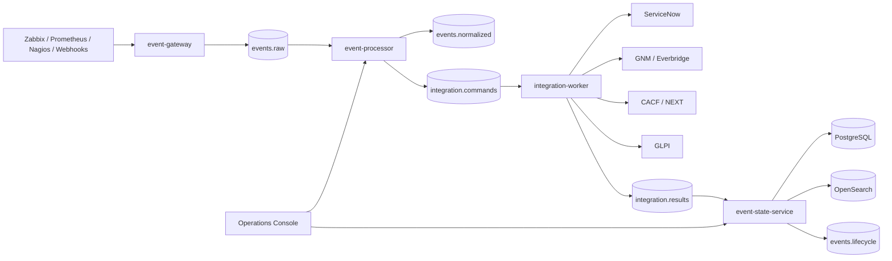

# Mapa completo V1.0.0

## Línea base
- Gateway HTTP y Kafka para ingesta desacoplada.
- Processor para normalización, policy, enrichment/inventory, blackout, auto-suppression, correlation y routing según módulos implementados.
- Worker para ejecución de integraciones.
- ESS para consolidación de estado, persistencia y lifecycle.
- PostgreSQL y OpenSearch.
- Console, dashboards y administración mínima.
- Docker Compose local, scripts, health, evidencias y runbooks.
- Terraform GCP foundation y diseño Kubernetes.
- Seguridad mínima V1; controles avanzados quedan en Defect Prevention V2.

Topics principales: `events.raw`, `events.normalized`, `events.lifecycle`, `events.dlq`, `integration.commands`, `integration.results`, `integration.callbacks`, `event.journal`.

Puertos core locales: Gateway 8081, Processor 8082, Worker 8083, ESS 8084 y Console 8090.

**Regla documental:** código, PASS local, certificación E2E y certificación contra proveedor real son estados diferentes.
