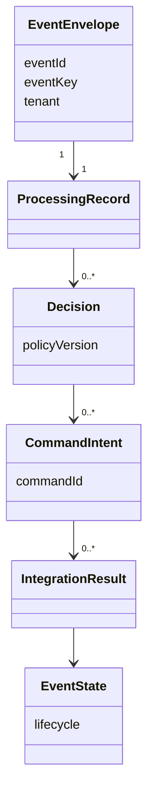

# Modelo de dominio

El evento conserva una identidad técnica (`eventId`) y una identidad de ciclo
(`eventKey`). El envelope original se conserva para trazabilidad; la salida
normalizada agrega estado, severidad, tenant, timestamps y decisiones sin
alterar el original.

Las configuraciones `POLICY`, `ENRICHMENT` y `ROUTING` se versionan por tenant.
Su activación usa revisión/ETag, checksum y auditoría inmutable. Un snapshot
capturado no cambia durante el pipeline. Las decisiones son directivas; la
ejecución pertenece al Worker y el lifecycle al Event State Service.
