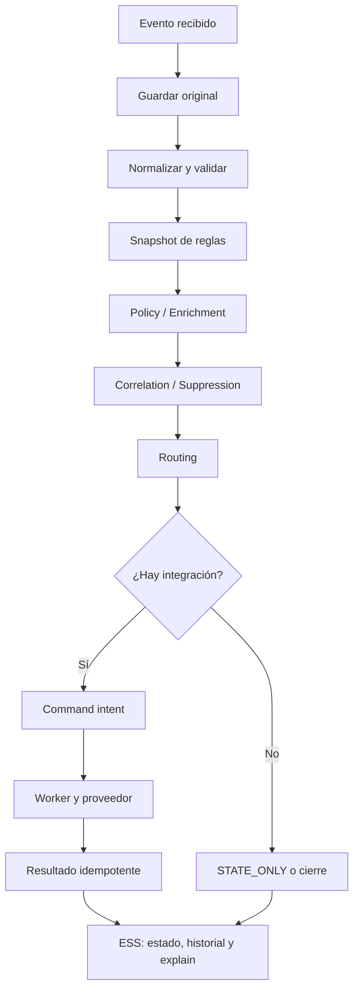

# Flujo de eventos

El flujo normalizado publica en Kafka; PostgreSQL conserva configuración,
auditoría, outbox y estado. El Worker no inventa comandos: ejecuta una intención
durable y exige consistencia de `commandId`. Los reintentos reutilizan la misma
intención y no deben crear tickets o alertas duplicados.

Las rutas de administración y simulación están en [API](../reference/api/index.md)
y el escenario completo en [Primer evento](../getting-started/first-event.md).
