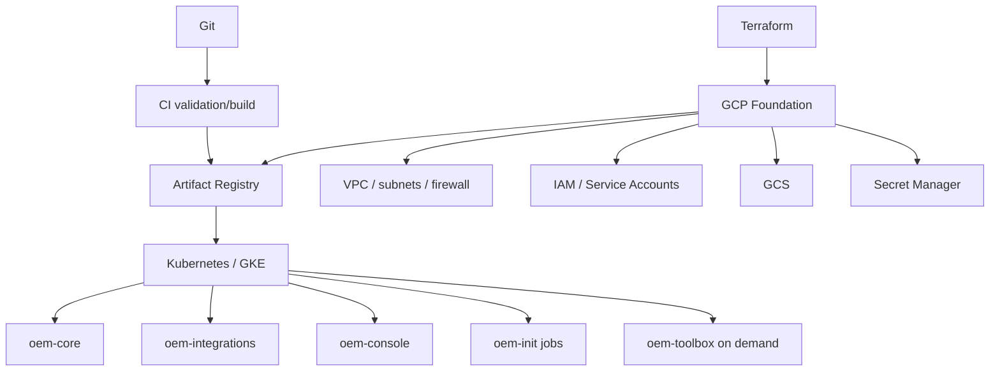

# IaC, GCP y Kubernetes

## GCP foundation
OS_08_13 documenta VPC/subredes management-workloads-data, firewall, Secret Manager, Artifact Registry, buckets application/backups/shared/logs, Cloud Build y service accounts de despliegue/entrega, tratada como baseline certificada sin drift en su checkpoint.

## Kubernetes
Deployments separados; Jobs idempotentes; ConfigMaps; secret provider; startup/readiness/liveness; requests/limits; PDB/HA donde aplique; NetworkPolicy/RBAC como hardening; Helm/Kustomize/manifiestos versionados; rollback y backup/restore certificados antes de producción.

## Portabilidad
Los módulos cloud-specific deben aislarse. Network, identity, registry, secrets, storage, compute/orchestration y observability pueden mapearse a AWS, Azure u on-prem sin cambiar los contratos del core.
