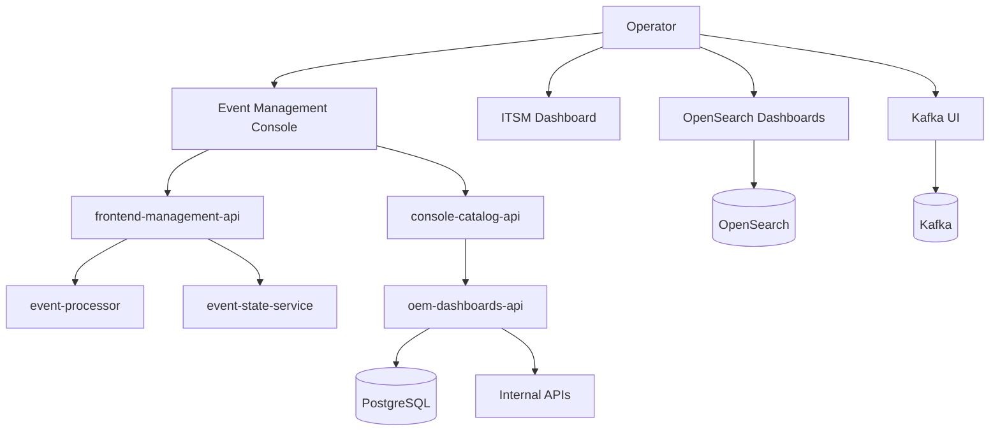

# Frontend Experience Layer — V1

| Interfaz | Propósito |
|---|---|
| Event Management Console | Portal OEM, eventos y administración mínima |
| ITSM Dashboard | KPIs y operación de ticketing |
| OpenSearch Dashboards | búsquedas e histórico técnico |
| Kafka UI | diagnóstico de Kafka; no consola de negocio |
| OEM Dashboards | KPIs propios y vistas operativas |

Las interfaces usan APIs internas. Donde el contrato lo soporte, la administración puede seleccionar PostgreSQL o API como fuente backend; nunca SQL directo desde el navegador.

V1 prioriza integración y administración mínima. SSO, RBAC granular, hardening y gobierno avanzado quedan como DP V2.
