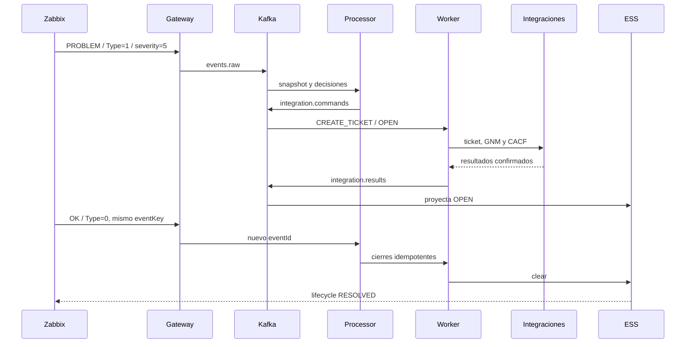

# Primer evento: happy path

Basado en `testing/cases/UC-001-happy-path.md`, este recorrido lleva un evento
fatal hasta su resolución usando fixtures y proveedores sintéticos.



## Aceptación

1. Enviar el fixture fatal: HTTP 202, `eventId`, `eventKey`, `processingId` y
   evento OPEN persistidos.
2. Confirmar un único ticket y una alerta GNM asociados al mismo evento.
3. Confirmar `executionId`, ACK y resultado CACF/NEXT.
4. Enviar callback `RESOLVE` y verificar resultado proyectado.
5. Enviar recuperación `Type=0`: mismo `eventKey`, nuevo `eventId` y clear.
6. Repetir callback/clear: no se crean operaciones duplicadas.

```bash
python3 testing/run.py certification --name lifecycle-prepare
python3 testing/run.py happy-path
```

Los reportes quedan en `evidences/testing/`; el runner limpia únicamente sus
reglas sintéticas. La aceptación falla ante duplicación, timeout, DLQ, IDs
inconsistentes o confirmaciones ausentes.
