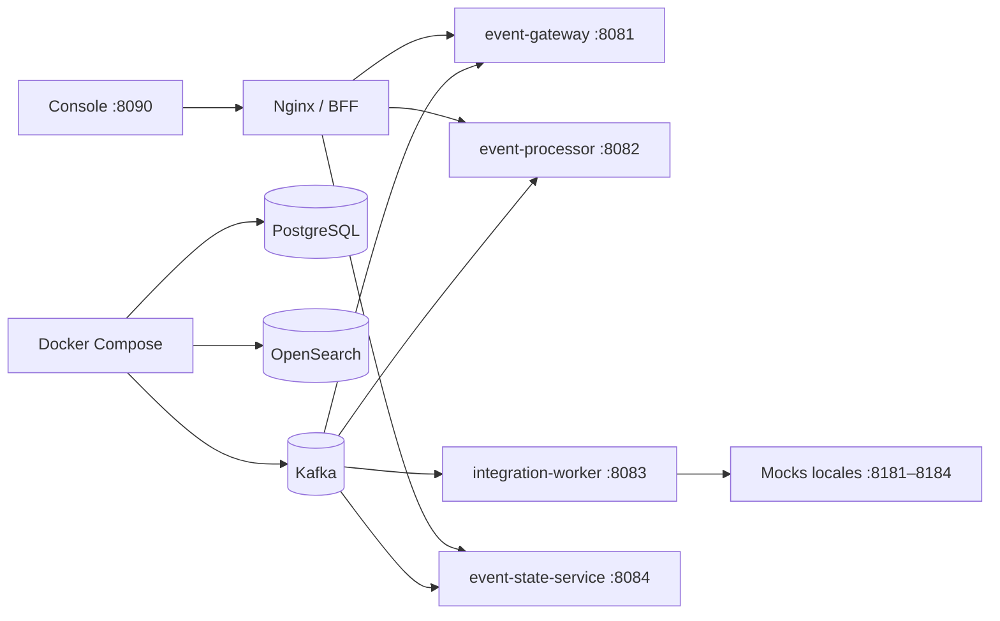

# Desarrollo local con Docker Compose

La versión actual compartida usa `infrastructure/docker-compose.yml`.



```bash
cp .env.example .env
docker compose -f infrastructure/docker-compose.yml up -d --build
bash scripts/eventmanagement-services.sh health
bash scripts/eventmanagement-services.sh status
```

La consola queda en `http://localhost:8090`; los mocks de ServiceNow, GNM,
AIOps y NEXT son sintéticos. Para el E2E aislado se usa
`testing/environments/lifecycle.compose.yml`, con puertos `28081–28084`:

```bash
python3 testing/run.py certification --name lifecycle-prepare
python3 testing/run.py happy-path
```

No mezclar el laboratorio aislado con el Compose compartido ni usar bases
productivas. Detener el entorno compartido con:

```bash
docker compose -f infrastructure/docker-compose.yml down
```
