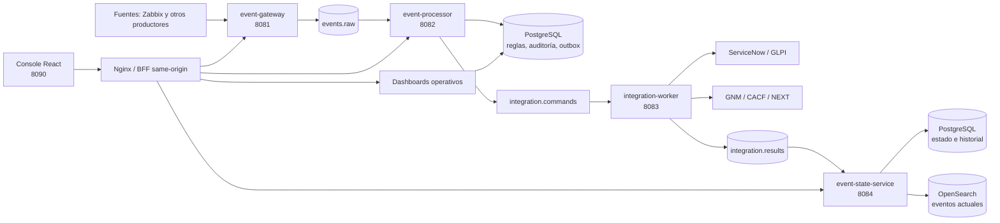
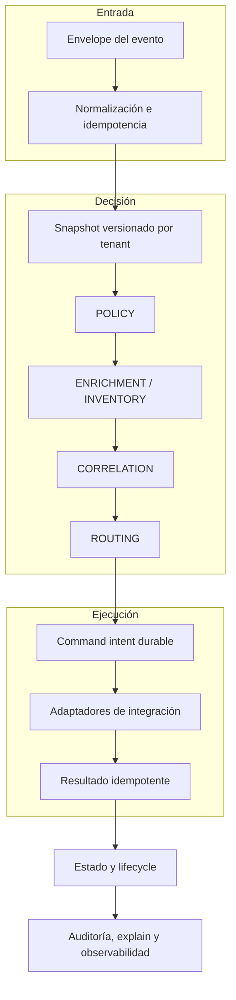

Documentation

# Open Event Management

Documentación de producto para la plataforma de gestión de eventos operativos.
Este portal explica cómo se integra cada servicio, cómo ejecutar el entorno local
y cómo seguir un evento desde su entrada hasta su estado final.

## Explore la documentación

  <a class="oem-quick-link" href="architecture/oem-architecture-definition/"><strong>Architecture</strong>Definición maestra, arquitecturas Golden y vistas cross-cutting.</a>
  <a class="oem-quick-link" href="platform/"><strong>Platform</strong>Servicios, integraciones y evidencia de implementación.</a>
  <a class="oem-quick-link" href="operations/local-runbook/"><strong>Operations</strong>Runbooks, observabilidad, incidentes y recuperación.</a>
  <a class="oem-quick-link" href="development/contributing/"><strong>Development</strong>Contribución, estándares, pruebas y releases.</a>
  <a class="oem-quick-link" href="reference/api/"><strong>Reference</strong>APIs, eventos, configuración y Terraform.</a>
  <a class="oem-quick-link" href="architecture/d6-environment-evolution/"><strong>Deployment</strong>Mapa de ambientes y perfiles de despliegue OEM.</a>

## Qué resuelve el producto

Event Management recibe señales de monitoreo, conserva el evento original,
normaliza su contrato, aplica políticas y enriquecimiento, decide acciones de
integración y proyecta el estado consultable. La consola WebGUI administra estas
capacidades mediante APIs same-origin; no accede directamente a bases de datos.

## Arquitectura principal

## Librería de arquitectura principal

La documentación detallada está en [Arquitectura](architecture/index.md),
[Modelo de dominio](concepts/domain-model.md) y [Flujo de eventos](concepts/event-flow.md).

## Documentación ampliada

- [Flujos de solución ejecutados](architecture/solution-flows.md)
- [Topología del runtime local](architecture/runtime-topology.md)
- [Defect Prevention global](project/defect-prevention.md)
- [Cobertura documental](project/documentation-coverage.md)
- [Administración e integraciones de plataforma](platform/service-administration.md)
