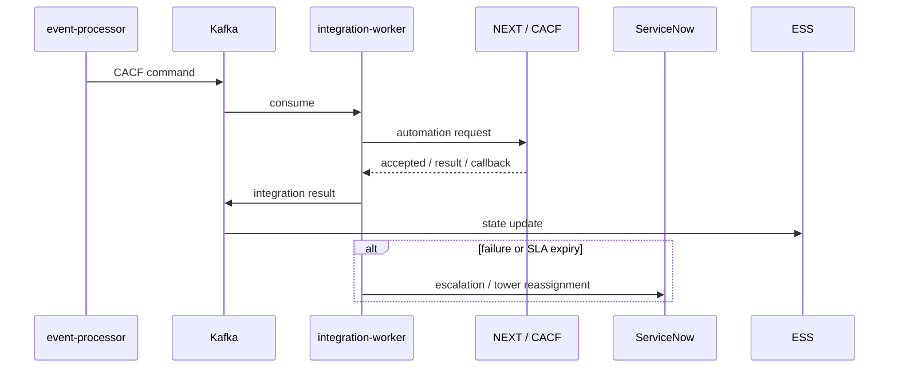

# CACF Core Foundation — Automation Router

Requester Identifier documentado: `<servername>:<serverserial>:<customercode>`. El modelo contempla aceptación asíncrona, listener/callback, worknote, timeout parametrizable y escalación humana. Casos de referencia incluyen `NO ACTION/NO MATCHING HOST`, `ESCALATION/AUTO ESCALATION`, `REMEDIATION` y `TOWER TRANSFER`.

La documentación detallada de contratos, estados, validación, runbook, ADR, DP y Draw.io se conserva en `platform/cacf/`.
