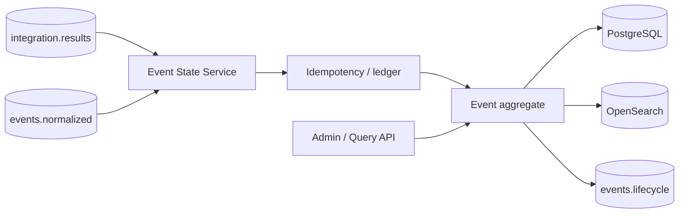
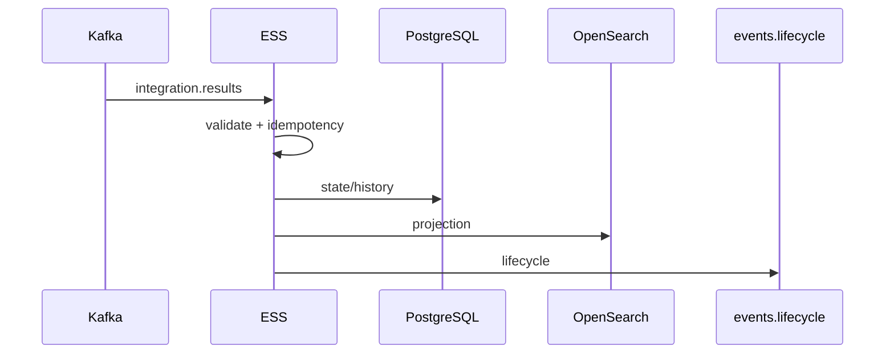

# Event State Service — arquitectura conceptual
ESS consolida el estado operacional; Processor decide, Worker ejecuta y ESS persiste/publica lifecycle.

Responsabilidades: validación, correlación contractual, idempotencia, estado durable, historial, proyección, lifecycle y API. No debe duplicar reglas, routing ni clientes de proveedores.

