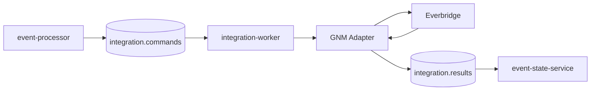

# GNM Core Foundation — Notification Router

El contrato forense legado usa `ServerSerial` como correlación relevante y Launch mediante `POST /rest/incidents/{organizationId}`. El payload incluye acción, nombre, fases/broadcast template y `formVariableItems`; la respuesta aporta identificador/URI y el detalle expone estado.

Casos CROWN y VITRO documentados sirven como fixtures/contract tests, sin conservar secretos.

Principios: provider HTTP sólo en Worker/adapter; secrets externos; resultado normalizado; idempotencia; mock para desarrollo y certificación real separada.
