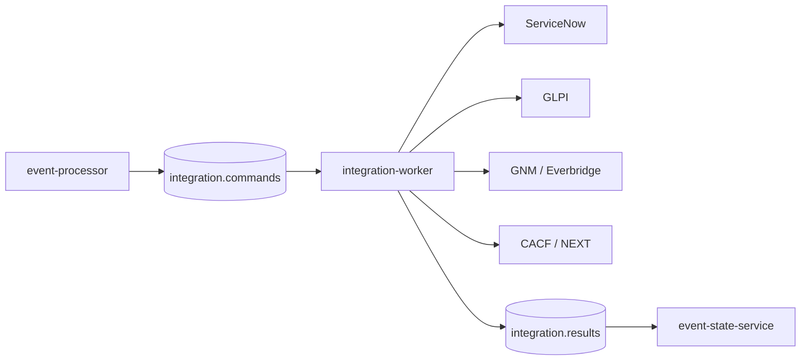

# Integraciones de la plataforma

La plataforma separa decisión (`event-processor`) de ejecución (`integration-worker`). Los resultados regresan por Kafka y `event-state-service` los consolida.

| Integración | Rol | Documentación |
|---|---|---|
| ServiceNow | Ticketing / ITSM | Changelog, owner-guarded package, mocks y flujo E2E. |
| GLPI | Ticketing open source | [Contrato y operación](glpi.md), API y mock local. |
| GNM / Everbridge | Notification Router | Changelog, adapter Worker y mock. |
| CACF / NEXT | Automation Router | [Core Foundation CACF](../cacf/README.md), contratos, estados, Draw.io, runbook, ADR y DP. |
| AIOps | Extensión de decisión | Módulo administrativo y mock; no implica activación automática en el pipeline. |

