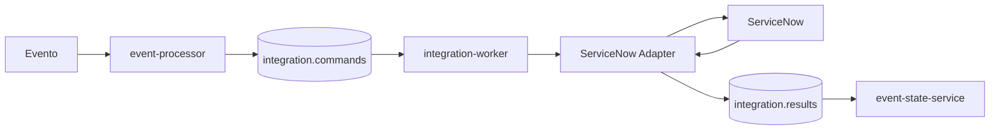

# ServiceNow Core Foundation — Ticketing Router

Processor decide **si** emitir el comando; Worker ejecuta el contrato ServiceNow; ESS consolida el resultado. El foundation cubre creación/reconciliación, ownership guards, normalización, evidencia y configuración mock/real.

## CMDB Processor
La evolución contempla un CI ServiceNow CMDB Processor para sustituir middleware legacy entre inventario/Lansweeper y ServiceNow CMDB. Debe mantenerse separado del ticketing transaccional y tener reconciliación, idempotencia y observabilidad propias.
