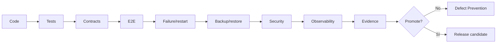

# Defect Prevention Matrix — V1 → V2
| Área | V1.0.0 | V2 / gate futuro | Riesgo |
|---|---|---|---|
| Ingesta | Gateway + Kafka | quotas/rate limiting/multi-region | saturación |
| Processor | reglas + admin mínima | governance/simulation/promotion | decisiones no gobernadas |
| Blackout | motor/contratos | UX + approvals | supresión incorrecta |
| Correlation | baseline ATTRIBUTE/GROUP | estrategias avanzadas | ruido |
| ESS | estado/idempotencia/lifecycle | HA/DR/escala certificada | divergencia |
| Integrations | Worker + adapters | proveedor real + HA | falso PASS |
| ServiceNow | ticketing foundation | rate/error/security prod | tickets perdidos |
| GNM | adapter + contrato/mock | Everbridge real resiliente | notificaciones perdidas |
| CACF | contrato/timeout/escalación | callback/SLA prod | automatización huérfana |
| Frontend | admin mínima | SSO/RBAC/session hardening | acceso indebido |
| APIs | contratos internos | authn/authz/quotas/policies | exposición |
| Secrets | externalización | Vault/SM/KMS + rotation | fuga |
| Kafka | runtime/tooling | TLS/mTLS/ACL/HA/DR | indisponibilidad |
| PostgreSQL | persistencia | HA/PITR/restore drills | pérdida de estado |
| OpenSearch | búsqueda | HA/snapshots/ISM/security | pérdida/retención |
| Kubernetes | runtime design | NetworkPolicy/PDB/HPA/admission | blast radius |
| Observability | health/logs/metrics | SLO/SLI/tracing/alerting | fallos invisibles |
| Supply chain | build/registry | SBOM/signing/provenance/scans | artefactos comprometidos |
| Git | governance | protected branches/CODEOWNERS/releases | cambios no controlados |
| Backup/restore | diseño/runbooks | restore certification | recuperación incierta |

## Gate global

