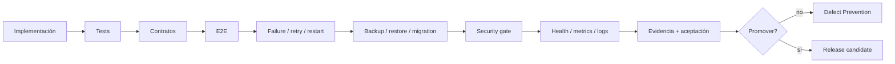

# Defect Prevention — índice global

Defect Prevention (DP) registra lo que **no debe darse por terminado**, separa implementación de certificación y evita publicar una capacidad local o simulada como production-ready.

| Dominio | Documento | Control |
|---|---|---|
| Gobierno documental | [DP documental](../platform/defect-prevention-documentation.md) | Gobierno, licencia, ownership y políticas. |
| Event Processor | [DP Processor](../platform/event-processor/defect-prevention.md) | Gaps funcionales, seguridad diferida y certificaciones. |
| Event State Service | [DP ESS](../platform/event-state-service/defect-prevention.md) | Estado, consistencia, lifecycle y recuperación. |
| CACF / Automation | [DP CACF](../platform/cacf/defect-prevention.md) | Contratos, callbacks, timeouts, escalación e idempotencia. |
| Proyecto | [Deuda técnica](technical-debt.md) | Pendientes transversales. |

## Principios

1. **Código ≠ certificación.**
2. **Mock ≠ proveedor real.**
3. **PASS local ≠ production-ready.**
4. **Seguridad V1 mínima ≠ seguridad completa.**
5. **Estado durable antes que UX.**
6. **Idempotencia y evidencia** para reintentos y callbacks.
7. **No ocultar gaps.**

## Gate recomendado

Identidad central, SSO, RBAC granular, hardening y gobierno completo permanecen como requisitos diferidos donde así se decidió; deben reaparecer como gates antes de declarar seguridad o producción.
