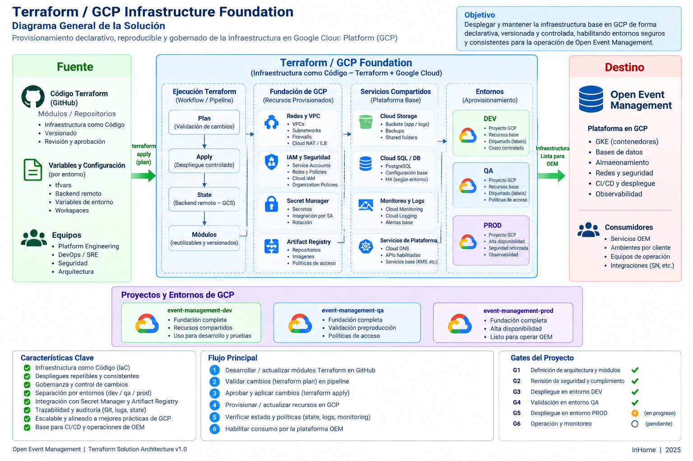

# Operaciones

## Solution Architecture

Terraform / GCP Infrastructure Foundation

## Instalación y despliegue

- Compose y servicios locales: `infrastructure/docker-compose*.yml`.
- Scripts operativos: `scripts/`.
- Manifiestos y validadores: `deploy/`.
- Cloud Build/Terraform: `infrastructure/gcp/terraform/`.

Antes de desplegar, validar migraciones pendientes, readiness, imágenes y
compatibilidad de contratos. Un rollback de binario no revierte migraciones:
seguir el runbook del componente y drenar procesos cuando el contrato lo exija.

## Observabilidad

Revisar readiness/liveness, logs estructurados, Kafka consumer lag, outbox
pendiente, errores de integración y salud de PostgreSQL/OpenSearch. La consola
marca explícitamente datos no disponibles; no convertir un error de proveedor en
un resultado exitoso.

## Recuperación

Usar los runbooks de [Kafka](../platform/kafka/installation-and-certification.md),
[dashboards](../platform/dashboards/operational-runbook.md),
[ESS](../platform/service-administration.md) y
[Processor](../platform/event-processor/defect-prevention.md). Respaldos y restauración
deben probarse en un ambiente aislado antes de una operación productiva.
